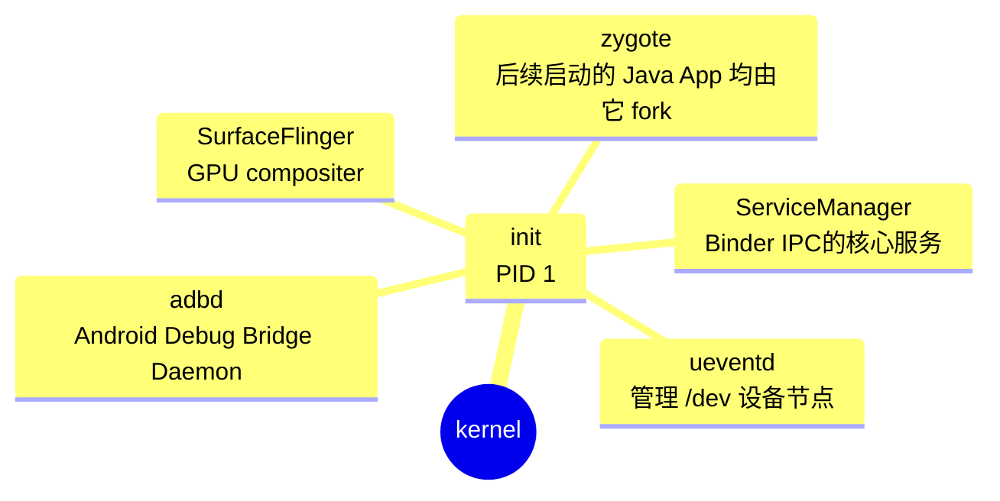

# 1 号进程 - init

在 Android 系统中， 1 号进程 (PID 1) 是 [**init**](https://android.googlesource.com/platform/system/core/+/9441fe979291d6b4e7db3c3742d1ef913d831cae/init/) 进程。它是系统启动后由 Linux 内核直接创建的第一个用户空间进程，负责初始化系统环境并启动关键服务。



<!--more-->

## Android Init Language (init.rc)

对比一下 SurfaceFlinger 和 drm_hwcomposer 的 .rc 文件

```bash
service surfaceflinger /system/bin/surfaceflinger
    class core animation
    user system
    group graphics drmrpc readproc
    capabilities SYS_NICE
    onrestart restart --only-if-running zygote
    task_profiles HighPerformance
```

```bash
service vendor.hwcomposer-3 /vendor/bin/hw/android.hardware.composer.hwc3-service.drm
    class hal animation
    interface aidl android.hardware.graphics.composer3.IComposer/default
    user system
    group graphics drmrpc
    capabilities SYS_NICE
    onrestart restart surfaceflinger
    task_profiles ServiceCapacityLow
```

# Apex - Android Pony EXpress

**Apex** 是 Android 10 引入的容器格式，用于在系统启动早期安装或加载不适用 APK 安装的底层组件，如 Native Service, HAL, ART 等。

# Zygote

# References

- [APEX 基础](https://juejin.cn/post/7109299045985681445)
- [init.rc 详解](https://qiushao.net/2020/03/01/Android%E7%B3%BB%E7%BB%9F%E5%BC%80%E5%8F%91%E8%BF%9B%E9%98%B6/init.rc%E4%BB%8B%E7%BB%8D/index.html)
