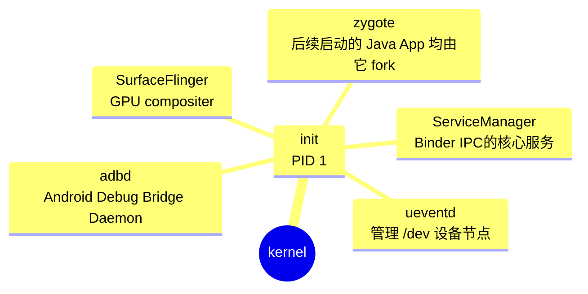

# 1 号进程 - init

在 Android 系统中， 1 号进程 (PID 1) 是 **init** 进程。它是系统启动后由 Linux 内核直接创建的第一个用户空间进程，负责初始化系统环境并启动关键服务。

# Apex - Android Pony EXpress

**Apex** 是 Android 10 引入的容器格式，用于在系统启动早期安装或加载不适用 APK 安装的底层组件，如 Native Service, HAL, ART 等。

# Zygote
