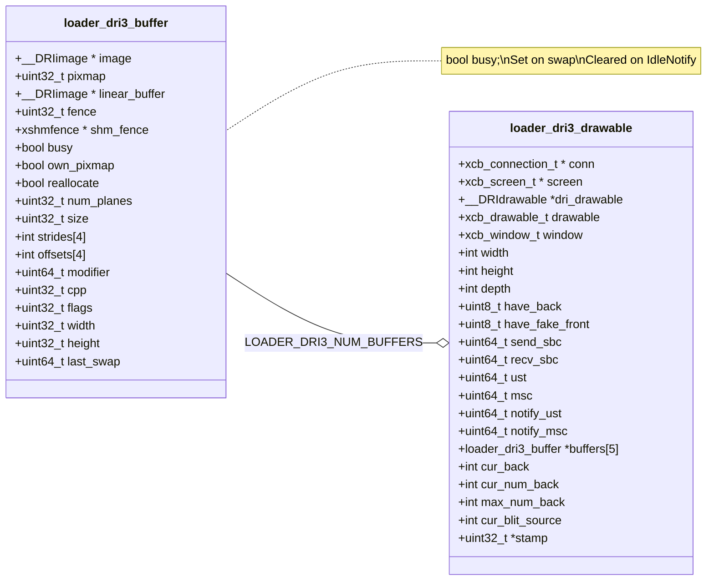
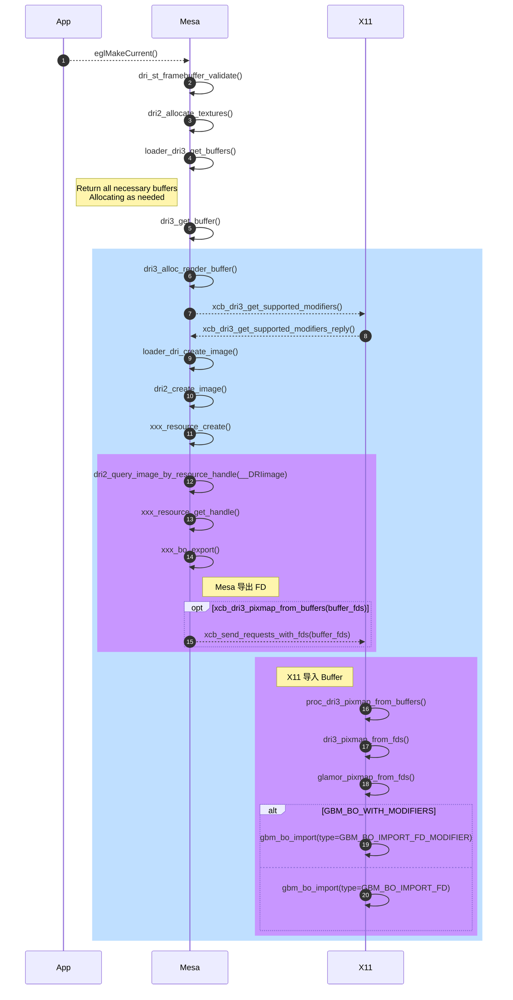
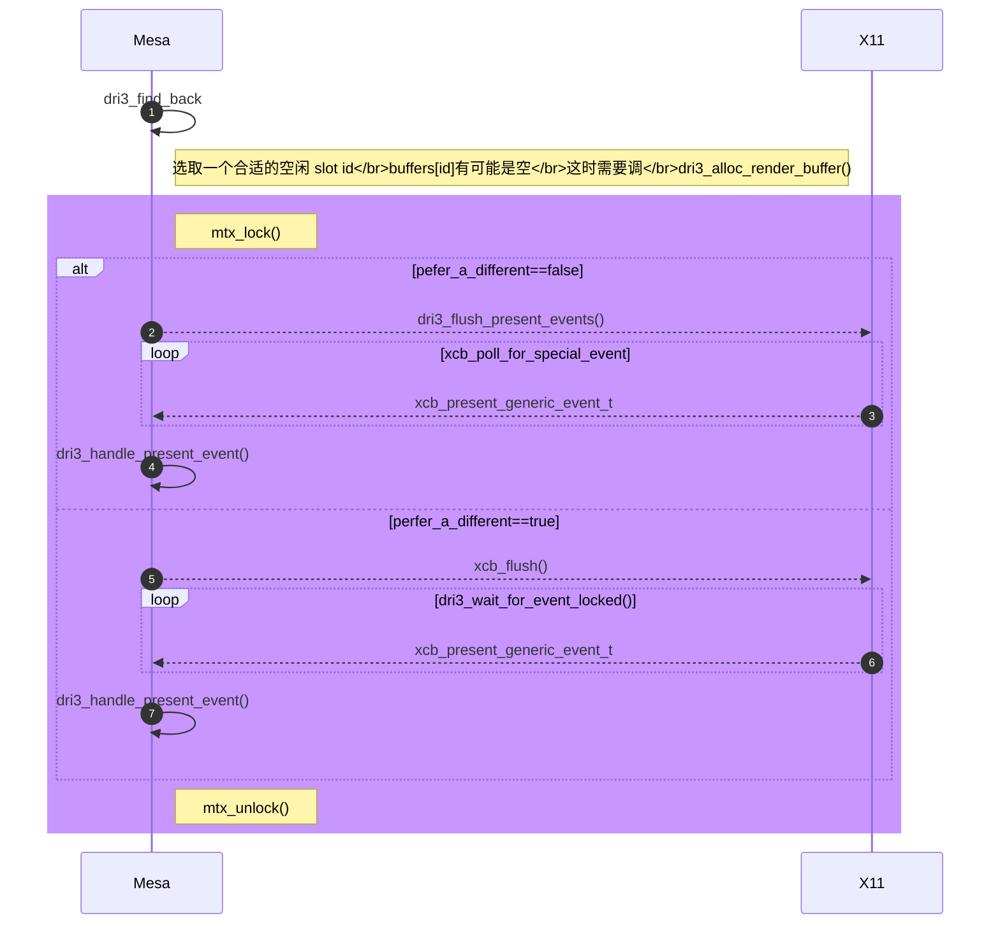
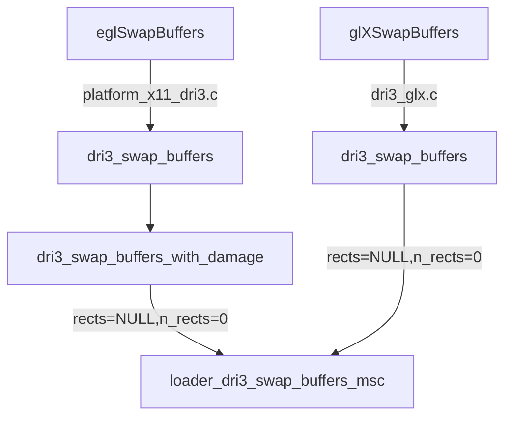

[`mesa/src/loader/loader_dri3_helper.c::dri3_alloc_render_buffer()`](https://gitlab.freedesktop.org/mesa/mesa/-/blob/main/src/loader_dri3/loader_dri3_helper.c#L1435), 这个函数不长，但却涉及到了DRI框架的许多重要概念，buffer共享(DMABUF), GPU offload (PRIME), buffer同步(X client和server)，送显(present), modifiers等等，所以非常值得深入分析。

<!--more-->

# dri3_alloc_render_buffer

```c
static struct loader_dri3_buffer *
dri3_alloc_render_buffer(struct loader_dri3_drawable *draw,
                         unsigned int fourcc,
                         int width, int height, int depth);
```

`dri3_alloc_render_buffer()` 的任务是创建渲染 buffer (包括 front 或 back), 并向 X11 导出它们的 fd。驱动当然不是一下子把 `buffers[]` 数组填满， 它是"按需创建"， `buffers[]` 像是提供这么多 buffer slot, 当 slot 后面是一个空闲的 buffer, 那就将它返回，否则才真正创建。

## Drawable 和 Buffer

`struct loader_dri3_drawable` 和 `struct loader_dri3_buffer` 这两个结构体，一个作为 `dri3_alloc_render_buffer()` 的主要参数，一个作为它的返回值类型，可谓是了解 DRI3 扩展下的数据流的关键。



## 同步

- 当我们谈论 X client 和 server 之间的 Buffer 同步时是在说什么？

在DRI3扩展下, render buffer (BO作为GPU 的render target) 是一开始由X client (例如一个 3D App)创建的(可能不止一个), render buffer 创建好后随即会通过 __DRIimageExtension 的 `queryImage()` 查询到该buffer 的 FD (drmPrimeHandleToFD, 后面会将该 FD 传送给 X server), 而在 X 的 compositor, 拿到 GPU 的渲染结果实际上就是通过该 FD (drmPrimeFDToHandle) 将 render buffer `gbm_bo_import()` 到 X server 进程, 并创建X 的 Pixmap (Pixmap 的Backing BO就是当初App进程创建的)后读取渲染结果进行合成。

该过程通过 X client 和 server 进程间的 buffer 共享实现了 render buffer 的零拷贝。
而同步问题也在这个过程中产生，当 render buffer 被 server 进程导入后用于合成时，渲染结果什么时候被读取完毕(render buffer IDLE 状态)，需要告知client 进程(client不能在上一帧数据未读取完毕前同时再渲染到同一个render buffer)。同样client 也须在 server 读取当前帧之前告知server 渲染是否已经完成。

这样 X client 和 server 之间的buffer 同步问题就产生了。

- [xshmfence mapping to X SyncFence](https://gitlab.freedesktop.org/xorg/lib/libxshmfence)
    - [`xshmfence_alloc_shm()`](https://gitlab.freedesktop.org/xorg/lib/libxshmfence/-/blob/master/src/xshmfence_alloc.c?ref_type=heads#L69) 通过`memfd_create()/shm_open()/open()` 之一系统调用返回一个共享内存文件描述符(fence_fd)
    - [`xshmfence_map_shm(fence_fd)`](https://gitlab.freedesktop.org/xorg/lib/libxshmfence/-/blob/master/src/xshmfence_alloc.c?ref_type=heads#L128) 通过 `mmap()` fence_fd 返回一个指向 struct xshmfence 的地址
    - [`xcb_dri3_fence_from_fd()`](https://gist.github.com/lucmann/2a6e24338cdae55ac359af3d25ddf2da#file-dri3-c-L377) 将这个 xshmfence 的 fence_fd 发送给 X server, 让其知道这个xshmfence 的存在

以上3步实际上是利用4个字节(`sizeof(struct xshmfence)`)大小的共享内存在X server 和 client 进程间通过原子操作和 futex 系统调用达到两个进程对 render buffer 的同步访问。

(以上4个字节共享内存的结论是基于futex和原子操作实现的 xshmfence 的版本)

由于client 创建的render buffer 是与 X server 共享的，所以这个 render buffer 被两个进程读写时须要同步，Mesa3D 中是使用 xshmfence 来完成这个需求的。xshmfence 顾名思义它是基于共享内存的，采用它实现进程间对 render buffer 操作的同步，好处就是只需要将 xshmfence 映射到一个 X server SyncFence, 通过一个简单的函数调用([xshmfence_await(struct xshmfence *f)](https://gitlab.freedesktop.org/xorg/lib/libxshmfence/-/blob/master/src/xshmfence_futex.c?ref_type=heads#L60))就可将调用进程(client process)阻塞直到 X server 完成对 render buffer的操作再被操作系统唤醒，而无需通过接收网络事件(socket event)来确定X server 是否已经完成对 render buffer 的使用。

## 导入/导出

render buffer 的导入/导出操作是Linux 下[Buffer 共享和同步](https://www.kernel.org/doc/html/latest/driver-api/dma-buf.html)的一个标准流程，不仅仅是在 DRM 子系统使用，在Linux的其它子系统也广泛使用，如Video4Linux, Networking。这里仅仅将 mesa 中的实现与DMABUF 机制中的角色对应一下，作为一个DMABUF的应用案例分析。

- 导出(exporter·mesa)
     - [`image->queryImage(image, __DRI_IMAGE_ATTRIB_FD, &buffer_fds[i])`](https://gitlab.freedesktop.org/mesa/mesa/-/blob/main/src/loader_dri3/loader_dri3_helper.c#L1602)
        - [`dri2_query_image(image, attrib, *value)`](https://gitlab.freedesktop.org/mesa/mesa/-/blob/main/src/gallium/frontends/dri/dri2.c#L1476)
            - [`dri2_query_image_by_resource_handle(image, attrib, *value)`](https://gitlab.freedesktop.org/mesa/mesa/-/blob/main/src/gallium/frontends/dri/dri2.c#L1350)
                - [`pipe_screen->resource_get_handle(pscreen, NULL, image->texture, &whandle, usage)`](https://gitlab.freedesktop.org/mesa/mesa/-/blob/main/src/gallium/drivers/r600/r600_texture.c#L556)
                    - [`radeon_winsys_bo_get_handle(rws, buffer, *whandle)`](https://gitlab.freedesktop.org/mesa/mesa/-/blob/main/src/gallium/winsys/radeon/drm/radeon_drm_bo.c#L1331)
                        - drmPrimeHandleToFD()

    (以上调到pipe_screen后以AMD Radeon驱动为例)

- 传送(FD transfer·xcb)

    ```c
    static const xcb_protocol_request_t xcb_req = {
        .count = 2,
        .ext = &xcb_dri3_id,
        .opcode = XCB_DRI3_PIXMAP_FROM_BUFFERS,
        .isvoid = 1
    };
    ```

    - [`xcb_dri3_pixmap_from_buffers()`](https://gist.github.com/lucmann/2a6e24338cdae55ac359af3d25ddf2da#file-dri3-c-L676)
        - [`xcb_send_request_with_fds()`](https://gitlab.freedesktop.org/xorg/lib/libxcb/-/blob/master/src/xcb_out.c#L225)
            - [`send_fds(xcb_connection_t *, fds, num_fds)`](https://gitlab.freedesktop.org/xorg/lib/libxcb/-/blob/master/src/xcb_out.c#L190)

- 导入(importer·xserver)
    - [`proc_dri3_pixmap_from_buffers(ClientPtr client)`](https://gitlab.freedesktop.org/xorg/xserver/-/blob/master/dri3/dri3_request.c#L490)
        - [`dri3_pixmap_from_fds()`](https://gitlab.freedesktop.org/xorg/xserver/-/blob/master/dri3/dri3_screen.c#L63)
            - [`glamor_pixmap_from_fds()`](https://gitlab.freedesktop.org/xorg/xserver/-/blob/master/glamor/glamor_egl.c#L612)
                - [`gbm_bo_import(gbm_device *, GBM_BO_IMPORT_FD_MODIFIER, &import_data, 0)` (libgbm.so)](https://gitlab.freedesktop.org/mesa/mesa/-/blob/main/src/gbm/main/gbm.c#L583)
                    - [`image->createImageFromDmaBufs()` (libgbm.so)](https://gitlab.freedesktop.org/mesa/mesa/-/blob/main/src/gbm/backends/dri/gbm_dri.c#L801)

    (不难看出如果驱动支持DRI3, 则有以下依赖关系 **Xserver->Glamor->GBM**)

- mesa dri3 render buffer (DMABUF) Sharing



- 所有情况都是 **Mesa 创建导出，X11 导入**吗? 

`eglCreatePbufferSurface()` 是个例外，实际上 PBuffer 是离屏渲染使用的，它是由 X11 创建 buffer, X11 导出 FD, Mesa (应用进程) 导入作为伪前缓冲 (fake front buffer) 使用。

通常 `eglCreate***Surface()` 需要 App 先调用 `XCreateWindow()` 让 X11 创建 Pixmap, 但是 `eglCreatePbufferSurface()` 不用，它由 Mesa 调用 `xcb_create_pixmap()` 让 X11 创建 Pixmap, 之后 Mesa 再调用 `xcb_dri3_buffers_from_pixmap()` 让 X11 导出 Pixmap(gbm_bo) 关联的 FD, 由 Mesa 导入。


    autonumber
    participant App
    participant Mesa
    participant X11

    App-->>Mesa: eglCreatePbufferSurface()
    rect rgb(191, 223, 255)
    Mesa->>Mesa: dri3_create_surface(type=EGL_PBUFFER_BIT)
    Mesa-->>X11: xcb_generate_id()
    X11-->>Mesa: drawable ID (uint32_t)
    Mesa-->>X11: xcb_create_pixmap()
    App-->>Mesa: eglBindTexImage()
    Mesa->>Mesa: dri_st_framebuffer_validate()
    Mesa->>Mesa: dri2_allocate_textures()
    Mesa->>Mesa: loader_dri3_get_buffers()
    Mesa->>Mesa: dri3_get_pixmap_buffer()
    rect rgb(200, 150, 255)
    note left of X11: X11 导出 FD</br>(调用 gbm_bo_get_fd(gbm_bo*))
    Mesa-->>X11: xcb_dri3_buffers_from_pixmap()
    X11-->>Mesa: xcb_dri3_buffers_from_pixmap_reply()
    Mesa-->>X11: loader_dri3_create_image_from_buffers()
    X11-->>Mesa: xcb_dri3_buffers_from_pixmap_reply_fds()
    end
    rect rgb(200, 150, 255)
    note left of Mesa: Mesa 导入 Buffer
    Mesa->>Mesa: dri2_from_dma_bufs2()
    Mesa->>Mesa: dri2_create_image_from_fd()
    Mesa->>Mesa: dri2_create_image_from_winsys()
    Mesa->>Mesa: xxx_resource_from_handle()
    Mesa->>Mesa: xxx_bo_import()
    end
    end


# dri3_find_back

```c
/**
 * Find an idle back buffer. If there isn't one, then
 * wait for a present IdleNotify event from the X server
 */
static int
dri3_find_back(struct loader_dri3_drawable *draw,
               bool prefer_a_different);
```

`dri3_find_back()` 的任务是查找 `buffers[]` 中空闲 buffer 的 slot (array index), 如果存在，返回其 index, 否则等待 (`dri3_wait_for_event_locked()`)

如何知道 buffer 是否空闲呢？ `buffer->busy`, 这个标志在 SwapBuffers 时会置为 true, mesa 收到 IdleNotify 事件后置为 false



# loader_dri3_swap_buffers_msc

```c
/**
 * Make the current back buffer visible using the present extension
 */
int64_t
loader_dri3_swap_buffers_msc(struct loader_dri3_drawable *draw,
                             int64_t target_msc, int64_t divisor, int64_t remainder,
                             unsigned flush_flags,
                             const int *rects, int n_rects,
                             bool force_copy);
```



## 送显

如果平台的窗口系统(Winsys)是X11, 则送显主要是通过 Present 扩展完成的。这个与Xserver 的交互过程是通过 [`present_event`](https://gitlab.freedesktop.org/xorg/xserver/-/blob/master/present/present_priv.h#L226) 完成的

```c
typedef struct present_event {
    present_event_ptr next;
    ClientPtr client;
    WindowPtr window;
    XID id;
    int mask;
} present_event_rec;
```

- 注册事件
    - [`dri3_setup_present_event(struct loader_dri3_drawable *draw)`](https://gitlab.freedesktop.org/mesa/mesa/-/blob/main/src/loader_dri3/loader_dri3_helper.c#L1709)
        - [`xcb_present_select_input()`](https://gist.github.com/lucmann/2a6e24338cdae55ac359af3d25ddf2da#file-present-c-L398): 告诉Xserver，client 正在监听这几个事件:
            - XCB_PRESENT_EVENT_CONFIGURE_NOTIFY
            - XCB_PRESENT_EVENT_COMPLETE_NOTIFY
            - XCB_PRESENT_EVENT_IDLE_NOTIFY

        (注册时实际上是使用对应事件的 MASK 注册的，因为在向 Xserver 发送的注册消息中，注册的所有消息的MASK ORing 在一个 uint32_t [`event_mask`](https://gist.github.com/lucmann/2a6e24338cdae55ac359af3d25ddf2da#file-present-c-L416)发送过去的)

- 接收事件
    - [`dri3_setup_present_event(struct loader_dri3_drawable *draw)`](https://gitlab.freedesktop.org/mesa/mesa/-/blob/main/src/loader_dri3/loader_dri3_helper.c#L1699)
        - [`xcb_register_for_special_xge()`](https://gitlab.freedesktop.org/mesa/mesa/-/blob/main/src/loader_dri3/loader_dri3_helper.c#L1779): 创建一个接收Present XGE 事件的队列，实质上是初始化了一个 pthread_cond_t。（这里 special 就special在它是一个带了条件变量的 generic events 的队列)
            ```c
            struct xcb_special_event {
                struct xcb_special_event *next;
                uint8_t     extension;
                uint32_t    eid;
                uint32_t    *stamp;

                struct event_list *events;
                struct event_list **events_tail;

                pthread_cond_t special_event_cond;
            };
            ```

    (XGE指 [X Generic Event extension](https://www.x.org/wiki/Development/Documentation/XGE/))

- 处理事件
    - [`dri3_flush_present_events(struct loader_dri3_drawable *draw)`](https://gitlab.freedesktop.org/mesa/mesa/-/blob/main/src/loader_dri3/loader_dri3_helper.c#L987)
        - [`xcb_poll_for_special_event()`](https://gitlab.freedesktop.org/xorg/lib/libxcb/-/blob/master/src/xcb_in.c#L787)
        - [`dri3_handle_present_event(draw, ge)`](https://gitlab.freedesktop.org/mesa/mesa/-/blob/main/src/loader_dri3/loader_dri3_helper.c#L483): 处理一个 X generic event

- 等待事件 (阻塞式)
    - [`loader_dri3_wait_for_msc()`](https://gitlab.freedesktop.org/mesa/mesa/-/blob/main/src/loader_dri3/loader_dri3_helper.c#L611): (阻塞)等待X Server 管理的 MSC 大于等于当前应用的 MSC (target_msc)
        - [`dri3_wait_for_event_locked(draw, &full_sequence)`](https://gitlab.freedesktop.org/mesa/mesa/-/blob/main/src/loader_dri3/loader_dri3_helper.c#L572)
            - [`xcb_wait_for_special_event(draw->conn, draw->special_event)`](https://gitlab.freedesktop.org/xorg/lib/libxcb/-/blob/master/src/xcb_in.c#L806)
            - [`dri3_handle_present_event(draw, ge)`](https://gitlab.freedesktop.org/mesa/mesa/-/blob/main/src/loader_dri3/loader_dri3_helper.c#L483): 处理一个 X generic event
    - [`loader_dri3_wait_for_sbc()`](https://gitlab.freedesktop.org/mesa/mesa/-/blob/main/src/loader_dri3/loader_dri3_helper.c#L649): (阻塞)等待SBC 大于等于当前应用的 SBC (target_sbc)
        - [`dri3_wait_for_event_locked(draw, NULL)`](https://gitlab.freedesktop.org/mesa/mesa/-/blob/main/src/loader_dri3/loader_dri3_helper.c#L572)
            - [`xcb_wait_for_special_event(draw->conn, draw->special_event)`](https://gitlab.freedesktop.org/xorg/lib/libxcb/-/blob/master/src/xcb_in.c#L806)
            - [`dri3_handle_present_event(draw, ge)`](https://gitlab.freedesktop.org/mesa/mesa/-/blob/main/src/loader_dri3/loader_dri3_helper.c#L483): 处理一个 X generic event


以上无论是 `loader_dri3_wait_for_msc()` 还是 `loader_dri3_wait_for_sbc()`, 当所等待的条件满足后，都会更新(`dri3_handle_present_event()`)当前client 的状态(UST, MSC, SBC), 整个过程是一种同步，也是一种协商。

# Modifiers

向 X server 查询并获取显示/渲染设备所支持的 modifiers 是执行 [`__DRIimageExtension::createImage()`](https://gitlab.freedesktop.org/mesa/mesa/-/blob/main/src/gallium/include/mesa_interface.h#L1570) 的一个准备工作。但 `createImage()` 允许modifiers 为空，此情况下让驱动来选一个合适的纹理图像内存布局。

```c
__DRIimage *
(*createImage)(__DRIscreen *screen,
               int width, int height, int format,
               const uint64_t *modifiers, const unsigned int modifier_count,
               unsigned int use,
               void *loaderPrivate);
```

与 X server 交互的过程包括 3 步:

- [`xcb_dri3_get_supported_modifiers(draw->conn, draw->window, depth, buffer->cpp*8)`](https://gist.github.com/lucmann/2a6e24338cdae55ac359af3d25ddf2da#file-dri3-c-L496): 返回一个 cookie
- [`xcb_dri3_get_supported_modifiers_reply(draw->conn, mod_cookie, &error)`](https://gist.github.com/lucmann/2a6e24338cdae55ac359af3d25ddf2da#file-dri3-c-L604): 返回一个 reply 包含实际的modifiers内容
    - `xcb_dri3_get_supported_modifiers_reply_t`
    ```c
    typedef struct xcb_dri3_get_supported_modifiers_reply_t {
        uint8_t response_type;
        uint8_t pad0;
        uint16_t sequence;
        uint32_t length;
        uint32_t num_window_modifiers;
        uint32_t num_screen_modifiers;
        uint8_t pad1[16];
    } xcb_dri3_get_supported_modifiers_reply_t;
    ```
    - [`proc_dri3_get_supported_modifiers(ClientPtr client)`](https://gitlab.freedesktop.org/xorg/xserver/-/blob/master/dri3/dri3_request.c#L394)
        - [`dri3_get_supported_modifiers()`](https://gitlab.freedesktop.org/xorg/xserver/-/blob/master/dri3/dri3_screen.c#L236): 通过 `drm_format_for_depth(depth, bpp)` 获得一个 `DRM_FORMAT_*`, 实际上[`drm_format_for_depth()`](https://gitlab.freedesktop.org/xorg/xserver/-/blob/master/dri3/dri3.c#L117) 返回的 `format` 也只会是以下4种之一:
            ```c
            DRM_FORMAT_RGB565       // bpp = 16
            DRM_FORMAT_XRGB8888     // bpp = 24
            DRM_FORMAT_XRGB2101010  // bpp = 30
            DRM_FORMAT_ARGB8888     // bpp = 32
            ```

            无论是获取 screen_modifiers 还是 window_modifiers, 实际上都依据 format 获取相应的 modifiers.
            - [`glamor_get_drawable_modifiers(DrawablePtr draw, uint32_t format, uint32_t *num_modifiers, uint64_t **modifiers)`](https://gitlab.freedesktop.org/xorg/xserver/-/blob/master/glamor/glamor.c#L1003): 回调由具体的DDX(如modesetting)提供的 `get_drawable_modifiers()` 函数
                - [`get_drawable_modifiers(DrawablePtr draw, uint32_t format, uint32_t *num_modifiers, uint64_t **modifiers)`](https://gitlab.freedesktop.org/xorg/xserver/-/blob/master/hw/xfree86/drivers/modesetting/drmmode_display.c#L230)
- [`xcb_dri3_get_supported_modifiers_window_modifiers(mod_reply)`](https://gist.github.com/lucmann/2a6e24338cdae55ac359af3d25ddf2da#file-dri3-c-L558)
    - [`xcb_dri3_get_supported_modifiers_screen_modifiers(mod_reply)`](https://gist.github.com/lucmann/2a6e24338cdae55ac359af3d25ddf2da#file-dri3-c-L580): 如果获取window_modifiers 失败则fallback 到screen_modifiers

# 参考
- MSC: Graphics Media Stream Counter, 实际上就是CRTC 的Vblank中断次数 [(GLX_OML_sync_control)](https://registry.khronos.org/OpenGL/extensions/OML/GLX_OML_sync_control.txt)
- SBC: Swap Buffer Counter, 就是Swapbuffer 的次数 [(GLX_EXT_swap_control)](https://registry.khronos.org/OpenGL/extensions/EXT/EXT_swap_control.txt)