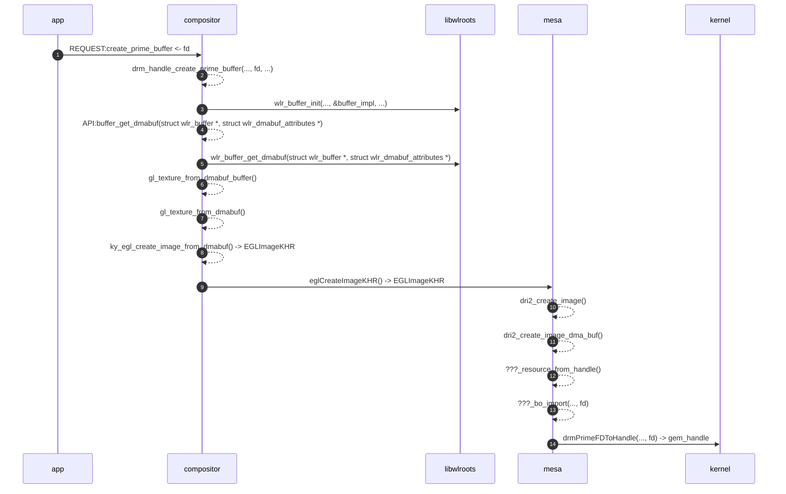

# Overview
EGLImage的存在是为了更方便地在EGL client API之间共享2D Image Data. 那什么是EGL client API呢？OpenGL, OpenGL ES, OpenVG都是EGL client API. EGLImage与下面3个EGL Extensions有关:
- EGL_KHR_image
- EGL_KHR_image_base
- EGL_KHR_image_pixmap

<!--more-->

后两个扩展其实是从第一个开离出来的。涉及EGLImage新增的Token和API都是在后两个扩展里定义的。

# EGL_KHR_image_base
它定义了一个新的Opaque类型EGLImageKHR
```c
typedef void * EGLImageKHR;
```

两者它定义了2个新API
```c
EGLImageKHR eglCreateImageKHR(
EGLDisplay dpy,
EGLContext ctx,
EGLenum target,
EGLClientBuffer buffer,
const EGLint *attrib_list
);

EGLBoolean eglDestroyImageKHR(
EGLDisplay dpy,
EGLImageKHR image
);
```

其中，EGLClientBuffer也是Opaque类型
```c
typedef void * EGLClientBuffer;
```

eglCreateImageKHR可以接受的target的值有:

| target                             | Notes                                             |
|:-----------------------------------|:--------------------------------------------------|
| EGL_GL_TEXTURE_2D                  | Used for GL 2D texture images                     |
| EGL_GL_TEXTURE_CUBE_MAP_POSITIVE_X | Used for the +X face of GL cubemap texture images |
| EGL_GL_TEXTURE_CUBE_MAP_NEGATIVE_X | Used for the -X face of GL cubemap texture images |
| EGL_GL_TEXTURE_CUBE_MAP_POSITIVE_Y | Used for the +Y face of GL cubemap texture images |
| EGL_GL_TEXTURE_CUBE_MAP_NEGATIVE_Y | Used for the -Y face of GL cubemap texture images |
| EGL_GL_TEXTURE_CUBE_MAP_POSITIVE_Z | Used for the +Z face of GL cubemap texture images |
| EGL_GL_TEXTURE_CUBE_MAP_NEGATIVE_Z | Used for the -Z face of GL cubemap texture images |
| EGL_GL_TEXTURE_3D                  | Used for GL 3D texture images                     |
| EGL_GL_RENDERBUFFER                | Used for GL renderbuffer images                   |
| EGL_NATIVE_PIXMAP_KHR              | Used for X11 Pixmap (added EGL_KHR_image_pixmap)  |

## EGLImageKHR in [kylin-wlcom](https://gitee.com/openkylin/kylin-wayland-compositor)



# EGL_KHR_image_pixmap
