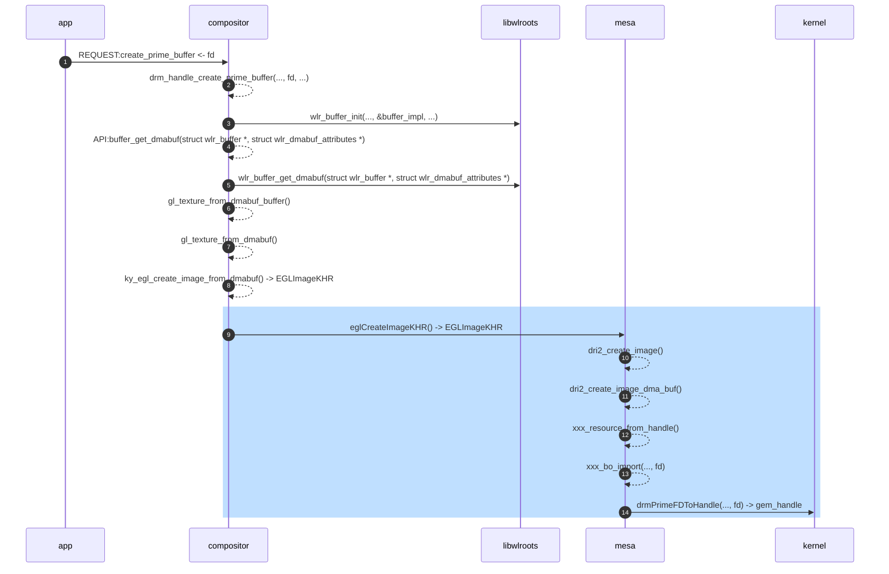

# Overview
EGLImage的存在是为了更方便地在EGL client API之间共享2D Image Data. 那什么是EGL client API呢？OpenGL, OpenGL ES, OpenVG都是EGL client API. EGLImage与下面3个EGL Extensions有关:
- EGL_KHR_image
- EGL_KHR_image_base
- EGL_KHR_image_pixmap

<!--more-->

后两个扩展其实是从第一个开离出来的。涉及EGLImage新增的Token和API都是在后两个扩展里定义的。

# EGL_KHR_image_base
它定义了一个新的Opaque类型EGLImageKHR
```c
typedef void * EGLImageKHR;
```

两者它定义了2个新API
```c
EGLImageKHR eglCreateImageKHR(
EGLDisplay dpy,
EGLContext ctx,
EGLenum target,
EGLClientBuffer buffer,
const EGLint *attrib_list
);

EGLBoolean eglDestroyImageKHR(
EGLDisplay dpy,
EGLImageKHR image
);
```

其中，EGLClientBuffer也是Opaque类型
```c
typedef void * EGLClientBuffer;
```

- `eglCreateImageKHR()` 接受的 **targets**:

| target                             | Notes                                             |
|:-----------------------------------|:--------------------------------------------------|
| EGL_GL_TEXTURE_2D                  | Used for GL 2D texture images                     |
| EGL_GL_TEXTURE_CUBE_MAP_POSITIVE_X | Used for the +X face of GL cubemap texture images |
| EGL_GL_TEXTURE_CUBE_MAP_NEGATIVE_X | Used for the -X face of GL cubemap texture images |
| EGL_GL_TEXTURE_CUBE_MAP_POSITIVE_Y | Used for the +Y face of GL cubemap texture images |
| EGL_GL_TEXTURE_CUBE_MAP_NEGATIVE_Y | Used for the -Y face of GL cubemap texture images |
| EGL_GL_TEXTURE_CUBE_MAP_POSITIVE_Z | Used for the +Z face of GL cubemap texture images |
| EGL_GL_TEXTURE_CUBE_MAP_NEGATIVE_Z | Used for the -Z face of GL cubemap texture images |
| EGL_GL_TEXTURE_3D                  | Used for GL 3D texture images                     |
| EGL_GL_RENDERBUFFER                | Used for GL renderbuffer images                   |
| EGL_NATIVE_PIXMAP_KHR              | Used for X11 Pixmap (added EGL_KHR_image_pixmap)  |

- `eglCreateImageKHR()` 接受的 **attributes**:

| attribute                          | Notes                                             |
|:-----------------------------------|:--------------------------------------------------|
| EGL_WIDTH                          |                                                   |
| EGL_HEIGHT                         |                                                   |
| EGL_LINUX_DRM_FOURCC_EXT           |                                                   |
| EGL_DMA_BUF_PLANE0_FD_EXT          |                 0x3272                            |
| EGL_DMA_BUF_PLANE0_OFFSET_EXT      |                 0x3273                            |
| EGL_DMA_BUF_PLANE0_PITCH_EXT       |                 0x3274                            |
| EGL_DMA_BUF_PLANE1_FD_EXT          |                 0x3275                            |
| EGL_DMA_BUF_PLANE1_OFFSET_EXT      |                 0x3276                            |
| EGL_DMA_BUF_PLANE1_PITCH_EXT       |                 0x3277                            |
| EGL_DMA_BUF_PLANE2_FD_EXT          |                 0x3278                            |
| EGL_DMA_BUF_PLANE2_OFFSET_EXT      |                 0x3279                            |
| EGL_DMA_BUF_PLANE2_PITCH_EXT       |                 0x327A                            |

- `eglDestroyImageKHR()`


## EGLImageKHR in [kylin-wlcom](https://gitee.com/openkylin/kylin-wayland-compositor)



# EGL_KHR_image_pixmap


# [GL_OES_EGL_image](https://docs.imgtec.com/reference-manuals/open-gl-es-extensions/html/topics/GL_OES_EGL/image.html)

通过 **EGLImage** 允许在上下文之间，API 之间 (如 OpenGL ES 与 Vulkan) 共享纹理数据。但需要纹理的 format/type 要被 OpenGL ES 支持，不支持的那些要走 [GL_OES_EGL_image_external](https://docs.imgtec.com/reference-manuals/open-gl-es-extensions/html/topics/GL_OES_EGL/image-external.html), 因为 format/type 不是 OpenGL ES 原生支持，所以这个扩展相比 GL_OES_EGL_image 多了几个**限制**

- 不能在这些纹理对象上调用 `gl*Tex*Image*2D()` 和 `glGenerateMipmap()` 函数改变原本的存储内容(原因是这些导入进来的不被支持的格式可能依赖特定的硬件特性，所以不允许导入者修改它们)
- 纹理目前只能绑定 `GL_TEXTURE_EXTERNAL_OES`, 而不是 GL_TEXTURE_2D， GL_TEXTURE_3D 等
- 纹理采样时只允许使用 `GL_CLAMP_TO_EDGE` 这一个 wrap mode
- 纹理采样时会隐式地将任何格式转换成线性 RGB
