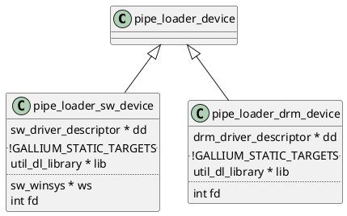

# Gallium Framework

## `-Dgallium-drivers` 与 `-Ddri-drivers` 的区别，以及它们与 `-Degl` 的关系 

从构建的角度看， `-Dgallium-drivers` 与 `-Ddri-drivers` 是无关的。

```
        DRI platform:    drm
        DRI drivers:     no
        DRI driver dir:  /usr/lib/x86_64-linux-gnu/dri
```

```
        EGL:             yes
        EGL drivers:     builtin:egl_dri2 builtin:egl_dri3
        EGL/Vulkan/VL platforms:   x11 surfaceless drm xcb
```

```
        Gallium drivers: swrast panfrost
        Gallium st:      mesa
        HUD lmsensors:   no
```

```
build/src/gallium/targets/dri/libgallium_dri.so
build/src/gallium/targets/dri/8381c20@@gallium_dri@sha/target.c.o
build/src/gallium/targets/dri/8381c20@@gallium_dri@sha/megadriver_stub.c.o
```



