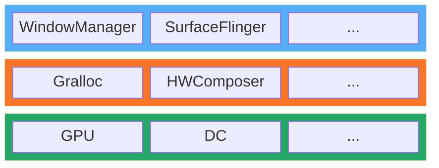

# [Android Stack](https://source.android.com/docs/core/architecture?hl=zh-cn)

<!--more-->

# Android Graphics Stack

# SurfaceFlinger (`/f'lɪngər/`:抛投器)

# [HAL](https://android.googlesource.com/platform/hardware/libhardware/)

## [Gralloc](https://android.googlesource.com/platform/hardware/libhardware/+/refs/heads/main/modules/gralloc/)

## [HWComposer](https://android.googlesource.com/platform/hardware/libhardware/+/refs/heads/main/modules/hwcomposer/)

# References
- [Andorid 文档：实现硬件混合渲染器 HAL](https://source.android.com/docs/core/graphics/implement-hwc?hl=zh-cn)
