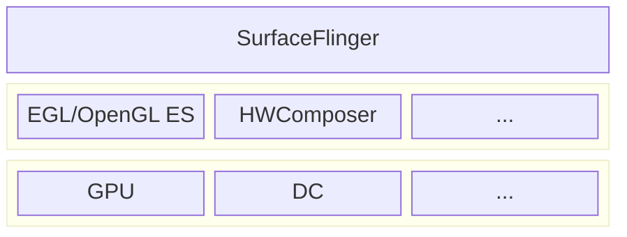

```mermaid
block-beta
  columns 3
  A["SurfaceFlinger"]:3
  block:group1:3
    %% columns auto (default)   
    a["EGL/OpenGL ES"]
    b["HWComposer"]
    c["..."]
  end
  block:group2:3
    a1["GPU"]
    b1["DC"]
    c1["..."]
  end
```

<!--more-->

# References
- [Andorid 文档：实现硬件混合渲染器 HAL](https://source.android.com/docs/core/graphics/implement-hwc?hl=zh-cn)
