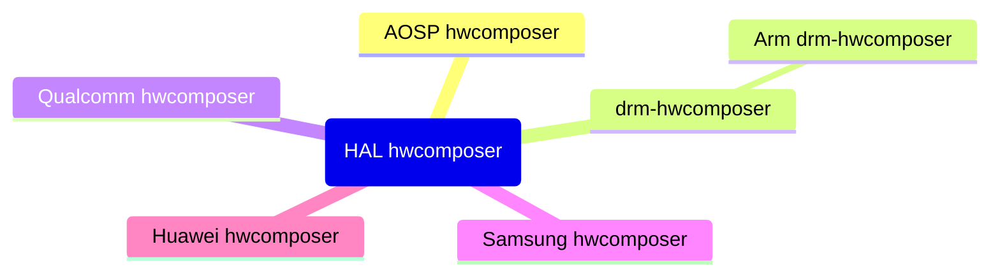

<!--more-->

# [Android Stack](https://source.android.com/docs/core/architecture?hl=zh-cn)

# Android Graphics Stack

# SurfaceFlinger (`/f'lɪngər/`:抛投器)

# [HAL](https://android.googlesource.com/platform/hardware/libhardware/)

## [Gralloc](https://android.googlesource.com/platform/hardware/libhardware/+/refs/heads/main/modules/gralloc/)

## 硬件合成器

**硬件合成器**是 Android 系统中负责屏幕显示的硬件抽象层 (HAL) 组件之一。它负责将图形渲染的内容(比如应用程序界面，视频等)合成到帧缓冲里，以便高效地利用 DPU 加速，减少 GPU 合成的负担，从而整体上提供更流畅的图形渲染显示。

hwcomposer 组件通常是由各个设备厂商根据自己的硬件特性实现的，有开源的，也有闭源的。在 AOSP 中有一个通用的基础的 **hwcomposer** 实现，主要用于那些不需要特别硬件加速或优化的设备，类似 xserver 中的 **modesetting**.

## [HWComposer](https://android.googlesource.com/platform/hardware/libhardware/+/refs/heads/main/modules/hwcomposer/)

尽量让 GPU 少做合成的工作，让 DPU (Display Processor Unit) 多做合成的工作，因为合成涉及的操作主要有

- 格式转换
- 旋转缩放
- 像素拷贝

如果这些都占用 GPU 去做，太浪费 GPU 了。

### [drm-hwcomposer](https://gitlab.freedesktop.org/drm-hwcomposer/drm-hwcomposer)

一个基于 KMS 的 HWComposer 实现。

### [ARM drm-hwcomposer](https://github.com/ARM-software/drm-hwcomposer)

给 Mali DP 量身定制的 drm-hwcomposer.

# Android Sync Framework

Android Sync Framework 实现的是**显式同步 (Explicit Synchronization)**, 所谓显式同步，指的是用户态可见，与隐式同步 (Implicit Synchronization) 相对，隐式同步用户态应用程序是不感知的。虽然隐式同步完全由**驱动和内核控制**，无需应用程序干预(这对应用开发者来说可能更简单些，但有时简单的方案可能不是最高效的)，但[显式同步比隐式同步更能发挥硬件的并行性](https://www.collabora.com/news-and-blog/blog/2022/06/09/bridging-the-synchronization-gap-on-linux/)，这应该也是 Android 实现的是显式同步的主要原因。

- sync_timeline
  - control ordering
- sync_pt (point)
  - represent a fence
- sync_fence (like sync file in Linux kernel)
  - for fd passing across userspace processes like `SurfaceFlinger` and 3D applications

# References

- [Android Graphics](https://blog.csdn.net/liuning1985622/article/details/138453346?utm_medium=distribute.pc_relevant.none-task-blog-2~default~baidujs_baidulandingword~default-4-138453346-blog-45080305.235^v43^pc_blog_bottom_relevance_base6&spm=1001.2101.3001.4242.3&utm_relevant_index=6)
- [自上而下解读 Android 显示流程](https://zhuanlan.zhihu.com/p/261169653)
- [Android 文档：实现硬件混合渲染器 HAL](https://source.android.com/docs/core/graphics/implement-hwc?hl=zh-cn)
- [Android drm-hwcomposer](https://blog.csdn.net/stray2b/article/details/130291840)
- [Fence](https://blog.csdn.net/MoLiYw/article/details/118829051)
- [Android Sync](https://blog.linuxplumbersconf.org/2014/ocw/system/presentations/2355/original/03%20-%20sync%20&%20dma-fence.pdf)
- [Mainline Explicit Fencing](https://www.collabora.com/news-and-blog/blog/2016/09/13/mainline-explicit-fencing-part-1/)
- [Explicit Sync](https://zamundaaa.github.io/wayland/2024/04/05/explicit-sync.html)
