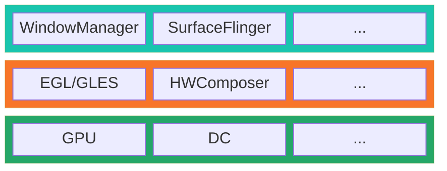

# [Android Stack](https://source.android.com/docs/core/architecture?hl=zh-cn)

<!--more-->

# References
- [Andorid 文档：实现硬件混合渲染器 HAL](https://source.android.com/docs/core/graphics/implement-hwc?hl=zh-cn)
