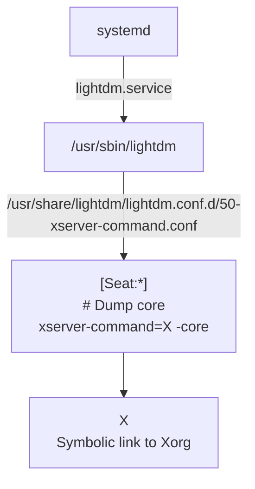

[Light Display Manager](https://wiki.archlinux.org/title/LightDM) 是一个轻量级的跨桌面环境的 Display Manager, 可以支持多种显示技术，如 X11, Mir, Wayland.

# Build

### Dependencies

- 开发包依赖
    * libpam0g-dev
    * libgcrypt20-dev
    * libglib2.0-dev
    * libxklavier-dev

- 构建工具依赖
    * intltool
    * yelp-tools
    * gtk-doc-tools 

- 安装

Lightdm 可执行程序路径 `/usr/sbin/lightdm`, 日志默认路径 `/var/log/lightdm/lightdm.log`. 所以构建时可以使用

* `--prefix` 指定安装路径 (默认 /usr/local)
* `--localstatedir` 指定日志路径 (默认 $prefix/var/log/lightdm)
* `--sysconfdir` 指定 `lightdm.conf` 路径 （默认 $prefix/etc/lightdm)

```
./autogen.sh --prefix=/usr --localstatedir=/var --sysconfdir=/etc --disable-tests
make -j $JOBS
sudo make install
```

# Graphics Boot-up


P.S. `lightdm --show-config` 可以显示与 lightdm 相关的配置
