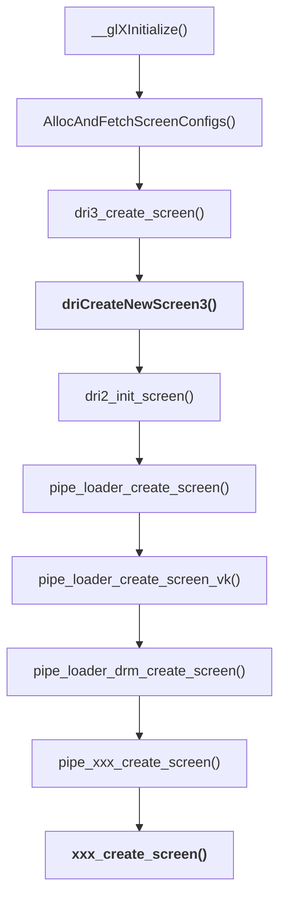
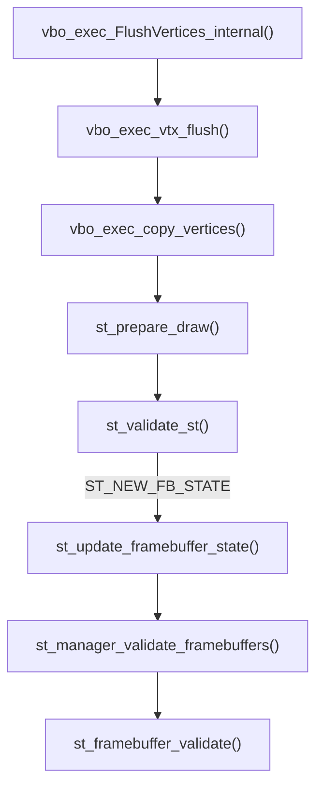

# Gallium Framework

引用[ Mesa3D 官方文档](https://docs.mesa3d.org/gallium/intro.html#what-is-gallium)的话，Gallium 本质上是一种应用程序接口，用于编写与设备基本无关的图形驱动程序。它提供了多个对象，以简单明了的方式封装了图形硬件的核心服务。据说，Gallium 的设计是借鉴了 DirectX。

<!--more-->

它提供的比较核心的对象，我觉得有

- `pipe_screen`
- `pipe_context`
- `pipe_resource`
- `pipe_surface`
- `pipe_framebuffer_state`

一开始看 Gallium 时，疑问为什么没有 *pipe_device*, 其实很简单，Gallium 这一套 API 之所以可以用来编写**与设备基本无关**的图形驱动程序，可能就是因为它没有抽象 device 这个数据结构。

Gallium 确实是一组 API, 因为 `pipe_screen` 里是一大堆函数, `pipe_context` 里也是一大堆函数。虽然 Gallium 没有定义 pipe_device, 但几乎与硬件设备相关的一切都包含在了 `pipe_screen`,  一个 `pipe_screen` 同时可以追踪多个 `pipe_context`, 每个 `pipe_context` 里都有一个指向它所在的 `pipe_screen` 的指针 (handle)。

当一个 Gallium 驱动初始化时，第一个调用的函数就是 `driCreateNewScreen3()`

```c
/**
 * This is the first entrypoint in the driver called by the DRI driver loader
 * after dlopen()ing it.
 *
 * It's used to create global state for the driver across contexts on the same
 * Display.
 */
__DRIscreen *
driCreateNewScreen3(int scrn, int fd,
                    const __DRIextension **loader_extensions,
                    enum dri_screen_type type,
                    const __DRIconfig ***driver_configs, bool driver_name_is_inferred,
                    bool has_multibuffer, void *data)
```



# State Tracker



`st_validate_st()` 可能会更新很多状态，像 `ST_NEW_FB_STATE` 如果 dirty, 那么就会调用 `st_update_framebuffer_state()` 函数。

- `grep -Po 'ST_STATE\(ST_.*?\)' src/mesa/state_tracker/st_atom_list.h | awk -F"[(,)]" '{printf "| %-26s | %-32s |\n", $2, $3}'`

| STATE                      |  HOOK                            |
|:---------------------------|:---------------------------------|
| ST_NEW_DSA                 |  st_update_depth_stencil_alpha   |
| ST_NEW_CLIP_STATE          |  st_update_clip                  |
| ST_NEW_FS_STATE            |  st_update_fp                    |
| ST_NEW_GS_STATE            |  st_update_gp                    |
| ST_NEW_TES_STATE           |  st_update_tep                   |
| ST_NEW_TCS_STATE           |  st_update_tcp                   |
| ST_NEW_VS_STATE            |  st_update_vp                    |
| ST_NEW_POLY_STIPPLE        |  st_update_polygon_stipple       |
| ST_NEW_WINDOW_RECTANGLES   |  st_update_window_rectangles     |
| ST_NEW_BLEND_COLOR         |  st_update_blend_color           |
| ST_NEW_VS_SAMPLER_VIEWS    |  st_update_vertex_textures       |
| ST_NEW_FS_SAMPLER_VIEWS    |  st_update_fragment_textures     |
| ST_NEW_GS_SAMPLER_VIEWS    |  st_update_geometry_textures     |
| ST_NEW_TCS_SAMPLER_VIEWS   |  st_update_tessctrl_textures     |
| ST_NEW_TES_SAMPLER_VIEWS   |  st_update_tesseval_textures     |
| ST_NEW_VS_SAMPLERS         |  st_update_vertex_samplers       |
| ST_NEW_TCS_SAMPLERS        |  st_update_tessctrl_samplers     |
| ST_NEW_TES_SAMPLERS        |  st_update_tesseval_samplers     |
| ST_NEW_GS_SAMPLERS         |  st_update_geometry_samplers     |
| ST_NEW_FS_SAMPLERS         |  st_update_fragment_samplers     |
| ST_NEW_VS_IMAGES           |  st_bind_vs_images               |
| ST_NEW_TCS_IMAGES          |  st_bind_tcs_images              |
| ST_NEW_TES_IMAGES          |  st_bind_tes_images              |
| ST_NEW_GS_IMAGES           |  st_bind_gs_images               |
| ST_NEW_FS_IMAGES           |  st_bind_fs_images               |
| ST_NEW_FB_STATE            |  st_update_framebuffer_state     |
| ST_NEW_BLEND               |  st_update_blend                 |
| ST_NEW_RASTERIZER          |  st_update_rasterizer            |
| ST_NEW_SAMPLE_STATE        |  st_update_sample_state          |
| ST_NEW_SAMPLE_SHADING      |  st_update_sample_shading        |
| ST_NEW_SCISSOR             |  st_update_scissor               |
| ST_NEW_VIEWPORT            |  st_update_viewport              |
| ST_NEW_VS_CONSTANTS        |  st_update_vs_constants          |
| ST_NEW_TCS_CONSTANTS       |  st_update_tcs_constants         |
| ST_NEW_TES_CONSTANTS       |  st_update_tes_constants         |
| ST_NEW_GS_CONSTANTS        |  st_update_gs_constants          |
| ST_NEW_FS_CONSTANTS        |  st_update_fs_constants          |
| ST_NEW_VS_UBOS             |  st_bind_vs_ubos                 |
| ST_NEW_TCS_UBOS            |  st_bind_tcs_ubos                |
| ST_NEW_TES_UBOS            |  st_bind_tes_ubos                |
| ST_NEW_FS_UBOS             |  st_bind_fs_ubos                 |
| ST_NEW_GS_UBOS             |  st_bind_gs_ubos                 |
| ST_NEW_VS_ATOMICS          |  st_bind_vs_atomics              |
| ST_NEW_TCS_ATOMICS         |  st_bind_tcs_atomics             |
| ST_NEW_TES_ATOMICS         |  st_bind_tes_atomics             |
| ST_NEW_FS_ATOMICS          |  st_bind_fs_atomics              |
| ST_NEW_GS_ATOMICS          |  st_bind_gs_atomics              |
| ST_NEW_VS_SSBOS            |  st_bind_vs_ssbos                |
| ST_NEW_TCS_SSBOS           |  st_bind_tcs_ssbos               |
| ST_NEW_TES_SSBOS           |  st_bind_tes_ssbos               |
| ST_NEW_FS_SSBOS            |  st_bind_fs_ssbos                |
| ST_NEW_GS_SSBOS            |  st_bind_gs_ssbos                |
| ST_NEW_PIXEL_TRANSFER      |  st_update_pixel_transfer        |
| ST_NEW_TESS_STATE          |  st_update_tess                  |
| ST_NEW_HW_ATOMICS          |  st_bind_hw_atomic_buffers       |
| ST_NEW_VERTEX_ARRAYS       |  st_update_array                 |
| ST_NEW_CS_STATE            |  st_update_cp                    |
| ST_NEW_CS_SAMPLER_VIEWS    |  st_update_compute_textures      |
| ST_NEW_CS_SAMPLERS         |  st_update_compute_samplers      |
| ST_NEW_CS_CONSTANTS        |  st_update_cs_constants          |
| ST_NEW_CS_UBOS             |  st_bind_cs_ubos                 |
| ST_NEW_CS_ATOMICS          |  st_bind_cs_atomics              |
| ST_NEW_CS_SSBOS            |  st_bind_cs_ssbos                |
| ST_NEW_CS_IMAGES           |  st_bind_cs_images               |

# Gallium API

## resource_copy_region

```c
   /**
    * Copy a block of pixels from one resource to another.
    * The resource must be of the same format.
    * Resources with nr_samples > 1 are not allowed.
    */
   void (*resource_copy_region)(struct pipe_context *pipe,
                                struct pipe_resource *dst,
                                unsigned dst_level,
                                unsigned dstx, unsigned dsty, unsigned dstz,
                                struct pipe_resource *src,
                                unsigned src_level,
                                const struct pipe_box *src_box);
```

resource_copy_region 只能在 buffer 与 buffer 之间或 texture 与 texture 之间 memcpy, 而且源与目标的 format 必须相同。之所以不能做 buffers 与 textures 之间的 memcpy, 至少是因为缺少 stride 参数。一些硬件(如 nvidia) 可以通过专门的 copy engine 完成这些拷贝，但对于其它硬件可能需要一个 compute shader 去做这些拷贝。另一方面，那些专门的 copy engine 通常是比较慢的，所以只在那些带宽非常有限的 PCIe 传输场景下才有用。如果想利用全部的
VRAM 带宽(甚至 infinity cache bandwidth), 你很可能必须使用 compute shaders.

# Gallium HUD

HUD (Head-up Display) 是 Gallium 一个用于观测图形应用的 fps, cpu 利用率等性能数据的内置功能，它有点像精简版的 [MangoHud](https://github.com/flightlessmango/MangoHud), 但它的方便在于集成在驱动内部，不管是普通的 Gallium 驱动，还是 Zink，它都可以使用。它的 mannual 可以通过环境变量 `GALLIUM_HUD=help` 看到

```
Syntax: GALLIUM_HUD=name1[+name2][...][:value1][,nameI...][;nameJ...]

  Names are identifiers of data sources which will be drawn as graphs
  in panes. Multiple graphs can be drawn in the same pane.
  There can be multiple panes placed in rows and columns.

  '+' separates names which will share a pane.
  ':[value]' specifies the initial maximum value of the Y axis
             for the given pane.
  ',' creates a new pane below the last one.
  ';' creates a new pane at the top of the next column.
  '=' followed by a string, changes the name of the last data source
      to that string

  Example: GALLIUM_HUD="cpu,fps;primitives-generated"

  Additionally, by prepending '.[identifier][value]' modifiers to
  a name, it is possible to explicitly set the location and size
  of a pane, along with limiting overall maximum value of the
  Y axis and activating dynamic readjustment of the Y axis.
  Several modifiers may be applied to the same pane simultaneously.

  'x[value]' sets the location of the pane on the x axis relative
             to the upper-left corner of the viewport, in pixels.
  'y[value]' sets the location of the pane on the y axis relative
             to the upper-left corner of the viewport, in pixels.
  'w[value]' sets width of the graph pixels.
  'h[value]' sets height of the graph in pixels.
  'c[value]' sets the ceiling of the value of the Y axis.
             If the graph needs to draw values higher than
             the ceiling allows, the value is clamped.
  'd' activates dynamic Y axis readjustment to set the value of
      the Y axis to match the highest value still visible in the graph.
  'r' resets the color counter (the next color will be green)
  's' sort items below graphs in descending order

  If 'c' and 'd' modifiers are used simultaneously, both are in effect:
  the Y axis does not go above the restriction imposed by 'c' while
  still adjusting the value of the Y axis down when appropriate.

  You can change behavior of the whole HUD by adding these options at
  the beginning of the environment variable:
  'simple,' disables all the fancy stuff and only draws text.

  Example: GALLIUM_HUD=".w256.h64.x1600.y520.d.c1000fps+cpu,.datom-count"

  Available names:
    stdout (prints the counters value to stdout)
    csv (prints the counter values to stdout as CSV, use + to separate names)
    fps
    frametime
    cpu
    cpu0
    cpu1
    cpu2
    cpu3
    cpu4
    cpu5
    cpu6
    cpu7
    cpu8
    cpu9
    cpu10
    cpu11
    samples-passed
    primitives-generated
    render-passes
```


