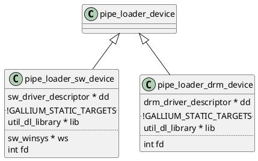

# Gallium Framework

## `-Dgallium-drivers` 与 `-Ddri-drivers` 的区别，以及它们与 `-Degl` 的关系 

从构建的角度看， `-Dgallium-drivers` 与 `-Ddri-drivers` 是无关的。

```
        DRI platform:    drm
        DRI drivers:     no
        DRI driver dir:  /usr/lib/x86_64-linux-gnu/dri
```

```
        EGL:             yes
        EGL drivers:     builtin:egl_dri2 builtin:egl_dri3
        EGL/Vulkan/VL platforms:   x11 surfaceless drm xcb
```

```
        Gallium drivers: swrast panfrost
        Gallium st:      mesa
        HUD lmsensors:   no
```

```
build/src/gallium/targets/dri/libgallium_dri.so
build/src/gallium/targets/dri/8381c20@@gallium_dri@sha/target.c.o
build/src/gallium/targets/dri/8381c20@@gallium_dri@sha/megadriver_stub.c.o
```



# resource_copy_region

```c
   /**
    * Copy a block of pixels from one resource to another.
    * The resource must be of the same format.
    * Resources with nr_samples > 1 are not allowed.
    */
   void (*resource_copy_region)(struct pipe_context *pipe,
                                struct pipe_resource *dst,
                                unsigned dst_level,
                                unsigned dstx, unsigned dsty, unsigned dstz,
                                struct pipe_resource *src,
                                unsigned src_level,
                                const struct pipe_box *src_box);
```

resource_copy_region 只能在 buffer 与 buffer 之间或 texture 与 texture 之间 memcpy, 而且源与目标的 format 必须相同。之所以不能做 buffers 与 textures 之间的 memcpy, 至少是因为缺少 stride 参数。一些硬件(如 nvidia) 可以通过专门的 copy engine 完成这些拷贝，但对于其它硬件可能需要一个 compute shader 去做这些拷贝。另一方面，那些专门的 copy engine 通常是比较慢的，所以只在那些带宽非常有限的 PCIe 传输场景下才有用。如果想利用全部的
VRAM 带宽(甚至 infinity cache bandwidth), 你很可能必须使用 compute shaders.

