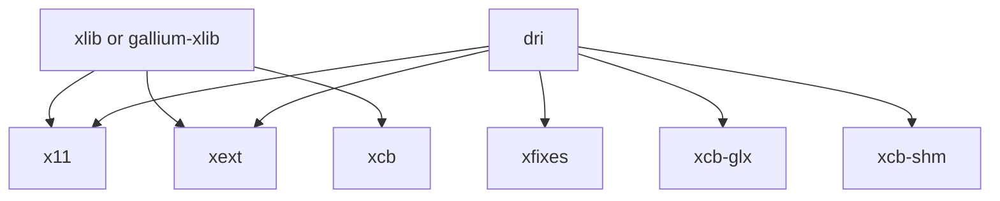
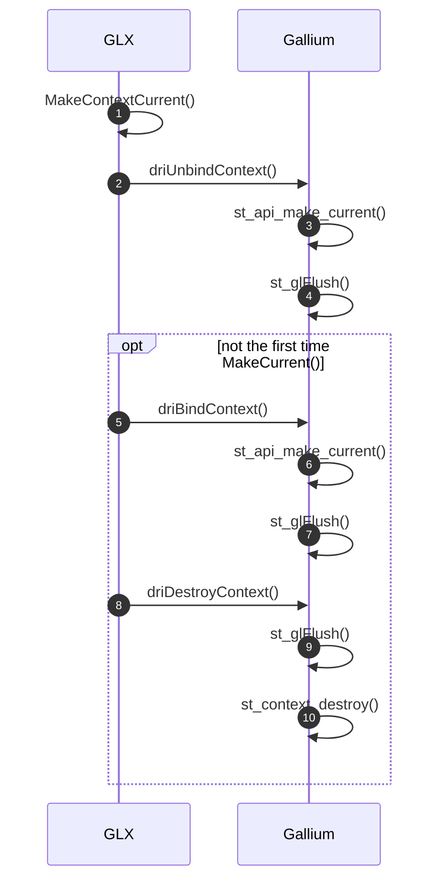

# GLX

GLX 是 Mesa 中实现的三大支持平台(EGL, GLX, GBM)之一, 原来 GLX 在 Mesa 中有 *xlib*, *gallium-xlib* 和 *dri* 三种实现，自从 [Delete Mesa Classic](https://gitlab.freedesktop.org/mesa/mesa/-/merge_requests/10153) 后就只剩下 *xlib*，*dri* 两种实现，其中 *dri* 使用得比较多一些。

<!--more-->

如果是xlib, 它的源码位于
- mesa/drivers/x11 

如果是gallium-xlib, 它的源码位于
- gallium/winsys/sw/xlib
- gallium/frontends/glx/xlib
- gallium/targets/libgl-xlib

# xlib

# dri

## glXMakeCurrent

