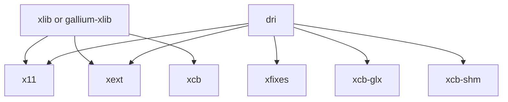

# GLX


GLX (Initialism for "OpenGL Extension to the X Window System") is an extension to the X Window System core protocol providing an interface between OpenGL and the X Window System as well as extensions to OpenGL itself. (From WiKi)


Mesa的 GLX 实现自从 [Delete Mesa Classic](https://gitlab.freedesktop.org/mesa/mesa/-/merge_requests/10153) 已经从原来的 3 种变成现在的 2 种:

- dri
- xlib

如果是xlib, 它的源码位于
- mesa/drivers/x11 

如果是gallium-xlib, 它的源码位于
- gallium/winsys/sw/xlib
- gallium/frontends/glx/xlib
- gallium/targets/libgl-xlib

# xlib

# dri

在 Linux 下 dri-based glx 实现我们只关注 3 个实现：

|   源文件                                                                                | 关键函数                                     |
|:----------------------------------------------------------------------------------------|:---------------------------------------------|
| [dri2_glx.c](https://gitlab.freedesktop.org/mesa/mesa/-/blob/main/src/glx/dri2_glx.c)   | [dri2CreateScreen()](https://gitlab.freedesktop.org/mesa/mesa/-/blob/main/src/glx/dri2_glx.c#L1001)                |
| [dri3_glx.c](https://gitlab.freedesktop.org/mesa/mesa/-/blob/main/src/glx/dri3_glx.c)   | [dri3_create_screen()](https://gitlab.freedesktop.org/mesa/mesa/-/blob/main/src/glx/dri3_glx.c#L789)                     |
| [drisw_glx.c](https://gitlab.freedesktop.org/mesa/mesa/-/blob/main/src/glx/drisw_glx.c) | [driswCreateScreenDriver()](https://gitlab.freedesktop.org/mesa/mesa/-/blob/main/src/glx/drisw_glx.c#L925)                |

## dri2CreateScreen

## driswCreateScreenDriver

