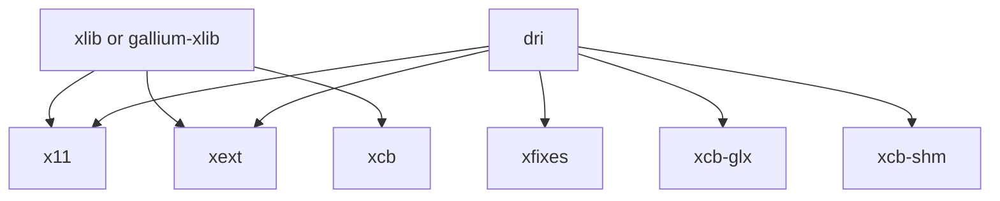
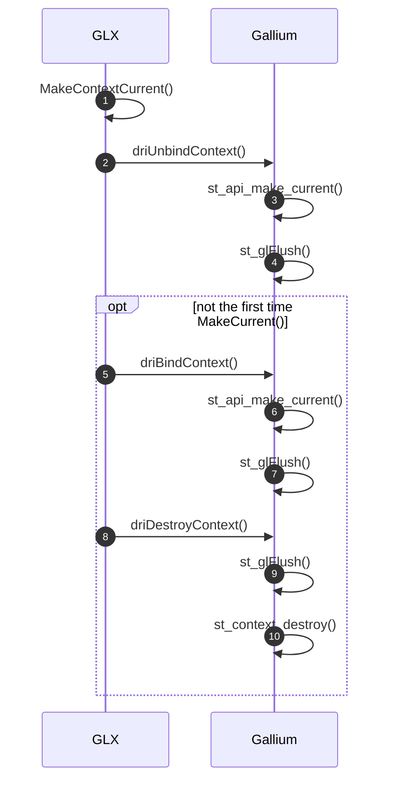
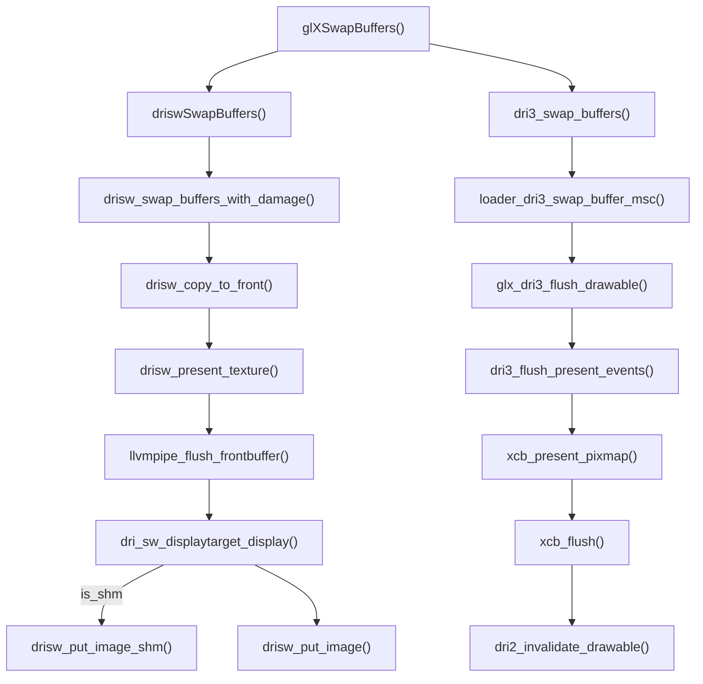

# GLX

GLX 是 Mesa 中实现的三大支持平台(EGL, GLX, GBM)之一, 原来 GLX 在 Mesa 中有 *xlib*, *gallium-xlib* 和 *dri* 三种实现，自从 [Delete Mesa Classic](https://gitlab.freedesktop.org/mesa/mesa/-/merge_requests/10153) 后就只剩下 *xlib*，*dri* 两种实现，其中 *dri* 使用得比较多一些。

<!--more-->



如果是xlib, 它的源码位于
- mesa/drivers/x11 

如果是gallium-xlib, 它的源码位于
- gallium/winsys/sw/xlib
- gallium/frontends/glx/xlib
- gallium/targets/libgl-xlib

# xlib

# dri

## glXMakeCurrent()



## glXSwapBuffers()



# GLVND(Vendor Neutral GL dispatch library)

| Source Directory |  Shared libraray       | APT Package                            |
|:-----------------|:-----------------------|:---------------------------------------|
| GLDispatch       | libGLdispatch.so.0.0.0 | libglvnd0_1.3.2-1~kylin0.20.04.2_arm64 |
| GLX              | libGLX.so.0.0.0        | libglx0_1.3.2-1~kylin0.20.04.2_arm64   |
| EGL              | libEGL.so.1.1.0        | libegl1_1.3.2-1~kylin0.20.04.2_arm64   |
| OpenGL           | libOpenGL.so.0.0.0     | libopengl0_1.3.2-1~kylin0.20.04.2_arm64|
| GLESv1           | libGLESv1_CM.so.1.2.0  | libgles1_1.3.2-1~kylin0.20.04.2_arm64  |
| GLESv2           | libGLESv2.so.2.1.0     | libgles2_1.3.2-1~kylin0.20.04.2_arm64  |
| GL               | libGL.so.1.7.0         | libgl1_1.3.2-1~kylin0.20.04.2_arm64    |

上面这些包和动态库文件都来自同一个源码库 [glvnd/libglvnd](https://gitlab.freedesktop.org/glvnd/libglvnd), 但它们并不是真正的 OpenGL 实现 (驱动)， 它们只是一个 **Dispatch Layer**, 利用 [Dynamic Tag `DT_FILTER`](https://docs.oracle.com/cd/E19683-01/817-3677/6mj8mbtbr/index.html#chapter4-31738) 实现多个 Vendor 的 OpenGL 驱动能在同一个系统上共存。 libglvnd 向用户提供环境变量

`__GLX_VENDOR_LIBRARY_NAME`

或

- `__EGL_VENDOR_LIBRARY_FILENAMES`
- `__EGL_VENDOR_LIBRARY_DIRS`

来指定运行时到底是哪个 vendor 的驱动被调用。

# Mesa 的包与库

``` shell find /usr -path /usr/share -prune -o -name 'libGL*' -type f -exec dpkg -S {} \;
libglew2.2:amd64: /usr/lib/x86_64-linux-gnu/libGLEW.so.2.2.0
libglvnd0:amd64: /usr/lib/x86_64-linux-gnu/libGLdispatch.so.0.0.0
libglew-dev:amd64: /usr/lib/x86_64-linux-gnu/libGLEW.a
arise-linux-graphics-driver-dri:amd64: /usr/lib/x86_64-linux-gnu/libGLX_arise.so.0.0.0
libglx-mesa0:amd64: /usr/lib/x86_64-linux-gnu/libGLX_mesa.so.0.0.0
libglx0:amd64: /usr/lib/x86_64-linux-gnu/libGLX.so.0.0.0
libgles2:amd64: /usr/lib/x86_64-linux-gnu/libGLESv2.so.2.1.0
libgles1:amd64: /usr/lib/x86_64-linux-gnu/libGLESv1_CM.so.1.2.0
libgl1:amd64: /usr/lib/x86_64-linux-gnu/libGL.so.1.7.0
libglu1-mesa:amd64: /usr/lib/x86_64-linux-gnu/libGLU.so.1.3.1
libglu1-mesa-dev:amd64: /usr/lib/x86_64-linux-gnu/libGLU.a
```

# References
- [Dynamic Linking/Dynamic Section](https://docs.oracle.com/cd/E19683-01/817-3677/chapter6-42444/index.html)
