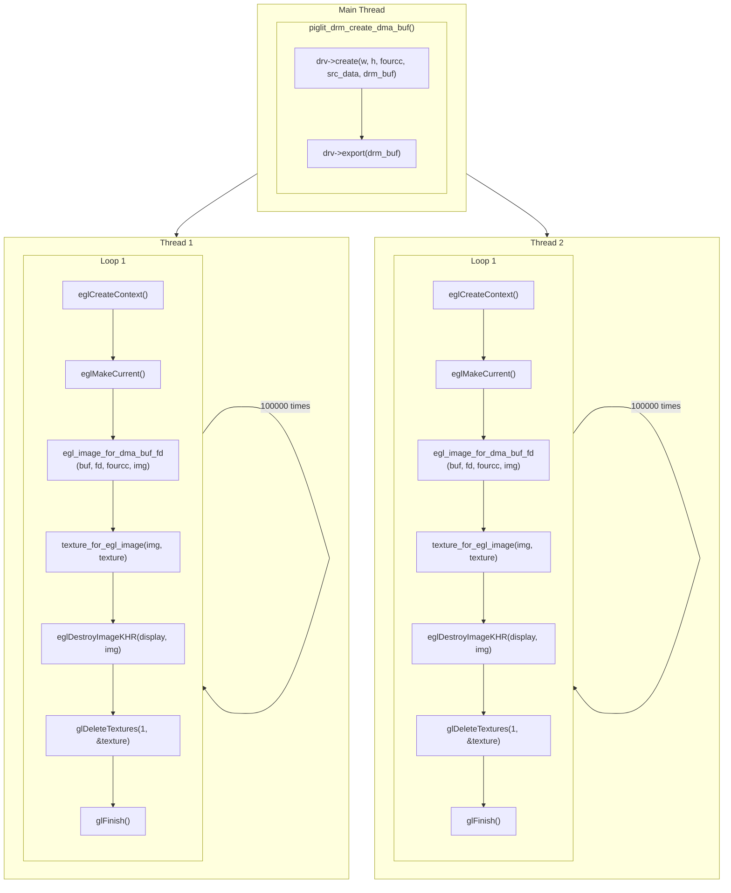

<!--more-->

[Piglit](https://gitlab.freedesktop.org/mesa/piglit) 是为 OpenGL, Vulkan, OpenCL 实现设计的自动化测试套件。Piglit 的目标是提高 OpenGL, Vulkan 和 OpenCL 开源驱动的质量，并为开发者提供一个简单的回归测试途径。

这里我们通过 Piglit 里的几个有意思的测试用例，反过来了解 Mesa 实现的一些底层机制，比如 DMABUF, EGLImageKHR 等等。

# [ext_image_dma_buf_import/refcount-multithread](https://gitlab.freedesktop.org/mesa/piglit/-/blob/main/tests/spec/ext_image_dma_buf_import/refcount-multithread.c)

测试多线程下，驱动是否正确处理 dma-buf 的导入/导出，

- export `drmPrimeHandleToFD()`
- import `drmPrimeFDToHandle()`

FD 是文件描述符，而 bo handles 在内核态和用户态各自维护有一份，分别是 **GEM bo handles** 和 **Userspace bo handles**, 在 mesa 的实现里，这两个集合是 1:1 映射关系, 当一个 gem bo handle 被导入, 如果对应的 userspace bo handle(实际上就是 drmPrimeFDToHandle() 返回的整数)已经存在，mesa 驱动仅仅是将这个 userspace bo handle 的引用计数加 1. 这就有可能导致 bo_destroy 函数和 bo_import() 函数发生竞争 (race), 从而导致 UAF, 这个 Piglit 用例就是专门测试这种场景的。

# [Waffle](https://gitlab.freedesktop.org/mesa/waffle)

[Waffle /wa:fl/ 动听而无意义的话](https://gitlab.freedesktop.org/mesa/waffle) 是一个跨平台的可以动态地选择 OpenGL, OpenGL ES, Vulkan 和窗口系统的库。piglit 用它来创建 EGLContext, 最终会创建 Galliumm pipe_context.
