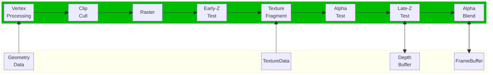
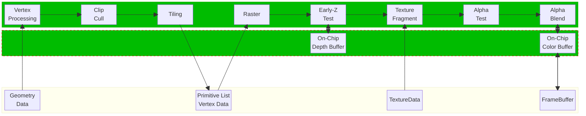

Render-To-Texture 是一种十分常见和简单的渲染技术，它将纹理对象和 FBO 绑定，把场景渲染到纹理中，以便之后可以反复使用。RTT 被广泛应用在 in-game cameras(virtual camera systems), post-processing 和各种特效中。本文主要比较 RTT 技术在两种不同的渲染架构下的不同和一些思考。

<!--more-->

# IMR vs TBR

IMR (Immediate Mode Rendering) 和 TBR (Tile-Based Rendering) 是两种不同的渲染架构，前者常见于桌面 GPU (NVIDIA, AMD), 后者常见于移动 GPU (Imagination, Mali)。

## IMR

- 一整块一整块渲染，所以在片上做了**大面积**的高速缓存
- 需要大量带宽，所以功耗高
- 渲染管线执行**流畅**， 从顶点到片段**一口气弄完**

## TBR

- 一小块一小块**渲染**, 对于每一小块来说，所需要的访存的带宽就相对较小，可以在片上做一小块高速缓存
- 需要的带宽小，所以功耗也相对较低

# References

- [Tutorial 14: Render To Texture](https://www.opengl-tutorial.org/intermediate-tutorials/tutorial-14-render-to-texture/)
- [渲染架构比较：IMR,TBR & TBDR](https://zhuanlan.zhihu.com/p/390625258)
