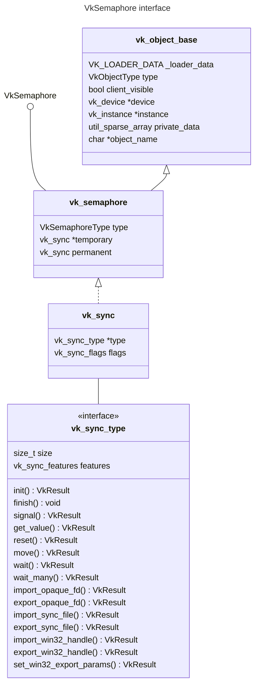

<!--more-->

如果把基于 Vulkan 的渲染看成一个图，那么 `VkCommandBuffer` 是节点 (node)，`VkSemaphore` 是边 (edge)

# Implicit Sync 好好的，为什么在 Vulkan 里要搞 Explicit Sync?

Implicit Sync 由内核负责，应用(甚至 UMD) 不用操心，确实也能工作，但是 implicit sync 存在**过度同步 (over-synchronization)** 的问题，必然导致不能最大限度地发挥出 CPU 和 GPU 的并行能力。

为什么 implicit sync 会有过度同步的问题? implicit sync 说白了，是由内核在不知道应用确切同步要求(谁等什么，什么时候完成)的情况下**一股脑儿**地给你进行**不分青红皂白**地阻塞式同步，是能正常工作，但不够精细，好多地方可能是白等了。

# 参考

- [Brigding the synchronization gap on Linux](https://www.collabora.com/news-and-blog/blog/2022/06/09/bridging-the-synchronization-gap-on-linux)