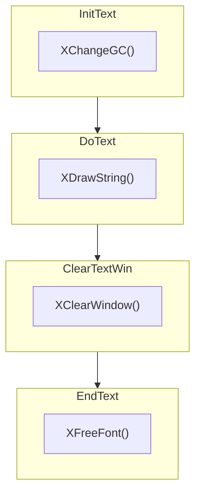

# [x11perf](https://gitlab.freedesktop.org/xorg/test/x11perf)

[x11perf](https://gitlab.freedesktop.org/xorg/test/x11perf) 是一个 X11 Server 的性能测试程序

<!--more-->

# [Xlib](https://gitlab.freedesktop.org/xorg/lib/libx11)

[Xlib](https://gitlab.freedesktop.org/xorg/lib/libx11) 是 X11 核心客户端库，客户端程序基本上都是调用它提供的 API 来绘制图形的。

# ftext

