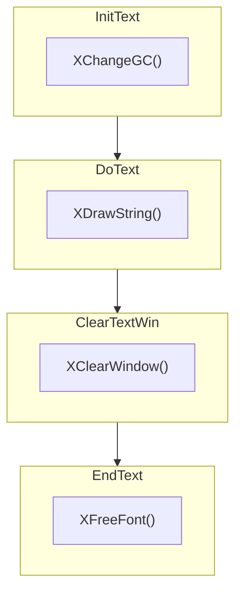

# [x11perf](https://gitlab.freedesktop.org/xorg/test/x11perf)

[x11perf](https://gitlab.freedesktop.org/xorg/test/x11perf) 是一个 X11 Server 的性能测试程序


<!--more-->

# [Xlib](https://gitlab.freedesktop.org/xorg/lib/libx11)

[Xlib](https://gitlab.freedesktop.org/xorg/lib/libx11) 是 X11 核心客户端库，客户端程序基本上都是调用它提供的 API 来绘制图形的。 而 Xlib 的函数基本上都是给 xserver 发请求

| File                           | Request                                  |
|:-------------------------------|:-----------------------------------------|
| src/ImText16.c:86:9:           |  GetReq (ImageText16, req);              |
| src/Text16.c:50:5:             |  GetReq (PolyText16, req);               |
| src/DrSegs.c:47:2:             |  GetReq (PolySegment, req);              |
| src/LiHosts.c:85:5:            |  GetReq (ListHosts, req);                |
| src/PolyTxt.c:49:5:            |  GetReq (PolyText8, req);                |
| src/SetPntMap.c:43:5:          |  GetReq (SetPointerMapping, req);        |
| src/SetPntMap.c:66:5:          |  GetReq (ChangeKeyboardMapping, req);    |
| src/GetProp.c:60:5:            |  GetReq (GetProperty, req);              |
| src/DrLines.c:45:5:            |  GetReq (PolyLine, req);                 |
| src/xcms/cmsLkCol.c:151:5:     |  GetReq (LookupColor, req);              |
| src/RotProp.c:44:5:            |  GetReq (RotateProperties, req);         |
| src/ImText.c:85:9:             |  GetReq (ImageText8, req);               |
| src/OpenDis.c:532:6:           |  GetReq (GetProperty, req);              |
| src/SetFPath.c:48:2:           |  GetReq (SetFontPath, req);              |
| src/ParseCol.c:120:6:          |  GetReq (LookupColor, req);              |
| src/ChProp.c:47:5:             |  GetReq (ChangeProperty, req);           |
| src/Text.c:50:5:               |  GetReq (PolyText8, req);                |
| src/PolyTxt16.c:49:5:          |  GetReq (PolyText16, req);               |
| src/LookupCol.c:83:2:          |  GetReq (LookupColor, req);              |
| src/GetImage.c:64:2:           |  GetReq (GetImage, req);                 |
| src/SetCRects.c:46:5:          |  GetReq (SetClipRectangles, req);        |

*P.S.: formatting command*

```shell
rg 'GetReq (.*, req)' --vimgrep -tc | awk -F"[ \t]+" '{printf "| %30-s | ", $1; $1=""; printf "%40-s |\n", $0}'
```

# ftext


