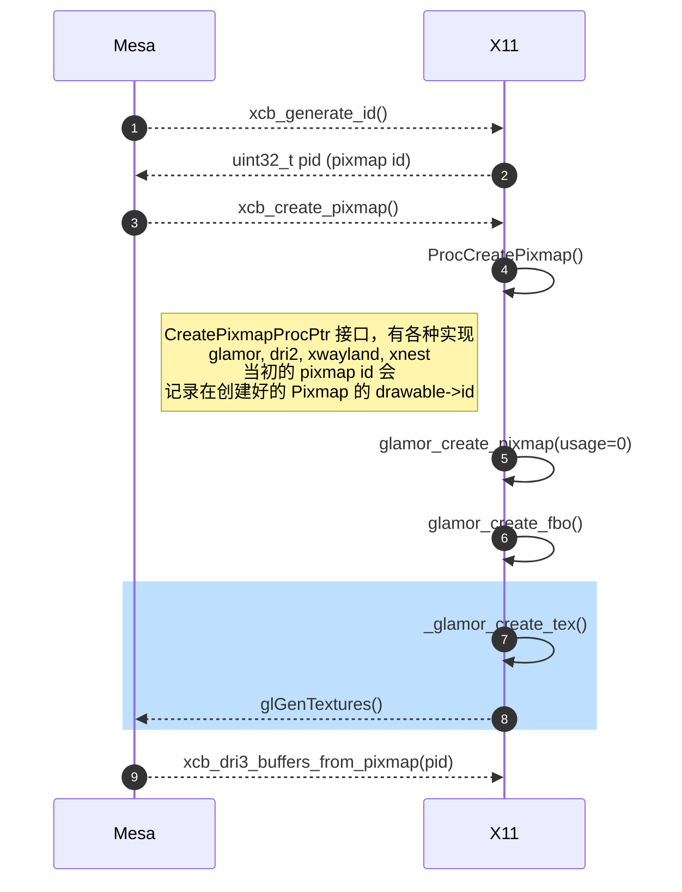
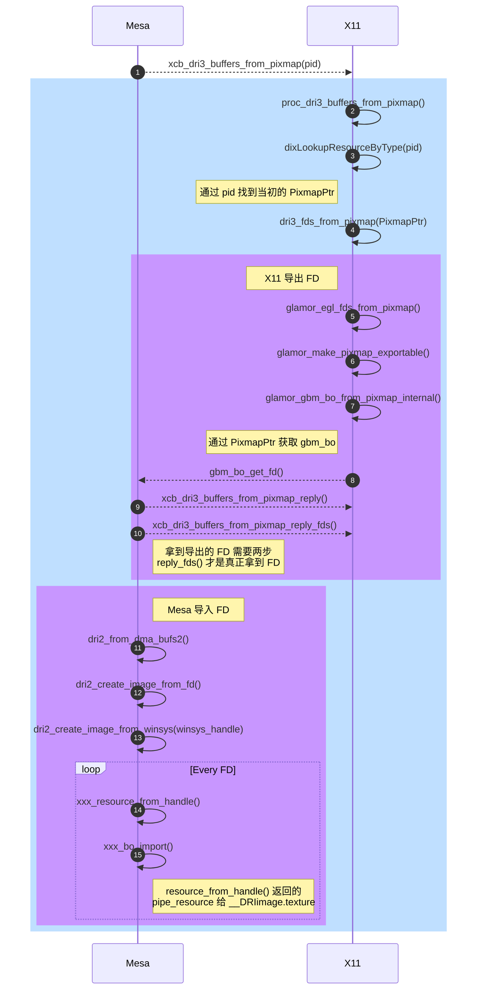

XCB 是应用与 X 服务器交互使用的 C 绑定函数集，它里面的一些 C 函数是通过 python3-xcbgen 工具生成的，不经过编译在它的[源码库](https://gitlab.freedesktop.org/xorg/lib/libxcb)是找不到的。而且 XCB 古老到仍然使用 autotools 那套构建系统，想要看到某些函数的“真容”，你还得“千呼万唤”。

<!--more-->

# Build
- 安装工具
    - `sudo apt install python3-xcbgen autoconf automake libtool xutils-dev xcb-proto`
    - **xutils-dev** 里包含 xorg-macros
    - **libxcb** 的版本与 ***xcb-proto** 软件包的版本有依赖关系，如果你安装的 xcb-proto 版本是 1.14-2, 那么最好将 libxcb 的 tag 也检出到 libxcb-1.14

- 构建
    - `./autogen.sh`
    - `make`
- 千呼万唤始出来
    - 在构建完之后，为了保存“成果”，需要使用一点 git 小技巧, 在 `src/.gitignore` 最后加上
        - `!*.c`
    - 现在可以好好看看 `xcb_dri3_pixmap_from_buffers()` 的实现了
        - [https://gitlab.freedesktop.org/lucmann/libxcb/-/tree/v1.14-where-you-will-find-xcb_dri3_pixmap_from_buffers](https://gitlab.freedesktop.org/lucmann/libxcb/-/tree/v1.14-where-you-will-find-xcb_dri3_pixmap_from_buffers)

# Bindings
## xcb_create_pixmap

## xcb_dri3_buffers_from_pixmap

## glamor_make_pixmap_exportable

函数功能:

- 100 创建一个新的 Pixmap `exported` 用来 export
- 200 同时创建一个 gbm_bo, 将 `exported` 的 header 设置成刚创建的 gbm_bo
- 300 将原来的 Pixmap 的内容 `CopyArea()` 到 `exported`
- 400 `glamor_egl_exchange_buffers(pixmap, exported)`, 将 `exported` 里的 tex/gbm_bo/EGLImage 换到原来的 Pixmap 结构体中
- 500 销毁 `exported` Pixmap

步骤 300 暗藏 bug, 因为 `CopyArea()` 会调用 `glamor_copy_fbo_fbo_draw()` 将原 Pixmap 作为纹理采样到新的 Pixmap `exported`, 也就是会调入 `_mesa_DrawArrays()`, 进而导致这个即将被导出的 BO, 被重新设置成 drawcall 的 render target buffer。 但是 `glamor_copy_fbo_fbo_draw()` 在调用 `_mesa_DrawArrays()` 进行"拷贝"后，并**不会 `glFlush()`**, 只能等到 X11 定时触发 `Screen->BlockHandler()` 时 `glFlush()`。

另外一个进程导入 BO 后，同样会设置它为 render target buffer, 这就造成 X11 进程和 App 进程同时往同一个 render target buffer 里提交渲染命令，导致结果变得不确定。
