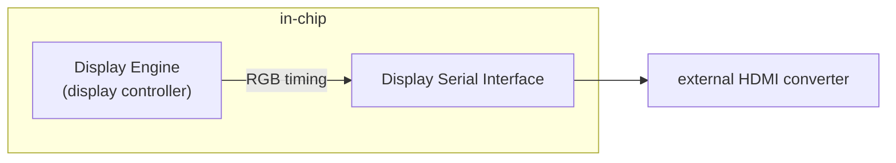

# 环境准备

## WSL2 作为上位机

### 识别 Windows 11 Host 的 USB Serial Device

分别在 Windows 11 上安装 [usbipd-win](https://github.com/dorssel/usbipd-win)， 在 WSL2 上安装 [user space tools for USB/IP](https://github.com/dorssel/usbipd-win/wiki/WSL-support) 

```
Microsoft Windows [版本 10.0.22621.1702]
(c) Microsoft Corporation。保留所有权利。

C:\Windows\System32>usbipd wsl list
BUSID  VID:PID    DEVICE                                                        STATE
1-9    046d:c534  USB 输入设备                                                  Not attached
1-13   04e2:1410  USB 串行设备 (COM4)                                           Not attached
```

### WSL2 Ubuntu-20.04 创建 /dev/ttyUSB0

```
[Thu Jun 15 19:19:44 2023] vhci_hcd vhci_hcd.0: pdev(0) rhport(0) sockfd(3)
[Thu Jun 15 19:19:44 2023] vhci_hcd vhci_hcd.0: devid(65546) speed(2) speed_str(full-speed)
[Thu Jun 15 19:19:44 2023] vhci_hcd vhci_hcd.0: Device attached
[Thu Jun 15 19:19:45 2023] vhci_hcd: vhci_device speed not set
[Thu Jun 15 19:19:45 2023] usb 1-1: new full-speed USB device number 2 using vhci_hcd
[Thu Jun 15 19:19:45 2023] vhci_hcd: vhci_device speed not set
[Thu Jun 15 19:19:45 2023] usb 1-1: SetAddress Request (2) to port 0
[Thu Jun 15 19:19:45 2023] usb 1-1: New USB device found, idVendor=04e2, idProduct=1410, bcdDevice= 0.03
[Thu Jun 15 19:19:45 2023] usb 1-1: New USB device strings: Mfr=0, Product=0, SerialNumber=0
[Thu Jun 15 19:19:45 2023] xr_serial 1-1:1.0: xr_serial converter detected
[Thu Jun 15 19:19:45 2023] usb 1-1: xr_serial converter now attached to ttyUSB0
```

### Recovery 模式应该连接哪个 Type-C （USB SERIAL) 接口

HiKey970 有两个 Type-C 接口，而且当板子被设置为 Recovery 模式时，两个接口均会被识别为“串口”。在左手边的 (J3101) 是用来访问 Debug UART 的，而在 HDMI 和 USB 中间的那个(J1801)是在 Recovery 模式下使用的。而且这两个接口是两个不同厂家提供的芯片，使用完全不同的内核驱动模块


- 前者(J3101)：
    `Bus 001 Device 003: ID 04e2:1410 Exar Corp. XR21V1410 USB-UART IC`


- 后者(J1801)：
    `Bus 001 Device 002: ID 12d1:3609 Huawei Technologies Co., Ltd. USB SER`


# Build rootfs.img and boot.img

## boot.img
 
`boot.img` 主要提供 bootloader, 所以它可以只包含 **grub.efi**, Hikey970 使用的 boot.img 是 64M 大小

## rootfs.img

`rootfs.img` 就是整个系统了(根文件系统)，内核可执行文件(Image)和设备树二进制文件(.dtb) 都包含在它的 boot 目录里，Hikey970 使用的 rootfs.img 原始大小是 4.0GB, 但经过 android-tools 工具包里的 `img2simg` 处理后只有 716M

```Sparse image 与 Raw image 大小对比
-rw-r--r-- 1 luc luc 4.0G 11月26日 06:48 rootfs.img
-rw-r--r-- 1 luc luc 716M 11月18日 21:47 rootfs.sparse.img
```

## debootstrap

- `/usr/sbin/qemu-debootstrap`
- `/usr/sbin/debootstrap`

是两个 **Shell 脚本**, 主要就是通过下载相应平台的 binaries，通过 **chroot** 来制作根文件系统

# fastboot

fastboot 是用来从 Host 向开发板烧写固件和镜像的常用工具之一，在 Arch Linux 上它可以通过以下命令安装

```install fastboot
yay -S android-sdk-platform-tools
```

## fastboot 常用命令

```从设备的 bootloader 获取各种信息，如 version, partition
fastboot getvar all
```

```列出已连接设备的 ID, 可以用来判断设备是否已与 Host 正常连接就绪
fastboot devices
```

```在指定分区刷写指定镜像
fastboot flash ptable 64gtoendprm_ptable.img
fastboot flash xloader sec_xloader.img
fastboot flash fastboot l-loader.bin
fastboot flash fip fip.bin
fastboot flash boot boot2grub.uefi.img
```

```对于比较大的 Sparse 镜像，指定传输块大小，每 8M 传输
fastboot -S 8M flash system rootfs.sparse.img
```

# 启动

## Bootloader

```sudo mount -o loop boot2grub.uefi.img /mnt
➜  /mnt ls -lh /mnt/EFI/BOOT
总计 881K
-rwxr-xr-x 1 root root  29K 2018年 2月14日 fastboot.efi
-rwxr-xr-x 1 root root 852K 2018年 2月14日 grubaa64.efi
```

```启动后的 /boot 目录
hikey970% ls -lhR /boot
/boot:
total 23M
drwxr-xr-x 3 root root 4.0K Jun 12  2018 EFI
-rw-r--r-- 1 root root  23M Jun 12  2018 Image
drwxr-xr-x 2 root root 4.0K Jun 12  2018 grub
-rw-r--r-- 1 root root  68K Jun 12  2018 kirin970-hikey970.dtb

/boot/EFI:
total 4.0K
drwxr-xr-x 2 root root 4.0K Jun 12  2018 BOOT

/boot/EFI/BOOT:
total 32K
-rw-r--r-- 1 root root 29K Jun 12  2018 fastboot.efi

/boot/grub:
total 4.0K
-rw-r--r-- 1 root root 462 Jun 12  2018 grub.cfg
```


> **NOTE:**
> HiKey970 的输入电压要求在 8V ~ 18V 之间，但最好使用 **12V 以上接近 18V**的输入电压，否则可能出现 `fastboot flash` 时出现板子自己重启的怪现象
> 

## 连接 WiFi


## xfce4 桌面

吃灰5,6年的板子又再一次亮了


# 制作 rootfs, initramfs

环境是 qemu-system-aarch64 Debian 13 Trixie, 折腾了一圈，最后还是发现 Ubuntu, Debian, Arch Linux 这3个，还是 Debian 对 Aarch64 支持最好，Ubuntu 甚至还一个桌面版的 Arm 安装镜像都没有(Arm架构的安装镜像似乎都是服务器版的)。


## NetworkManager vs wpasupplicant

点亮吹灰 Hikey970 用的是 [hikey970-ubuntu-image](https://github.com/mengzhuo/hikey970-ubuntu-image), 它的 rootfs 里安装的是 NetworkManager, 当我试着将 hikey970-ubuntu-image 转换成 hikey970-debian-image 时，发现 debootstrap 会因为奇怪的包依赖问题，无法安装 NetworkManager， 而且了解到 wpasupplicant 可以完成同样的事情(连接 WiFi,让板子联网), 而且体量更小，更适合这种开发板。

所以这个 Debian 12 rootfs 网络这块使用了 **wpasupplicant**, **iw**, **iproute2**, **dhcpcd5** 四剑客

- wpasupplicant

```rootfs/etc/systemd/system/wpa_supplicant@.service
[Unit]
Description=WPA supplicant daemon (interface %i)
After=sys-subsystem-net-devices-%i.device
Wants=sys-subsystem-net-devices-%i.device

[Service]
Type=simple
ExecStart=/sbin/wpa_supplicant -c /etc/wpa_supplicant/wpa_supplicant.conf -i %i
Restart=on-failure

[Install]
WantedBy=multi-user.target
```

Note:

1. 当 `systemctl enable wpa_supplicant@wlan0.service` 时 systemd 会自动创建一个符号链接文件到 `/etc/systemd/system/wpa_supplicant@.service`, 而文件里的 `%i` 是无线网络设备接口名，即 **wlan0**.
2. 手动创建 `/etc/wpa_supplicant/wpa_supplicant.conf`
    ```
    wpa_passphrase <SSID> <PASSWORD> >/etc/wpa_supplicant/wpa_supplicant.conf
    ```

- iw

```/sbin/iw
iw dev wlan0 scan | grep 'SSID:'
iw dev wlan0 connect <SSID>
```
- iproute2

```/bin/ip
ip link show wlan0
ip addr wlan0
```

- dhcpcd5

```
systemctl enable dhcpcd.service
systemctl start dhcpcd.service
```

# 显示



# Panfrost on HiKey970

Pathor(Written in C) 和 Tyr(Written in Rust) 都只用于 Valhall 以上的 Mali GPUs. HiKey 970 (HI3670 SoC) 搭载的是 Mali G72 MP12 (Bifrost)，所以只能使用 Panfrost 驱动。上面可以启动的内核是 v4.19, 当时的 GPU 驱动还是 lima.

HiKey 970 开发板对应的 devicetree 源文件 **hi3670-hikey970.dts**， 在 v4.19 时也合入了主线。

> commit 5510ee99c0deb0c0235acee6498a6745c8317df1
> Refs: v4.19-rc1-6-g5510ee99c0de
> Author:     Manivannan Sadhasivam <mani@kernel.org>
> AuthorDate: Fri Aug 10 23:23:39 2018 +0530
> Commit:     Wei Xu <xuwei5@hisilicon.com>
> CommitDate: Wed Sep 19 16:15:25 2018 +0100
> 
>     arm64: dts: Add devicetree support for HiKey970 board
> 
>     Add devicetree support for HiKey970 development board which
>     based on Hi3670 SoC and is also one of the 96Boards Consumer
>     Edition and AI platform.
> 
>     Only UART6 is enabled which is the default console required
>     by the 96Boards Consumer Edition Specification.
> 
>     This patch has been tested on HiKey970 Board.
> 
>     Signed-off-by: Manivannan Sadhasivam <manivannan.sadhasivam@linaro.org>
>     Signed-off-by: Wei Xu <xuwei5@hisilicon.com>
> ---
>  arch/arm64/boot/dts/hisilicon/hi3670-hikey970.dts | 35 +++++++++++++++++++++++++++++++++++
>  1 file changed, 35 insertions(+)

## v6.19

到目前为止，使用 [@mengzhuo/hikey970-ubuntu-image](https://github.com/mengzhuo/hikey970-ubuntu-image) 可以正常启动 HiKey970，而且安装了 Xfce，所以我 fork 了这个仓库，将其更名为 [hikey970-debian-image](https://github.com/lucmann/hikey970-debian-image)，将基于 Ubuntu bionic (18.04 LTS) 的 rootfs.img 移植到基于 Debian bookworm (12) 的 rootfs.img，并成功启动。之后准备将这块 2018 年 3 月发布的板子作为学习和测试内核最新驱动的平台，所以现在就看看主线编译的设备树 (arch/arm64/boot/dts/hisilicon/hi3670-hikey970.dtb) 和内核 (arch/arm64/boot/Image.gz) 是否能正常启动。 

- kernel + dtb

- kernel only


### `random: crng init done` took **70** minutes

```
[    5.201987] random: perl: uninitialized urandom read (4 bytes read)
[    5.202263] random: perl: uninitialized urandom read (4 bytes read)
[FAILED] Failed to start systemd-ra…rvice - Load/Save Random Seed.
See 'systemctl status systemd-random-seed.service' for details.
         Starting systemd-tmpfiles-…leanup of Temporary Directories...
[  OK  ] Finished systemd-tmpfiles-… Cleanup of Temporary Directories.
         Starting dpkg-db-backup.se…ly dpkg database backup service...
         Starting logrotate.service - Rotate log files...
[  OK  ] Finished dpkg-db-backup.se…aily dpkg database backup service.
[  OK  ] Finished logrotate.service - Rotate log files.
[ 4396.712657] random: crng init done
[ 4396.712674] random: 4 urandom warning(s) missed due to ratelimiting
```

# 参考

- [HiKey970 官方文档](https://www.96boards.org/documentation/consumer/hikey/hikey970/installation/board-recovery.md.html)
- [HiKey970 GitHub](https://github.com/96boards/documentation/tree/master/consumer/hikey/hikey970)
- [Linaro uefi-staging](https://snapshots.linaro.org/reference-platform/components/uefi-staging/)
- [DRM driver for HiKey 970](https://lore.kernel.org/bpf/20200820100440.2d30dc02@coco.lan/T/)
- [usbipd-win github issues](https://github.com/dorssel/usbipd-win/issues/59)
- [跨平台更新制作 rootfs](https://notes.leconiot.com/debootstrap.html)
- [Racing karts on a Rust GPU kernel driver](https://www.collabora.com/news-and-blog/news-and-events/racing-karts-on-a-rust-gpu-kernel-driver.html)
- [制作 Hikey970 的 rootfs](https://github.com/lucmann/hikey970-ubuntu-image)
