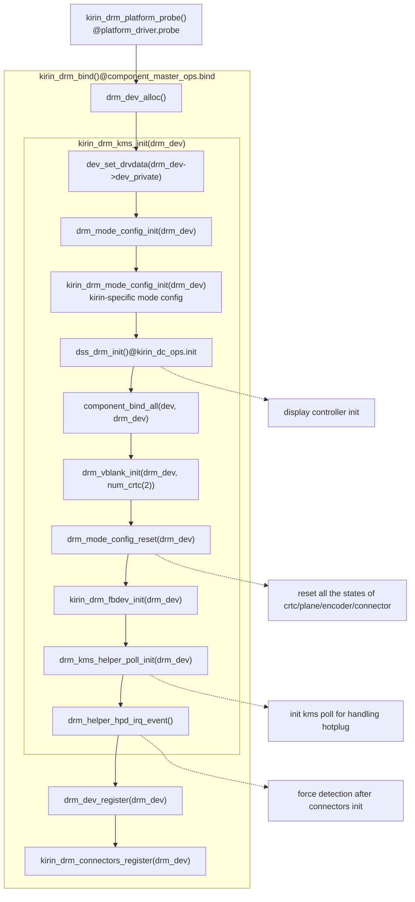
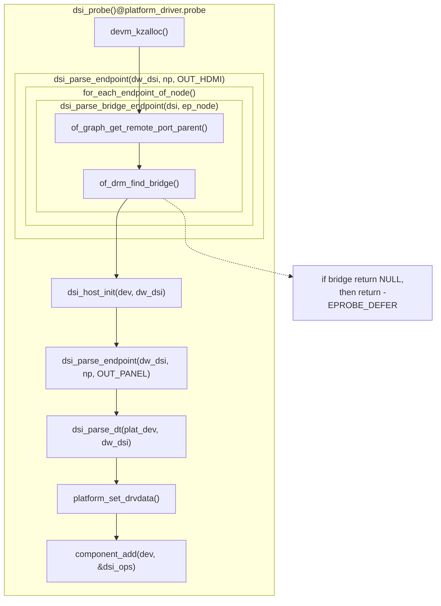
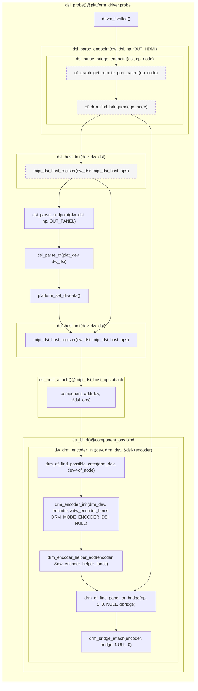

# 环境准备

## WSL2 作为上位机

### 识别 Windows 11 Host 的 USB Serial Device

分别在 Windows 11 上安装 [usbipd-win](https://github.com/dorssel/usbipd-win)， 在 WSL2 上安装 [user space tools for USB/IP](https://github.com/dorssel/usbipd-win/wiki/WSL-support) 

```
Microsoft Windows [版本 10.0.22621.1702]
(c) Microsoft Corporation。保留所有权利。

C:\Windows\System32>usbipd wsl list
BUSID  VID:PID    DEVICE                                                        STATE
1-9    046d:c534  USB 输入设备                                                  Not attached
1-13   04e2:1410  USB 串行设备 (COM4)                                           Not attached
```

### WSL2 Ubuntu-20.04 创建 /dev/ttyUSB0

```
[Thu Jun 15 19:19:44 2023] vhci_hcd vhci_hcd.0: pdev(0) rhport(0) sockfd(3)
[Thu Jun 15 19:19:44 2023] vhci_hcd vhci_hcd.0: devid(65546) speed(2) speed_str(full-speed)
[Thu Jun 15 19:19:44 2023] vhci_hcd vhci_hcd.0: Device attached
[Thu Jun 15 19:19:45 2023] vhci_hcd: vhci_device speed not set
[Thu Jun 15 19:19:45 2023] usb 1-1: new full-speed USB device number 2 using vhci_hcd
[Thu Jun 15 19:19:45 2023] vhci_hcd: vhci_device speed not set
[Thu Jun 15 19:19:45 2023] usb 1-1: SetAddress Request (2) to port 0
[Thu Jun 15 19:19:45 2023] usb 1-1: New USB device found, idVendor=04e2, idProduct=1410, bcdDevice= 0.03
[Thu Jun 15 19:19:45 2023] usb 1-1: New USB device strings: Mfr=0, Product=0, SerialNumber=0
[Thu Jun 15 19:19:45 2023] xr_serial 1-1:1.0: xr_serial converter detected
[Thu Jun 15 19:19:45 2023] usb 1-1: xr_serial converter now attached to ttyUSB0
```

### Recovery 模式应该连接哪个 Type-C （USB SERIAL) 接口

HiKey970 有两个 Type-C 接口，而且当板子被设置为 Recovery 模式时，两个接口均会被识别为“串口”。在左手边的 (J3101) 是用来访问 Debug UART 的，而在 HDMI 和 USB 中间的那个(J1801)是在 Recovery 模式下使用的。而且这两个接口是两个不同厂家提供的芯片，使用完全不同的内核驱动模块


- 前者(J3101)：
    `Bus 001 Device 003: ID 04e2:1410 Exar Corp. XR21V1410 USB-UART IC`


- 后者(J1801)：
    `Bus 001 Device 002: ID 12d1:3609 Huawei Technologies Co., Ltd. USB SER`


# Build rootfs.img and boot.img

## boot.img
 
`boot.img` 主要提供 bootloader, 所以它可以只包含 **grub.efi**, Hikey970 使用的 boot.img 是 64M 大小

## rootfs.img

`rootfs.img` 就是整个系统了(根文件系统)，内核可执行文件(Image)和设备树二进制文件(.dtb) 都包含在它的 boot 目录里，Hikey970 使用的 rootfs.img 原始大小是 4.0GB, 但经过 android-tools 工具包里的 `img2simg` 处理后只有 716M

```Sparse image 与 Raw image 大小对比
-rw-r--r-- 1 luc luc 4.0G 11月26日 06:48 rootfs.img
-rw-r--r-- 1 luc luc 716M 11月18日 21:47 rootfs.sparse.img
```

## debootstrap

- `/usr/sbin/qemu-debootstrap`
- `/usr/sbin/debootstrap`

是两个 **Shell 脚本**, 主要就是通过下载相应平台的 binaries，通过 **chroot** 来制作根文件系统

# fastboot

fastboot 是用来从 Host 向开发板烧写固件和镜像的常用工具之一，在 Arch Linux 上它可以通过以下命令安装

```install fastboot
yay -S android-sdk-platform-tools
```

## fastboot 常用命令

```从设备的 bootloader 获取各种信息，如 version, partition
fastboot getvar all
```

```列出已连接设备的 ID, 可以用来判断设备是否已与 Host 正常连接就绪
fastboot devices
```

```在指定分区刷写指定镜像
fastboot flash ptable 64gtoendprm_ptable.img
fastboot flash xloader sec_xloader.img
fastboot flash fastboot l-loader.bin
fastboot flash fip fip.bin
fastboot flash boot boot2grub.uefi.img
```

```对于比较大的 Sparse 镜像，指定传输块大小，每 8M 传输
fastboot -S 8M flash system rootfs.sparse.img
```

# 启动

## Bootloader

```sudo mount -o loop boot2grub.uefi.img /mnt
➜  /mnt ls -lh /mnt/EFI/BOOT
总计 881K
-rwxr-xr-x 1 root root  29K 2018年 2月14日 fastboot.efi
-rwxr-xr-x 1 root root 852K 2018年 2月14日 grubaa64.efi
```

```启动后的 /boot 目录
hikey970% ls -lhR /boot
/boot:
total 23M
drwxr-xr-x 3 root root 4.0K Jun 12  2018 EFI
-rw-r--r-- 1 root root  23M Jun 12  2018 Image
drwxr-xr-x 2 root root 4.0K Jun 12  2018 grub
-rw-r--r-- 1 root root  68K Jun 12  2018 kirin970-hikey970.dtb

/boot/EFI:
total 4.0K
drwxr-xr-x 2 root root 4.0K Jun 12  2018 BOOT

/boot/EFI/BOOT:
total 32K
-rw-r--r-- 1 root root 29K Jun 12  2018 fastboot.efi

/boot/grub:
total 4.0K
-rw-r--r-- 1 root root 462 Jun 12  2018 grub.cfg
```


> **NOTE:**
> HiKey970 的输入电压要求在 8V ~ 18V 之间，但最好使用 **12V 以上接近 18V**的输入电压，否则可能出现 `fastboot flash` 时出现板子自己重启的怪现象
> 

## 连接 WiFi


## xfce4 桌面

吃灰5,6年的板子又再一次亮了


# 制作 rootfs, initramfs

环境是 qemu-system-aarch64 Debian 13 Trixie, 折腾了一圈，最后还是发现 Ubuntu, Debian, Arch Linux 这3个，还是 Debian 对 Aarch64 支持最好，Ubuntu 甚至还一个桌面版的 Arm 安装镜像都没有(Arm架构的安装镜像似乎都是服务器版的)。


## NetworkManager vs wpasupplicant

点亮吹灰 Hikey970 用的是 [hikey970-ubuntu-image](https://github.com/mengzhuo/hikey970-ubuntu-image), 它的 rootfs 里安装的是 NetworkManager, 当我试着将 hikey970-ubuntu-image 转换成 hikey970-debian-image 时，发现 debootstrap 会因为奇怪的包依赖问题，无法安装 NetworkManager， 而且了解到 wpasupplicant 可以完成同样的事情(连接 WiFi,让板子联网), 而且体量更小，更适合这种开发板。

所以这个 Debian 12 rootfs 网络这块使用了 **wpasupplicant**, **iw**, **iproute2**, **dhcpcd5** 四剑客

- wpasupplicant

```rootfs/etc/systemd/system/wpa_supplicant@.service
[Unit]
Description=WPA supplicant daemon (interface %i)
After=sys-subsystem-net-devices-%i.device
Wants=sys-subsystem-net-devices-%i.device

[Service]
Type=simple
ExecStart=/sbin/wpa_supplicant -c /etc/wpa_supplicant/wpa_supplicant.conf -i %i
Restart=on-failure

[Install]
WantedBy=multi-user.target
```

Note:

1. 当 `systemctl enable wpa_supplicant@wlan0.service` 时 systemd 会自动创建一个符号链接文件到 `/etc/systemd/system/wpa_supplicant@.service`, 而文件里的 `%i` 是无线网络设备接口名，即 **wlan0**.
2. 手动创建 `/etc/wpa_supplicant/wpa_supplicant.conf`
    ```
    wpa_passphrase <SSID> <PASSWORD> >/etc/wpa_supplicant/wpa_supplicant.conf
    ```

- iw

```/sbin/iw
iw dev wlan0 scan | grep 'SSID:'
iw dev wlan0 connect <SSID>
```
- iproute2

```/bin/ip
ip link show wlan0
ip addr wlan0
```

- dhcpcd5

```
systemctl enable dhcpcd.service
systemctl start dhcpcd.service
```

- ntpdate

```
/sbin/ntpdate ntp.aliyun.com
```

# `kirin-drm` Display Pipeline Engine driver



```mermaid
flowchart TB
    A["kirin_drm_platform_probe()<br/>@platform_driver.probe"]
    subgraph "kirin_drm_bind()@component_master_ops.bind"
        B["drm_dev_alloc()"]
        subgraph "kirin_drm_kms_init(drm_dev)"
            C1["dev_set_drvdata(drm_dev->dev_private)"]
            C2["drm_mode_config_init(drm_dev)"]
            C3["kirin_drm_mode_config_init(drm_dev)<br/>kirin-specific mode config"]
            C31["dss_drm_init()@kirin_dc_ops.init"]
            C4["component_bind_all(dev, drm_dev)"]
            C5["drm_vblank_init(drm_dev, num_crtc(2))"]
            C6["drm_mode_config_reset(drm_dev)"]
            C7["kirin_drm_fbdev_init(drm_dev)"]
            C8["drm_kms_helper_poll_init(drm_dev)"]
            C9["drm_helper_hpd_irq_event()"]
        end
        D["drm_dev_register(drm_dev)"]
        E["kirin_drm_connectors_register(drm_dev)"]
    end

    N31["display controller init"]
    N6["reset all the states of crtc/plane/encoder/connector"]
    N8["init kms poll for handling hotplug"]
    N9["force detection after connectors init"]

    C31 -.-> N31
    C6 -.-> N6
    C8 -.-> N8
    C9 -.-> N9
    A --> B --> C1 --> C2 --> C3 --> C31 --> C4 --> C5 --> C6 --> C7 --> C8 --> C9 --> D --> E
```

# `dw-dsi` DesignWare MIPI DSI Host Controller Driver


```mermaid
flowchart TB
    subgraph "dsi_probe()@platform_driver.probe"
        direction TB
        A["devm_kzalloc()"]
        subgraph "dsi_parse_endpoint(dw_dsi, np, OUT_HDMI)"
            subgraph "for_each_endpoint_of_node()"
                subgraph "dsi_parse_bridge_endpoint(dsi, ep_node)"
                    B1["of_graph_get_remote_port_parent()"]
                    B2["of_drm_find_bridge()"]
                end
            end
        end
        C["dsi_host_init(dev, dw_dsi)"]
        D["dsi_parse_endpoint(dw_dsi, np, OUT_PANEL)"]
        E["dsi_parse_dt(plat_dev, dw_dsi)"]
        F["platform_set_drvdata()"]
        G["component_add(dev, &dsi_ops)"]
    end 
    N2["if bridge return NULL,<br/>then return -EPROBE_DEFER"]

    A --> B1 --> B2 --> C --> D --> E --> F --> G
    B2 -.-> N2
```

## [DSI bridge probe](https://lore.kernel.org/dri-devel/e5ec9763-37fe-6cd8-6eca-52792afbdb94@samsung.com/T/)

DSI bridge driver probe [陷入死循环](https://gist.github.com/lucmann/7ae4bf26d49807a4d951db2e989a271c)

```
[    3.270639] [drm] the bridge node is adv7533
[    3.270645] [drm] wait for external HDMI bridge driver.
[    3.270832] of_irq_parse_raw:  /soc/gpio@e8a0c000:00000001,00000002
[    3.270905] adv7511_probe dev->of_node (____ptrval____)
[    3.270909] __devm_drm_bridge_alloc
[    3.271426] adv7511_init_regulators
[    3.330257] [drm] the bridge node is adv7533
[    3.330264] [drm] wait for external HDMI bridge driver.
[    3.330449] of_irq_parse_raw:  /soc/gpio@e8a0c000:00000001,00000002
[    3.330522] adv7511_probe dev->of_node (____ptrval____)
[    3.330526] __devm_drm_bridge_alloc
[    3.331015] adv7511_init_regulators
[    3.390209] [drm] the bridge node is adv7533
[    3.390215] [drm] wait for external HDMI bridge driver.
[    3.390397] of_irq_parse_raw:  /soc/gpio@e8a0c000:00000001,00000002
[    3.390464] adv7511_probe dev->of_node (____ptrval____)
[    3.390468] __devm_drm_bridge_alloc
[    3.390937] adv7511_init_regulators
[    3.446194] [drm] the bridge node is adv7533
[    3.446200] [drm] wait for external HDMI bridge driver.
```

按照上游对 hisilicon/kirin/dw_drm_dsi.c 的[修改](https://lists.freedesktop.org/archives/freedreno/2021-October/012892.html)，将 hikey9xx/gpu/kirin9xx_dw_drm_dsi.c 中的 `dsi_probe()` 在 probe ordering 调整后可解决此问题


# `kirin9xx-dw-dsi` MIPI DSI Host Controller Driver


```mermaid
flowchart TB
    subgraph "dsi_probe()@platform_driver.probe"
        direction TB
        A["devm_kzalloc()"]
        subgraph "dsi_parse_endpoint(dw_dsi, np, OUT_HDMI)"
            subgraph "dsi_parse_bridge_endpoint(dsi, ep_node)"
                B["of_graph_get_remote_port_parent(ep_node)"]
                B_["of_drm_find_bridge(bridge_node)"]
            end
        end
        subgraph "dsi_host_init(dev, dw_dsi)"
            B1["mipi_dsi_host_register(dw_dsi::mipi_dsi_host::ops)"]
        end
        C["dsi_parse_endpoint(dw_dsi, np, OUT_PANEL)"]
        D["dsi_parse_dt(plat_dev, dw_dsi)"]
        E["platform_set_drvdata()"]
        subgraph "dsi_host_init(dev, dw_dsi)"
            F1["mipi_dsi_host_register(dw_dsi::mipi_dsi_host::ops)"]
        end
        subgraph "dsi_host_attach()@mipi_dsi_host_ops.attach"
            G1["component_add(dev, &dsi_ops)"]
        end
        subgraph "dsi_bind()@component_ops.bind"
            subgraph "dw_drm_encoder_init(dev, drm_dev, &dsi->encoder)"
                direction TB
                H11["drm_of_find_possible_crtcs(drm_dev, dev->of_node)"]
                H12["drm_encoder_init(drm_dev, encoder, &dw_encoder_funcs,<br/>DRM_MODE_ENCODER_DSI, NULL)"]
                H13["drm_encoder_helper_add(encoder, &dw_encoder_helper_funcs)"]
                H14["drm_of_find_panel_or_bridge(np, 1, 0, NULL, &bridge)"]
                H15["drm_bridge_attach(encoder, bridge, NULL, 0)"]
            end
        end

        style B  fill: #f5f5f5, stroke-dasharray: 5,5
        style B_ fill: #f5f5f5, stroke-dasharray: 5,5
        style B1 fill: #f5f5f5, stroke-dasharray: 5,5
    end
    A --> B --> B_ --> B1 --> C --> D --> E --> F1 --> G1 --> H11 --> H12 --> H13 --> H14 --> H15
    B1 --> F1
    B_ --> H14
```

# `adv7511` ADV7535 Bridge Driver

```
[    2.363067] [drm] Initialized kirin9xx 1.0.0 for e8600000.dpe on minor 0
[    2.363085] kirin9xx-drm e8600000.dpe: [drm:drm_client_modeset_probe] 
[    2.363091] [drm:drm_mode_object_get] OBJ ID: 37 (2)
[    2.363097] kirin9xx-drm e8600000.dpe: [drm:drm_helper_probe_single_connector_modes] [CONNECTOR:37:HDMI-A-1]
[    2.567054] [drm] Valid mode: 640x480@60, clock 25175 (adjusted to 25175)
[    2.567079] [drm] Valid mode: 800x600@56, clock 36000 (adjusted to 36000)
[    2.567100] [drm] Valid mode: 800x600@60, clock 40000 (adjusted to 40000)
[    2.567119] [drm] Valid mode: 848x480@60, clock 33750 (adjusted to 33750)
[    2.567137] [drm] Valid mode: 1024x768@60, clock 65000 (adjusted to 65000)
[    2.567144] kirin9xx-drm e8600000.dpe: [drm:drm_helper_probe_single_connector_modes] [CONNECTOR:37:HDMI-A-1] probed modes:
[    2.567151] kirin9xx-drm e8600000.dpe: [drm:drm_helper_probe_single_connector_modes] Probed mode: "1024x768": 60 65000 1024 1048 1184 1344 768 771 777 806 0x40 0xa
[    2.567158] kirin9xx-drm e8600000.dpe: [drm:drm_helper_probe_single_connector_modes] Probed mode: "800x600": 60 40000 800 840 968 1056 600 601 605 628 0x40 0x5
[    2.567165] kirin9xx-drm e8600000.dpe: [drm:drm_helper_probe_single_connector_modes] Probed mode: "800x600": 56 36000 800 824 896 1024 600 601 603 625 0x40 0x5
[    2.567171] kirin9xx-drm e8600000.dpe: [drm:drm_helper_probe_single_connector_modes] Probed mode: "848x480": 60 33750 848 864 976 1088 480 486 494 517 0x40 0x5
[    2.567177] kirin9xx-drm e8600000.dpe: [drm:drm_helper_probe_single_connector_modes] Probed mode: "640x480": 60 25175 640 656 752 800 480 490 492 525 0x40 0xa
[    2.567183] kirin9xx-drm e8600000.dpe: [drm:drm_client_modeset_probe] [CONNECTOR:37:HDMI-A-1] enabled? yes
[    2.567192] kirin9xx-drm e8600000.dpe: [drm:drm_client_modeset_probe] Not using firmware configuration
[    2.567200] kirin9xx-drm e8600000.dpe: [drm:drm_client_modeset_probe] [CONNECTOR:37:HDMI-A-1] found first mode: 1024x768
[    2.567206] kirin9xx-drm e8600000.dpe: [drm:drm_client_modeset_probe] picking CRTCs for 2048x2048 config
[    2.567214] kirin9xx-drm e8600000.dpe: [drm:drm_client_modeset_probe] [CRTC:35:crtc-0] desired mode 1024x768 set (0,0)
[    2.567219] [drm:drm_mode_object_get] OBJ ID: 37 (2)
[    2.567223] [drm:drm_mode_object_put.part.0] OBJ ID: 37 (3)
[    2.567231] kirin9xx-drm e8600000.dpe: [drm:__drm_fb_helper_initial_config_and_unlock] test CRTC 0 primary plane
[    2.567240] kirin9xx-drm e8600000.dpe: [drm:drm_fbdev_dma_driver_fbdev_probe] surface width(1024), height(768) and bpp(32)
[    2.574254] kirin9xx-drm e8600000.dpe: [drm:drm_mode_addfb2] [FB:39]
[    2.574260] [drm:drm_mode_object_put.part.0] OBJ ID: 39 (2)
[    2.574337] kirin9xx-drm e8600000.dpe: [drm] fb0: kirin9xxdrmfb frame buffer device
[    2.574341] [drm] Initialized kirin9xx 1.0.0 on minor 0
[    2.574344] [drm] host attach, client name=[adv7533], id=0
[    2.574347] adv7511 0-0039: adv7511_probe attach dsi ok
[    2.574350] adv7511 0-0039: adv7511_probe ok
```

```
[    2.204280] [drm] luc Initialized kirin9xx 1.0.0 on minor 0
[    2.204471] [drm] dss irq = 51.
[    2.204475] kirin9xx-drm e8600000.dpe: Looking up ldo3-supply from device node /dpe@e8600000
[    2.204576] [drm] dsi_bind
[    2.204578] kirin9xx-dw-dsi e8601000.dsi: dw_drm_encoder_init:
[    2.204586] kirin9xx-dw-dsi e8601000.dsi: Initializing CRTC encoder: 1
[    2.224171] kirin9xx-drm e8600000.dpe: bound e8601000.dsi (ops dsi_ops)
[    2.267712] dwmmc_k3 ff37f000.dwmmc1: tuning ok best_clksmpl 11 tuning_sample_flag bff7fff7
[    2.267729] mmc0: new UHS-I speed SDR104 SDHC card at address aaaa
[    2.268024] mmcblk0: mmc0:aaaa SC16G 14.8 GiB
[    2.282367]  mmcblk0: p1 p2
[    2.446942] kirin9xx-drm e8600000.dpe: [drm:check_connector_changed] [CONNECTOR:37:HDMI-A-1] status updated from unknown to connected
[    2.446962] kirin9xx-drm e8600000.dpe: [drm:check_connector_changed] [CONNECTOR:37:HDMI-A-1] Changed epoch counter 0 => 1
[    2.446969] [drm:drm_mode_object_get] OBJ ID: 37 (2)
[    2.446978] kirin9xx-drm e8600000.dpe: [drm:drm_sysfs_connector_hotplug_event] [CONNECTOR:37:HDMI-A-1] generating connector hotplug event
[    2.446994] [drm:drm_mode_object_put.part.0] OBJ ID: 37 (2)
[    2.446999] [drm] kirin_drm_kms_init ok
[    2.447023] [drm:drm_minor_register] 
[    2.447107] [drm:drm_minor_register] new minor registered 128
[    2.447111] [drm:drm_minor_register] 
[    2.447155] [drm:drm_minor_register] new minor registered 0
[    2.447159] [drm:drm_minor_register] 
[    2.447182] kirin9xx-drm e8600000.dpe: [drm:drm_sysfs_connector_add] [CONNECTOR:37:HDMI-A-1] adding connector to sysfs
[    2.447246] kirin9xx-drm e8600000.dpe: [drm:drm_sysfs_connector_hotplug_event] [CONNECTOR:37:HDMI-A-1] generating connector hotplug event
[    2.458988] [drm] Initialized kirin9xx 1.0.0 for e8600000.dpe on minor 0
[    2.459005] kirin9xx-drm e8600000.dpe: [drm:drm_client_modeset_probe] 
[    2.459013] [drm:drm_mode_object_get] OBJ ID: 37 (2)
[    2.459018] kirin9xx-drm e8600000.dpe: [drm:drm_helper_probe_single_connector_modes] [CONNECTOR:37:HDMI-A-1]
[    2.577598] kirin9xx-drm e8600000.dpe: [drm:update_display_info.part.0] [CONNECTOR:37:HDMI-A-1] CEA VCDB 0xd5
[    2.577609] kirin9xx-drm e8600000.dpe: [drm:update_display_info.part.0] [CONNECTOR:37:HDMI-A-1] HDMI: DVI dual 0, max TMDS clock 360000 kHz
[    2.577617] kirin9xx-drm e8600000.dpe: [drm:update_display_info.part.0] [CONNECTOR:37:HDMI-A-1] HDMI sink does deep color 30.
[    2.577622] kirin9xx-drm e8600000.dpe: [drm:update_display_info.part.0] [CONNECTOR:37:HDMI-A-1] Assigning HDMI sink color depth as 10 bpc.
[    2.577629] kirin9xx-drm e8600000.dpe: [drm:update_display_info.part.0] [CONNECTOR:37:HDMI-A-1] HDMI sink does YCRCB444 in deep color.
[    2.577633] kirin9xx-drm e8600000.dpe: [drm:update_display_info.part.0] [CONNECTOR:37:HDMI-A-1] HDMI sink should do DC_36, but does not!
[    2.577641] kirin9xx-drm e8600000.dpe: [drm:update_display_info.part.0] [CONNECTOR:37:HDMI-A-1] ELD monitor Sculptor
[    2.577646] kirin9xx-drm e8600000.dpe: [drm:update_display_info.part.0] [CONNECTOR:37:HDMI-A-1] HDMI: latency present 0 0, video latency 0 0, audio latency 0 0
[    2.577652] kirin9xx-drm e8600000.dpe: [drm:update_display_info.part.0] [CONNECTOR:37:HDMI-A-1] ELD size 32, SAD count 1
[    2.577792] [drm] Valid mode: 1920x1080@60, clock 148500 (adjusted to 144000)
[    2.577812] [drm] Valid mode: 1920x1080@50, clock 117000 (adjusted to 117000)
[    2.577830] [drm] Valid mode: 1152x864@60, clock 81579 (adjusted to 81579)
[    2.577833] [drm] Valid mode: 1280x720@60, clock 74250 (adjusted to 72000)
[    2.577852] [drm] Valid mode: 1280x1024@60, clock 108000 (adjusted to 108000)
[    2.577870] [drm] Valid mode: 1600x900@60, clock 108000 (adjusted to 108000)
[    2.577888] [drm] Valid mode: 800x600@60, clock 40000 (adjusted to 40000)
[    2.577906] [drm] Valid mode: 1024x768@60, clock 65000 (adjusted to 65000)
[    2.577910] [drm] Valid mode: 1920x1080@60, clock 148500 (adjusted to 144000)
[    2.577915] [drm] Valid mode: 1280x720@50, clock 74250 (adjusted to 72000)
[    2.577917] [drm] Valid mode: 1280x720@60, clock 74250 (adjusted to 72000)
[    2.577922] [drm] Valid mode: 1920x1080@50, clock 148500 (adjusted to 144000)
[    2.577925] [drm] Valid mode: 1280x720@60, clock 74176 (adjusted to 74176)
[    2.577929] [drm] Valid mode: 1920x1080@60, clock 148352 (adjusted to 148352)
[    2.577935] kirin9xx-drm e8600000.dpe: [drm:drm_helper_probe_single_connector_modes] [CONNECTOR:37:HDMI-A-1] probed modes:
[    2.577942] kirin9xx-drm e8600000.dpe: [drm:drm_helper_probe_single_connector_modes] Probed mode: "1920x1080": 60 148500 1920 2008 2052 2200 1080 1082 1087 1125 0x48 0x5
[    2.577948] kirin9xx-drm e8600000.dpe: [drm:drm_helper_probe_single_connector_modes] Probed mode: "1920x1080": 60 148500 1920 2008 2052 2200 1080 1084 1089 1125 0x40 0x5
[    2.577955] kirin9xx-drm e8600000.dpe: [drm:drm_helper_probe_single_connector_modes] Probed mode: "1920x1080": 60 148352 1920 2008 2052 2200 1080 1084 1089 1125 0x40 0x5
[    2.577961] kirin9xx-drm e8600000.dpe: [drm:drm_helper_probe_single_connector_modes] Probed mode: "1920x1080": 50 148500 1920 2448 2492 2640 1080 1084 1089 1125 0x40 0x5
[    2.577967] kirin9xx-drm e8600000.dpe: [drm:drm_helper_probe_single_connector_modes] Probed mode: "1920x1080": 50 117000 1920 2008 2052 2080 1080 1084 1089 1125 0x40 0x5
[    2.577973] kirin9xx-drm e8600000.dpe: [drm:drm_helper_probe_single_connector_modes] Probed mode: "1600x900": 60 108000 1600 1624 1704 1800 900 901 904 1000 0x40 0x5
[    2.577979] kirin9xx-drm e8600000.dpe: [drm:drm_helper_probe_single_connector_modes] Probed mode: "1280x1024": 60 108000 1280 1328 1440 1688 1024 1025 1028 1066 0x40 0x5
[    2.577984] kirin9xx-drm e8600000.dpe: [drm:drm_helper_probe_single_connector_modes] Probed mode: "1152x864": 60 81579 1152 1216 1336 1520 864 865 868 895 0x0 0x6
[    2.577990] kirin9xx-drm e8600000.dpe: [drm:drm_helper_probe_single_connector_modes] Probed mode: "1280x720": 60 74250 1280 1390 1430 1650 720 725 730 750 0x40 0x5
[    2.577996] kirin9xx-drm e8600000.dpe: [drm:drm_helper_probe_single_connector_modes] Probed mode: "1280x720": 60 74250 1280 1390 1430 1650 720 725 730 750 0x40 0x5
[    2.578002] kirin9xx-drm e8600000.dpe: [drm:drm_helper_probe_single_connector_modes] Probed mode: "1280x720": 60 74176 1280 1390 1430 1650 720 725 730 750 0x40 0x5
[    2.578007] kirin9xx-drm e8600000.dpe: [drm:drm_helper_probe_single_connector_modes] Probed mode: "1280x720": 50 74250 1280 1720 1760 1980 720 725 730 750 0x40 0x5
[    2.578013] kirin9xx-drm e8600000.dpe: [drm:drm_helper_probe_single_connector_modes] Probed mode: "1024x768": 60 65000 1024 1048 1184 1344 768 771 777 806 0x40 0xa
[    2.578018] kirin9xx-drm e8600000.dpe: [drm:drm_helper_probe_single_connector_modes] Probed mode: "800x600": 60 40000 800 840 968 1056 600 601 605 628 0x40 0x5
[    2.578025] kirin9xx-drm e8600000.dpe: [drm:drm_client_modeset_probe] [CONNECTOR:37:HDMI-A-1] enabled? yes
[    2.578034] kirin9xx-drm e8600000.dpe: [drm:drm_client_modeset_probe] Not using firmware configuration
[    2.578041] kirin9xx-drm e8600000.dpe: [drm:drm_client_modeset_probe] [CONNECTOR:37:HDMI-A-1] found preferred mode: 1920x1080
[    2.578047] kirin9xx-drm e8600000.dpe: [drm:drm_client_modeset_probe] picking CRTCs for 2048x2048 config
[    2.578054] kirin9xx-drm e8600000.dpe: [drm:drm_client_modeset_probe] [CRTC:35:crtc-0] desired mode 1920x1080 set (0,0)
[    2.578059] [drm:drm_mode_object_get] OBJ ID: 37 (2)
[    2.578063] [drm:drm_mode_object_put.part.0] OBJ ID: 37 (3)
[    2.578070] kirin9xx-drm e8600000.dpe: [drm:__drm_fb_helper_initial_config_and_unlock] test CRTC 0 primary plane
[    2.578078] kirin9xx-drm e8600000.dpe: [drm:drm_fbdev_dma_driver_fbdev_probe] surface width(1920), height(1080) and bpp(32)
[    2.588560] kirin9xx-drm e8600000.dpe: [drm:drm_mode_addfb2] [FB:40]
[    2.588566] [drm:drm_mode_object_put.part.0] OBJ ID: 40 (2)
[    2.588646] kirin9xx-drm e8600000.dpe: [drm] fb0: kirin9xxdrmfb frame buffer device
[    2.588649] [drm] Initialized kirin9xx 1.0.0 on minor 0
[    2.588653] [drm] host attach, client name=[adv7533], id=0
```

## fbdev vs drm_client

kernel command line 选项 `drm_client_lib.active=fbdev` 可以覆盖内核配置项 `CONFIG_DRM_CLIENT_DEFAULT` 

# `panfrost` GPU Driver

Pathor(C) 和 Tyr(Rust) 都是为 Valhall 架构以上的 Mali GPU (即基于 Command Stream Frontend 的 GPU) 而写的驱动, HiKey 970 (HI3670 SoC) 搭载的是 Mali G72 MP12 (Bifrost)，所以只能使用 Panfrost 驱动。上面可以启动的内核是 v4.19, 当时的 GPU 驱动还是 lima.

HiKey 970 开发板对应的 devicetree 源文件 **hi3670-hikey970.dts**， 在 v4.19 时也合入了主线。

> commit 5510ee99c0deb0c0235acee6498a6745c8317df1
> Refs: v4.19-rc1-6-g5510ee99c0de
> Author:     Manivannan Sadhasivam <mani@kernel.org>
> AuthorDate: Fri Aug 10 23:23:39 2018 +0530
> Commit:     Wei Xu <xuwei5@hisilicon.com>
> CommitDate: Wed Sep 19 16:15:25 2018 +0100
> 
>     arm64: dts: Add devicetree support for HiKey970 board
> 
>     Add devicetree support for HiKey970 development board which
>     based on Hi3670 SoC and is also one of the 96Boards Consumer
>     Edition and AI platform.
> 
>     Only UART6 is enabled which is the default console required
>     by the 96Boards Consumer Edition Specification.
> 
>     This patch has been tested on HiKey970 Board.
> 
>     Signed-off-by: Manivannan Sadhasivam <manivannan.sadhasivam@linaro.org>
>     Signed-off-by: Wei Xu <xuwei5@hisilicon.com>
> ---
>  arch/arm64/boot/dts/hisilicon/hi3670-hikey970.dts | 35 +++++++++++++++++++++++++++++++++++
>  1 file changed, 35 insertions(+)

## v6.19

到目前为止，使用 [@mengzhuo/hikey970-ubuntu-image](https://github.com/mengzhuo/hikey970-ubuntu-image) 可以正常启动 HiKey970，而且安装了 Xfce，所以我 fork 了这个仓库，将其更名为 [hikey970-debian-image](https://github.com/lucmann/hikey970-debian-image)，将基于 Ubuntu bionic (18.04 LTS) 的 rootfs.img 移植到基于 Debian bookworm (12) 的 rootfs.img，并成功启动。之后准备将这块 2018 年 3 月发布的板子作为学习和测试内核最新驱动的平台，所以现在就看看主线编译的设备树 (arch/arm64/boot/dts/hisilicon/hi3670-hikey970.dtb) 和内核 (arch/arm64/boot/Image.gz) 是否能正常启动。 

- kernel + dtb

- kernel only


### `random: crng init done` took **70** minutes

```
[    5.201987] random: perl: uninitialized urandom read (4 bytes read)
[    5.202263] random: perl: uninitialized urandom read (4 bytes read)
[FAILED] Failed to start systemd-ra…rvice - Load/Save Random Seed.
See 'systemctl status systemd-random-seed.service' for details.
         Starting systemd-tmpfiles-…leanup of Temporary Directories...
[  OK  ] Finished systemd-tmpfiles-… Cleanup of Temporary Directories.
         Starting dpkg-db-backup.se…ly dpkg database backup service...
         Starting logrotate.service - Rotate log files...
[  OK  ] Finished dpkg-db-backup.se…aily dpkg database backup service.
[  OK  ] Finished logrotate.service - Rotate log files.
[ 4396.712657] random: crng init done
[ 4396.712674] random: 4 urandom warning(s) missed due to ratelimiting
```

crng init 花这么长时间的原因是系统 entropy sources 不足，内核一直在填充 entropy pool, 这种情况只发生在刷写系统后第一次启动，之后 entropy pool 应该固化在 UFS 存储里了，启动时间就正常了。但因为需要频繁刷写系统，所以还是得解决这个问题。尝试了 rng-tools5 和 haveged 后，发现 haveged 可以解决这个问题。理论上 rng-tools5/rng-tools 也可以借助 `/dev/hwrng` 解决这个问题，但不知为何 rngd 服务始终[不能正常工作](https://gist.githubusercontent.com/lucmann/bfabaac6a2c904877629dd3ce97229eb/raw/ceb01cbe992a09d8e1c20a944ea272c8145c7a67/rngd.log)，怀疑可能是 Hi3670 SoC 的 TRNG 驱动有问题。

### SD 卡不识别

现象：系统启动后 `lsblk` 看不到 `/dev/mmcblk0`

使用原来的 [hikey970-ubuntu-image (@mengzhuo)](https://github.com/mengzhuo/hikey970-ubuntu-image) 镜像，SD 卡是正常识别的，这就说明电源和卡本身没有问题(之前因为使用 12V 的电源, fastboot flash 总是失败的教训很深刻🐶)。

将下来主要排查设备树和内核配置的问题，在这里和 ChatGPT/DeepSeek 交流了很多，总体感觉 ChatGPT 在这方面比 DeepSeek 靠谱一点。了解到了 HI3670 SoC 的 MMC 控制器使用的是 Synopsis DesignWare MMC, 它是一种不遵循 SD Host Controller Interface 规范的厂家自定义接口。

### SD 卡启动

SD 卡启动有两个主要问题:

- [准备好 sdcard.img](https://github.com/lucmann/hikey970-debian-image/blob/hikey970-debian-image/hikey970_dual_boot_builder.sh)
- 让 UEFI 能够识别 sdcard 上的 boot 分区


# 参考

- [HiKey970 User Guide](https://www.96boards.org/documentation/consumer/hikey/hikey970/hardware-docs/files/hikey970-user-manual.pdf)
- [HiKey970 Board Recovery](https://www.96boards.org/documentation/consumer/hikey/hikey970/installation/board-recovery.md.html)
- [HiKey970 GitHub](https://github.com/96boards/documentation/tree/master/consumer/hikey/hikey970)
- [Create a Bootable SD Card for HiKey](https://www.96boards.org/documentation/consumer/hikey/hikey620/installation/linux-sd-boot.md.html)
- [Linaro downloads](https://releases.linaro.org/96boards/reference-platform/debian/hikey/)
- [DRM driver for HiKey 970](https://lore.kernel.org/bpf/20200820100440.2d30dc02@coco.lan/T/)
- [usbipd-win github issues](https://github.com/dorssel/usbipd-win/issues/59)
- [跨平台更新制作 rootfs](https://notes.leconiot.com/debootstrap.html)
- [Racing karts on a Rust GPU kernel driver](https://www.collabora.com/news-and-blog/news-and-events/racing-karts-on-a-rust-gpu-kernel-driver.html)
- [制作 Hikey970 的 rootfs](https://github.com/lucmann/hikey970-ubuntu-image)
- [UEFI Shell Specification](https://uefi.org/sites/default/files/resources/UEFI_Shell_Spec_2_0_Errata_A.pdf)
- [When should ADV7511 bridge attach to DSI host](https://patchwork.kernel.org/project/dri-devel/patch/20190627151740.2277-1-matt.redfearn@thinci.com/)
