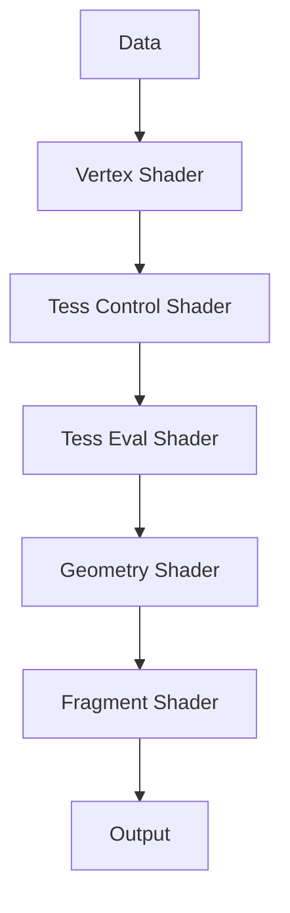

# [Overview](https://www.khronos.org/registry/OpenGL/extensions/ARB/ARB_program_interface_query.txt)

Numbers **ARB Extension #134**

Requires **OpenGL 2.0**

<!--more-->

Affected By
- ARB_transform_feedback
- EXT_transform_feedback
- ARB_uniform_buffer_object
- ARB_shader_subroutine
- ARB_shader_atomic_counters
- ARB_shader_storage_buffer_object
- ARB_arrays_of_arrays
- ARB_compute_shader
- ARB_explicit_uniform_location

Since **OpenGL 4.3 Core Profile Specification**

这个扩展给应用程序提供一组统一的查询命令。这组命令用来查询被program objects用来与应用程序代码或其它program object通信的各种interfaces和resources的属性。

这个扩展定义了两个概念：**interfaces**和**active resources**

## Interfaces

Provides a way for the program to communicate with application code, fixed-function OpenGL pipeline stages, and other programs.

例如：
- inputs
- outputs
- uniforms
- uniform blocks
- subroutines and subroutine uniforms
- atomic counter buffers

## Active Resources

Each interface of a program has a set of active resources used by the program.

