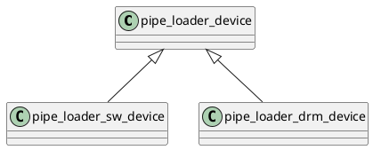

# Gallium Pipe

# swrast

# panfrost


luc:~/ $ glmark2 -b desktop                                           [8:02:58]
libGL error: MESA-LOADER: failed to open swrast: /home/luc/.local/lib/x86_64-linux-gnu/dri/swrast_dri.so: cannot open shared object file: No such file or directory (search paths /home/luc/.local/lib/x86_64-linux-gnu/dri)
libGL error: failed to load driver: swrast
Error: glXCreateNewContext failed
Error: CanvasGeneric: Invalid EGL state
Error: main: Could not initialize canvas
X Error of failed request:  BadValue (integer parameter out of range for operation)
  Major opcode of failed request:  149 (GLX)
  Minor opcode of failed request:  24 (X_GLXCreateNewContext)
  Value in failed request:  0x0
  Serial number of failed request:  38
  Current serial number in output stream:  39
luc:~/ $ cd .local/lib/x86_64-linux-gnu/dri                           [8:03:01]
luc:dri/ $ ls                                                         [8:05:03]
armada-drm_dri.so  imx-drm_dri.so      mxsfb-drm_dri.so  st7735r_dri.so
exynos_dri.so      ingenic-drm_dri.so  panfrost_dri.so   stm_dri.so
hx8357d_dri.so     mcde_dri.so         pl111_dri.so      sun4i-drm_dri.so
ili9225_dri.so     mediatek_dri.so     repaper_dri.so
ili9341_dri.so     meson_dri.so        rockchip_dri.so
imx-dcss_dri.so    mi0283qt_dri.so     st7586_dri.so

