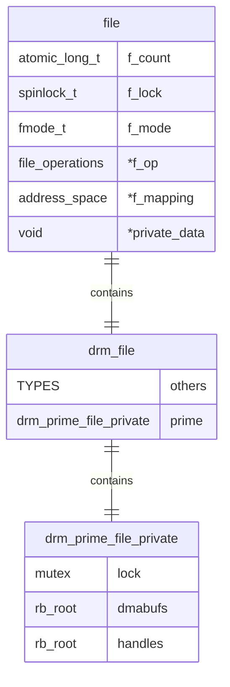
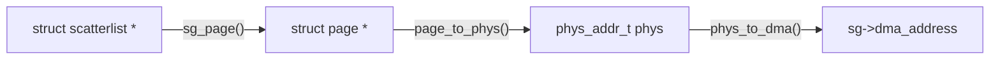
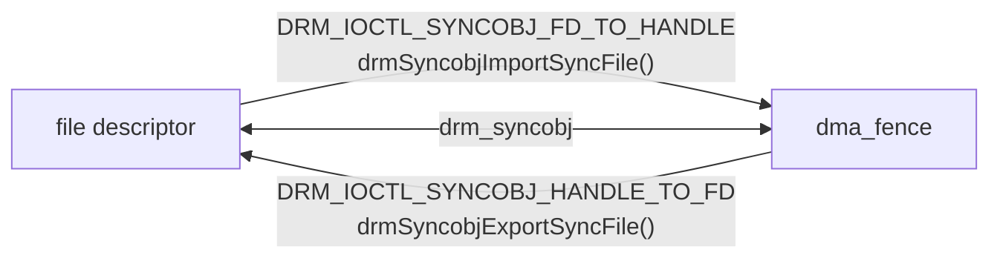
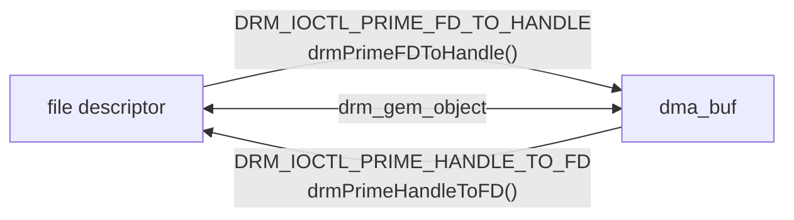

# DMA-BUF

```mermaid
flowchart BT
	App@{ img: "/images/dma-buf/window-content.png", label: "vram for rendering", pos: "d", w: 60, h: 60, constraint: "on" }
	Window@{ img: "/images/dma-buf/window-frame.png", label: "vram for window frame", pos: "d", w: 60, h: 60, constraint: "on" }

	subgraph app [glxgears]
		BO_10
	end
	subgraph x11 [Xorg]
		BO_20
		BO_11
	end
	subgraph compositor [kwin_x11]
		BO_21
	end

	App ~~~ BO_10 --Exporter--> App
	App --Importer--> BO_11

	Window ~~~ BO_20 --Exporter--> Window
	Window --Importer--> BO_21
```

<!--more-->

DMA-BUF 是 Linux 内核驱动中在上下文间，进程间，设备间，子系统间共享 buffer 的一种机制。 大概在[内核 3.2 版本就实现了](https://lwn.net/Articles/473668/)。 按最初的设计文档描述的，该框架大致是这样的:

- 导出者创建一个固定大小的 buffer object, 并将一个 struct file(anon file) 和 allocator 定义的一组操作 (`struct dma_buf_attach_ops`) 与之关联
- 不同的设备使用 `dma_buf_attach()` 将自己加到 buffer object 的 attachments 列表， 以便这个 buffer 的 backing storage 后面能被访问
- 这个导出的 buffer object 在各种实体间通过共享文件描述符 fd 来共享
- 收到 fd 的导入者将重新获取到 buffer object, 使用导出时关联的 `dma_buf_attach_ops` 去访问这个 buffer
- 导出者和导入者使用 `map_dma_buf()` 和 `unmap_dma_buf()` 来共享 buffer object 的 scatterlist

从用户态传递文件描述符一直到内核底层，最终共享的实际上是 scatter/gather table, 实际上就是那个 buffer 的内存物理地址(或 DMA 物理地址)

以 glxgears(`PRIME_HANDLE_TO_FD`) 和 Xorg(`PRIME_FD_TO_HANDLE`) 之间的共享过程为例, 主要有两个主要问题：

- 要给 DMA-BUF 套一层匿名文件(Anonymous File), 这样才可以安全地在进程间共享
- 导入者导入后，新建的 GPU VA 到 GPU PA 的映射要能够映射到与导出者进程里同样的物理显存位置 (GPU VA 倒无所谓)


为了实现上的优化，内核专门在 drm_file 下搞了一个 dmabuf 和 handle 的红黑树作为 **DMA-BUF 缓存**， 这样在同一设备文件中的导出导入或同一 DMA-BUF 被同一个设备多次导入的情况就会高效一些。DMA-BUF cache 如下：

```c
/**
 * struct drm_prime_file_private - per-file tracking for PRIME
 *
 * This just contains the internal &struct dma_buf and handle caches for each
 * &struct drm_file used by the PRIME core code.
 */
struct drm_prime_file_private {
/* private: */
	struct mutex lock;
	struct rb_root dmabufs;
	struct rb_root handles;
};
```

`struct file`, `struct drm_file`, `struct drm_prime_file_private` 三者的关系是



`struct file`， `struct dma_buf` 的关系

- 导出者 `DRM_IOCTL_PRIME_HANDLE_TO_FD`

先拿这个 gem_handle 去红黑树里找 dma_buf (**`drm_prime_lookup_buf_by_handle()`**), 如果有就返回这个 dma_buf，如果没有就调用 `export_and_register_object()` 给对应的 drm_gem_object 新申请一个 `struct dma_buf`，再由内核把这个 gem_handle 和 dma_buf 都缓存到红黑树中 (**`drm_prime_add_buf_handle()`**)， 最后 `fd_install(fd, dmabuf->file);` 把 fd 返回用户态的导出者。

```c
/**
 * dma_buf_export - Creates a new dma_buf, and associates an anon file
 * with this buffer, so it can be exported.
 * Also connect the allocator specific data and ops to the buffer.
 * Additionally, provide a name string for exporter; useful in debugging.
 *
 * @exp_info:	[in]	holds all the export related information provided
 *			by the exporter. see &struct dma_buf_export_info
 *			for further details.
 *
 * Returns, on success, a newly created struct dma_buf object, which wraps the
 * supplied private data and operations for struct dma_buf_ops. On either
 * missing ops, or error in allocating struct dma_buf, will return negative
 * error.
 *
 * For most cases the easiest way to create @exp_info is through the
 * %DEFINE_DMA_BUF_EXPORT_INFO macro.
 */
struct dma_buf *dma_buf_export(const struct dma_buf_export_info *exp_info)
{
	struct dma_buf *dmabuf;
	struct dma_resv *resv = exp_info->resv;
	struct file *file;
	size_t alloc_size = sizeof(struct dma_buf);
	int ret;

	if (WARN_ON(!exp_info->priv || !exp_info->ops
		    || !exp_info->ops->map_dma_buf
		    || !exp_info->ops->unmap_dma_buf
		    || !exp_info->ops->release))
		return ERR_PTR(-EINVAL);

	if (WARN_ON(exp_info->ops->cache_sgt_mapping &&
		    (exp_info->ops->pin || exp_info->ops->unpin)))
		return ERR_PTR(-EINVAL);

	if (WARN_ON(!exp_info->ops->pin != !exp_info->ops->unpin))
		return ERR_PTR(-EINVAL);

	if (!try_module_get(exp_info->owner))
		return ERR_PTR(-ENOENT);

	file = dma_buf_getfile(exp_info->size, exp_info->flags);
	if (IS_ERR(file)) {
		ret = PTR_ERR(file);
		goto err_module;
	}

	if (!exp_info->resv)
		alloc_size += sizeof(struct dma_resv);
	else
		/* prevent &dma_buf[1] == dma_buf->resv */
		alloc_size += 1;
	dmabuf = kzalloc(alloc_size, GFP_KERNEL);
	if (!dmabuf) {
		ret = -ENOMEM;
		goto err_file;
	}

	dmabuf->priv = exp_info->priv;
	dmabuf->ops = exp_info->ops;
	dmabuf->size = exp_info->size;
	dmabuf->exp_name = exp_info->exp_name;
	dmabuf->owner = exp_info->owner;
	spin_lock_init(&dmabuf->name_lock);
	init_waitqueue_head(&dmabuf->poll);
	dmabuf->cb_in.poll = dmabuf->cb_out.poll = &dmabuf->poll;
	dmabuf->cb_in.active = dmabuf->cb_out.active = 0;
	INIT_LIST_HEAD(&dmabuf->attachments);

	if (!resv) {
		dmabuf->resv = (struct dma_resv *)&dmabuf[1];
		dma_resv_init(dmabuf->resv);
	} else {
		dmabuf->resv = resv;
	}

	ret = dma_buf_stats_setup(dmabuf, file);
	if (ret)
		goto err_dmabuf;

	file->private_data = dmabuf;
	file->f_path.dentry->d_fsdata = dmabuf;
	dmabuf->file = file;

	__dma_buf_debugfs_list_add(dmabuf);

	return dmabuf;

err_dmabuf:
	if (!resv)
		dma_resv_fini(dmabuf->resv);
	kfree(dmabuf);
err_file:
	fput(file);
err_module:
	module_put(exp_info->owner);
	return ERR_PTR(ret);
}
```

- 导入者 `DRM_IOCTL_PRIME_FD_TO_HANDLE`

导入者接收到底层透过 UNIX domain socket 传来的 prime_fd 后 (如 Xorg 通过 `proc_dri3_pixmap_from_buffers()` 接收)，通过 `DRM_IOCTL_PRIME_FD_TO_HANDLE` IOCTL 陷入内核态，内核通过 `dma_buf_get(prime_fd)` 直接找到对应的 DMA-BUF, 然后先去 DMA-BUF 缓存中找 (`drm_prime_lookup_buf_handle()`)，如果命中就直接将 handle 返回给导入者， 如果不命中，就调用 `drm_gem_prime_import_dev()` 来完成 DMA-BUF Sharing 中最最关键的操作：**当 Buffer 导入另外一个进程后，这个 Buffer 的 GPU Mappings (GPU pagetables) 怎么复制过来**。

```c
/**
 * drm_gem_prime_import_dev - core implementation of the import callback
 * @dev: drm_device to import into
 * @dma_buf: dma-buf object to import
 * @attach_dev: struct device to dma_buf attach
 *
 * This is the core of drm_gem_prime_import(). It's designed to be called by
 * drivers who want to use a different device structure than &drm_device.dev for
 * attaching via dma_buf. This function calls
 * &drm_driver.gem_prime_import_sg_table internally.
 *
 * Drivers must arrange to call drm_prime_gem_destroy() from their
 * &drm_gem_object_funcs.free hook when using this function.
 */
struct drm_gem_object *drm_gem_prime_import_dev(struct drm_device *dev,
					    struct dma_buf *dma_buf,
					    struct device *attach_dev)
{
	struct dma_buf_attachment *attach;
	struct sg_table *sgt;
	struct drm_gem_object *obj;
	int ret;

	if (dma_buf->ops == &drm_gem_prime_dmabuf_ops) {
		obj = dma_buf->priv;
		if (obj->dev == dev) {
			/*
			 * Importing dmabuf exported from our own gem increases
			 * refcount on gem itself instead of f_count of dmabuf.
			 */
			drm_gem_object_get(obj);
			return obj;
		}
	}

	if (!dev->driver->gem_prime_import_sg_table)
		return ERR_PTR(-EINVAL);

	attach = dma_buf_attach(dma_buf, attach_dev);
	if (IS_ERR(attach))
		return ERR_CAST(attach);

	get_dma_buf(dma_buf);

	sgt = dma_buf_map_attachment_unlocked(attach, DMA_BIDIRECTIONAL);
	if (IS_ERR(sgt)) {
		ret = PTR_ERR(sgt);
		goto fail_detach;
	}

	obj = dev->driver->gem_prime_import_sg_table(dev, attach, sgt);
	if (IS_ERR(obj)) {
		ret = PTR_ERR(obj);
		goto fail_unmap;
	}

	obj->import_attach = attach;
	obj->resv = dma_buf->resv;

	return obj;

fail_unmap:
	dma_buf_unmap_attachment_unlocked(attach, sgt, DMA_BIDIRECTIONAL);
fail_detach:
	dma_buf_detach(dma_buf, attach);
	dma_buf_put(dma_buf);

	return ERR_PTR(ret);
}
```

## Dynamic DMA-BUF Mapping 和 Cached Sg Table

sg_table 是描述**不连续的物理内存块**(这个内存块是以物理页为单位的)的表结构，就是 scatterlist 的数组。

```c
struct scatterlist {
		unsigned long 	page_link;
		unsigned int 	offset;
		unsigned int 	length;
		dma_addr_t		dma_address;
}
```

- `page_link` 保存的是 `struct page *`, 即物理页的结构体指针再加最低两位的两个标识位
- `dma_address` 在有 IOMMU 的系统中是一个 I/O 虚拟地址(下图中的 Z)，在没有 IOMMU 的系统中就是设备地址空间(或 DMA 地址空间)的物理地址(下图中的 Y)


- `dma_direct_map_sg()`

`dma_direct_map_sg()` 是由一个 scatterlist 对应的物理页得到对应的 `dma_address`, 就是上图中 **Y 到 Z 的映射**



## dma_fence

`dma_fence_default_wait` 是 dma-fence 默认的 wait 操作。该函数会让当前进程(task) 进入睡眠状态 (可中断睡眠或不可中断睡眠，取决于调用者传入的参数 `intr`）, 直到 dma-fence 被 signaled 或者设置的超时时间到。

```c
	cb.base.func = dma_fence_default_wait_cb;
	cb.task = current;
	list_add(&cb.base.node, &fence->cb_list);
```

## dma_resv

`dma_resv` (reservation object) 提供一个管理 `dma_fence` 容器的机制，这些 `dma_fence` 都与某个 `dma_buf` 关联。它可以容纳任意数量的 `dma_fence`。 每个 `dma_fence` 被加入这个容器时都带有一个 `usage` 参数，`dma_resv_usage` 有两个作用：

- 描述对 `dma_resv` 不同的使用场景
- 在调用 `dma_resv_get_fences()` 时，决定哪些 fences 被返回


- 为什么同一个 `dma_buf` 会有那么多 `dma_fence` 与之关联呢？

因为同一个 Buffer 会有多个**使用者**， 有的读，有的写，有的等，这个 Buffer 的所有使用者的每个操作，理论上都有一个 `dma_fence`, 这些 `dma_fence` 在这整个机制下“有条不紊”地被 signaled, 才能保证所有访问都是按预期的顺序发生，这就是同步(每个使用者都可能是并发的进程)。

# Synchronization

隐式还是显式同步的主要区别在于同步是否由应用 (Applications) 直接控制，Vulkan 以前的图形 API，同步是由内核驱动或用户驱动完成的，应用完全不参与，这就是所谓的 "Implicit Synchronization", Vulkan 中，同步完全是由应用控制的，哪个渲染任务等哪个渲染任务，CPU 什么时候等 GPU, 都是由应用直接控制，从这一点也说明 Vulkan 应用是比较难写的，但 Vulkan 驱动(尤其用户驱动) 相对简单一些。但是问题是，不是所有的图形应用都是 Vulkan 写的 (Xorg, Wayland compositor 都不是 Vulkan 写的，而好多 Wayland client 可能是 Vulkan 写的)，所以目前还需要一些其它方案解决这种隐式同步和显式同步共存的场景。[Explicit sync](https://zamundaaa.github.io/wayland/2024/04/05/explicit-sync.html) 这篇博文关于这两者的概念讲得很清楚，这里主要是从实现的角度，做一下自己学习理解**隐式同步和显式同步**的记录。

## Implicit Synchronization

所谓**隐式同步**，就是驱动 (KMD) 会在每个 dmabuf 以及 buffer object 上附加一个 `dma_fence`, 以确保渲染命令的**有序**执行，以及 buffer 是否已经准备就绪后才可让**消费者**进行读取，所有这些工作基本上在内核完成，完全不需要应用程序的干预。这种方案虽然简单（对于应用开发者）来说，但会有**过度同步 (Over-Synchronization)** 的问题。

## Explicit Synchronization

- sync_file

`CONFIG_SYNC_FILE` 是内核 3.10 引入的一个可配置的 (configurable) 配置选项， 它控制的是 Linux 内核 Explicit Synchronization Framework 的编译。Sync File Framework 增加了由用户空间控制的显式同步, 它提供了通过用户空间组件 (Wayland, Vulkan 等)在驱动之间以 Sync File 文件描述符形式的 `struct dma_fence` 向用户空间的收发能力。Sync File 的主要使用者是 GPU 和 V4L 驱动, 它们通常会将一个 `dma_fence` 关联到一个 dmabuf, 这是**隐式同步**的做法,  而现在驱动会将与 dmabuf 相关的这个 `dma_fence` 以 **Sync File FD**传送到用户空间。

*NOTE: sync file 最初是先在 Android kernel 内实现的*

这里我们可以将 [`struct drm_syncobj`](https://elixir.bootlin.com/linux/v6.13.5/source/include/drm/drm_syncobj.h#L39) 和 [`struct drm_gem_object`](https://elixir.bootlin.com/linux/v6.13.5/source/include/drm/drm_gem.h#L273) 做个对比, 何其相似！

- drm_syncobj


- drm_gem_object



- drmSyncobjCreate()

```c
extern int drmSyncobjCreate(int fd, uint32_t flags, uint32_t *handle);
```

drm_syncobj 在用户空间只是一个 32 位整数 (handle), 创建它的用户态接口接受两个入参，一个出参:

- fd: drm 设备节点打开后的文件描述符
- flags: 要么 0， 要么 `DRM_SYNCOBJ_CREATE_SIGNALED`
- handle: 由内核返回的代表新创建的 drm_syncobj 的 ID 存放在 handle 这个地址

再看看创建 syncobj 的内核态接口，它里面有两步: 

- drm_syncobj_create() 

仅仅是申请 `struct drm_syncobj` 的内存, 初始化它的数据成员, 而且最关键的成员 `dma_fence` 还是空的，当用户传入 `DRM_SYNCOBJ_CREATE_SIGNALED` 标志时，`drm_syncobj_create()` 会自己创建一个 **stub fence** 赋给这个 syncobj, 如果创建时标志是 0， 则由用户后面绑定相关的 `dma_fence` (当然还是通过 syncobj 的形式，因为 `dma_fence` 对用户态不可见， 一般是用 `drmSyncobjExportSyncFile()`, `drmSyncobjCreate()`, `drmSyncobjImportSyncFile()` 来完成的。)

- drm_syncobj_get_handle()

返回的这个 32 位整数代表的就是 drm_syncobj, 但它仍然不是文件描述符 fd, 最终要让 drm_syncobj 能有一个真正的文件描述符还需要两个 IOCTL:

- `DRM_IOCTL_SYNCOBJ_HANDLE_TO_FD`
- `DRM_IOCTL_SYNCOBJ_FD_TO_HANDLE`

感觉为了让用户空间能够直接操作 `dma_fence` 这个内核的同步原语，费了“好大劲”，这背后应该有系统设计层面的考虑，后面有时间再琢磨。

```c
/**
 * drm_syncobj_get_handle - get a handle from a syncobj
 * @file_private: drm file private pointer
 * @syncobj: Sync object to export
 * @handle: out parameter with the new handle
 *
 * Exports a sync object created with drm_syncobj_create() as a handle on
 * @file_private to userspace.
 *
 * Returns 0 on success or a negative error value on failure.
 */
int drm_syncobj_get_handle(struct drm_file *file_private,
			   struct drm_syncobj *syncobj, u32 *handle)
```

- syncobj 的 handle 可以是 0 吗？

**不会是 0**

`drm_syncobj_get_handle()` 和 `drm_gem_handle_create_tail()` 一样，是通过 `idr_alloc()` 申请的一个给定范围内的 32 位整数，

```c
	ret = idr_alloc(&file_private->syncobj_idr, syncobj, 1, 0, GFP_NOWAIT);
```
它申请范围在最小值是 1 (包含)和最大值是 0 (不包含，实际上最大值是 0xffffffff) 之间的一个整数。 

# Questions

这里主要根据[内核邮件列表里的一个讨论](https://patchwork.kernel.org/project/kvm/patch/20250107142719.179636-2-yilun.xu@linux.intel.com/)来更好的理解 dma-buf 的设计思路和使用原则。

- 对于 dma-buf 来说， 什么是 **static attach** ？ 什么是 **dynamic attach** ? 
	- static attach 应该是指 dma-buf 对应的 page 不会在内存中移动 (move), 而 dynamic attach 相反**有可能移动**

- 用户为什么不直接将 dma-buf 的 PFN (物理页帧号) 共享给 importer, 让 importer 自己去创建 mappings ？
	- dma-buf 设计的就是不把 `struct page` 或 pfn 暴露给 importer, 本质上, dma-buf 只传送 dma_addr。所以 mappings 总是由 exporter 创建，而不是由 importer。
	- exported buffer 未必一定是内存 (有 `struct page`), 也可能是 MMIO
- 但为什么一定要让 exporter 去 map 呢？

- Exporter mapping 存在问题的场景:
	- Private address space
	- Multi-path PCI
	- Importing devices need to do things like turn on ATS on their DMA
	- TPH bits needs to be programmed into importer device
	- iommufd and KVM

- 为什么把 dma-buf 的 backing storage 信息暴露给 importer 是一个坏主意？

- exporter 会获取 importer 的 `struct device`

- multipath 总是需要在 importer 侧有额外的元信息去告诉 device 选择哪个 path 

:( 这5个场景目前一个都不知道是干什么的 :(


# References

- [Linux Kernel Documentation: Buffer Sharing and Synchronization](https://01.org/linuxgraphics/gfx-docs/drm/driver-api/dma-buf.html)
- [Sync File API Guide](https://docs.kernel.org/driver-api/sync_file.html)
- [Sharing buffers between devices](https://lwn.net/Articles/454389/)
- [PRIME](https://blog.csdn.net/hexiaolong2009/article/details/105961192)
- [何小龙的 DMA-BUF 系列文章](https://blog.csdn.net/hexiaolong2009/category_10838100.html)
- [Dynamic DMA Mapping Guide](http://www.wowotech.net/memory_management/DMA-Mapping-api.html)
- [Linux kernel scatterlist API 介绍](http://www.wowotech.net/memory_management/scatterlist.html)
- [深入理解 iommu 系列一：iommu 硬件架构和驱动初始化](https://kernelnote.com/deep-dive-iommu-hardware-driver.html)
- [Explicit sync](https://zamundaaa.github.io/wayland/2024/04/05/explicit-sync.html)
- [Bridging the synchronization gap on Linux](https://www.collabora.com/news-and-blog/blog/2022/06/09/bridging-the-synchronization-gap-on-linux/)
- [KVM 之内存虚拟化](https://royhunter.github.io/2016/03/13/kvm-mmu-virtualization/)
- [Dancing the DMA two-step](https://lwn.net/Articles/997563/)
