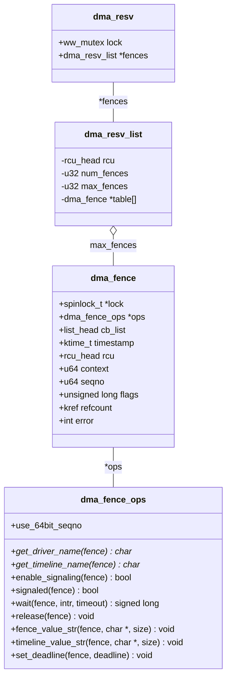

本文的标题来自[Linux Kernel 5.6.0-rc4文档](https://01.org/linuxgraphics/gfx-docs/drm/driver-api/dma-buf.html), dma-buf作为一个内核子系统，它的使用场景不局限于drm "[PRIME](https://blog.csdn.net/hexiaolong2009/article/details/105961192)" multi-GPU支持，它主要由3个组件支撑:

<!--more-->

- `dma_buf` 代表sg_table, 暴露给用户FD
- `dma_fence` 通知机制
- `dma_resv` 管理共享的或专有的fences

# DMA-BUF

dma-buf是Linux内核中在上下文间，进程间，设备间，子系统间进行 buffer 共享的一种实现。 它十几年前就已经合入内核了。

```
commit 3248877ea1796915419fba7c89315fdbf00cb56a
Author: Dave Airlie <airlied@redhat.com>
Date:   Fri Nov 25 15:21:02 2011 +0000

    drm: base prime/dma-buf support (v5)

    This adds the basic drm dma-buf interface layer, called PRIME. This
    commit doesn't add any driver support, it is simply and agreed upon starting
    point so we can work towards merging driver support for the next merge window.

    Current drivers with work done are nouveau, i915, udl, exynos and omap.

    The main APIs exposed to userspace allow translating a 32-bit object handle
    to a file descriptor, and a file descriptor to a 32-bit object handle.

    The flags value is currently limited to O_CLOEXEC.

    Acknowledgements:
    Daniel Vetter: lots of review
    Rob Clark: cleaned up lots of the internals and did lifetime review.

    v2: rename some functions after Chris preferred a green shed
    fix IS_ERR_OR_NULL -> IS_ERR
    v3: Fix Ville pointed out using buffer + kmalloc
    v4: add locking as per ickle review
    v5: allow re-exporting the original dma-buf (Daniel)

    Reviewed-by: Daniel Vetter <daniel.vetter@ffwll.ch>
    Reviewed-by: Rob Clark <rob.clark@linaro.org>
    Reviewed-by: Sumit Semwal <sumit.semwal@linaro.org>
    Reviewed-by: Inki Dae <inki.dae@samsung.com>
    Acked-by: Ben Widawsky <benjamin.widawsky@intel.com>
    Signed-off-by: Dave Airlie <airlied@redhat.com>
```

- exporter调用

```c
/**
 * drm_gem_prime_handle_to_fd - PRIME export function for GEM drivers
 * @dev: dev to export the buffer from
 * @file_priv: drm file-private structure
 * @handle: buffer handle to export
 * @flags: flags like DRM_CLOEXEC
 * @prime_fd: pointer to storage for the fd id of the create dma-buf
 *
 * This is the PRIME export function which must be used mandatorily by GEM
 * drivers to ensure correct lifetime management of the underlying GEM object.
 * The actual exporting from GEM object to a dma-buf is done through the
 * &drm_gem_object_funcs.export callback.
 */
int drm_gem_prime_handle_to_fd(struct drm_device *dev,
			       struct drm_file *file_priv, uint32_t handle,
			       uint32_t flags,
			       int *prime_fd)

```

- importer调用

```c
/**
 * drm_gem_prime_fd_to_handle - PRIME import function for GEM drivers
 * @dev: dev to export the buffer from
 * @file_priv: drm file-private structure
 * @prime_fd: fd id of the dma-buf which should be imported
 * @handle: pointer to storage for the handle of the imported buffer object
 *
 * This is the PRIME import function which must be used mandatorily by GEM
 * drivers to ensure correct lifetime management of the underlying GEM object.
 * The actual importing of GEM object from the dma-buf is done through the
 * &drm_driver.gem_prime_import driver callback.
 *
 * Returns 0 on success or a negative error code on failure.
 */
int drm_gem_prime_fd_to_handle(struct drm_device *dev,
			       struct drm_file *file_priv, int prime_fd,
			       uint32_t *handle)

```

从上面两个函数的接口看，它们共同涉及3个数据对象：

- drm_device
- dma_buf fd
- drm_gem_object handle

显然两个函数里的`dev`一定是**不同**的`drm_device`, `dma_buf` fd一定是同一个FD（也即同一个dma-buf, 要不然也不叫共享了），那么`handle`呢？肯定也是**不同**的`handle`, 因为`handle`其实是对`device`而言的，它是一个设备持有的`drm_gem_object`的ID. 但这个ID背后的东西(backing storage)可能是**同一个**东西。

可以打个比方，你去银行要办两种业务，两种业务分别排号，假如你要办的A业务排到7号，B业务也刚好排到7号（注意:号码相同，但是两个号），但是很有可能是同一个业务员为你办理这两种业务，这里的业务就是设备驱动，而那个业务员就是dma-buf(或者它封装的那块显存)。

## dma_fence


`dma_fence_default_wait` 是 dma-fence 默认的 wait 操作。该函数会让当前进程(task) 进入睡眠状态 (可中断睡眠或不可中断睡眠，取决于调用者传入的参数 `intr`）, 直到 dma-fence 被 signaled 或者设置的超时时间到。

```c
	cb.base.func = dma_fence_default_wait_cb;
	cb.task = current;
	list_add(&cb.base.node, &fence->cb_list);
```

## dma_resv



# Synchronization

隐式还是显式同步的主要区别在于同步是否由应用 (Applications) 直接控制，Vulkan 以前的图形 API，同步是由内核驱动或用户驱动完成的，应用完全不参与，这就是所谓的 "Implicit Synchronization", Vulkan 中，同步完全是由应用控制的，哪个渲染任务等哪个渲染任务，CPU 什么时候等 GPU, 都是由应用直接控制，从这一点也说明 Vulkan 应用是比较难写的，但 Vulkan 驱动(尤其用户驱动) 相对简单一些。但是问题是，不能所有的图形应用都是 Vulkan 写的 (Xorg, Wayland compositor 都不是 Vulkan 写的，而好多 Wayland client 可能是 Vulkan 写的)，所以目前还需要一些其它方案解决这种隐式同步和显式同步共存的场景。[Explicit sync](https://zamundaaa.github.io/wayland/2024/04/05/explicit-sync.html) 这篇博文关于这两者的概念讲得很清楚，这里主要是从实现的角度，做一下自己学习理解**隐式同步和显式同步**的记录。

## Implicit Synchronization

## Explicit Synchronization

- sync_file

`CONFIG_SYNC_FILE` 是内核 3.10 引入的一个可配置的 (configurable) 配置选项， 它控制的是内核 Explicit Synchronization Framework 的编译。Sync File Framework 增加了由用户空间控制的 explicit synchronization, 它提供了通过用户空间组件(Wayland, Vulkan 等)在驱动之间以 Sync File 文件描述符形式的 `struct dma_fence` 向用户空间的收发能力。Sync File 的主要使用者是图形子系统，图形子系统经常会将一个 dma_fence 关联到一个 buffer, 当一个 job 被提交给 GPU 时，一个 dma_fence 也会被附加到那个 buffer, dma_fence 会以 Sync File 文件描述符的形式通过用户空间传送到 DRM 驱动。

- drm_syncobj

```c
/**
 * struct drm_syncobj - sync object.
 *
 * This structure defines a generic sync object which wraps a &dma_fence.
 */
struct drm_syncobj {
	/**
	 * @refcount: Reference count of this object.
	 */
	struct kref refcount;
	/**
	 * @fence:
	 * NULL or a pointer to the fence bound to this object.
	 *
	 * This field should not be used directly. Use drm_syncobj_fence_get()
	 * and drm_syncobj_replace_fence() instead.
	 */
	struct dma_fence __rcu *fence;
	/**
	 * @cb_list: List of callbacks to call when the &fence gets replaced.
	 */
	struct list_head cb_list;
	/**
	 * @ev_fd_list: List of registered eventfd.
	 */
	struct list_head ev_fd_list;
	/**
	 * @lock: Protects &cb_list and &ev_fd_list, and write-locks &fence.
	 */
	spinlock_t lock;
	/**
	 * @file: A file backing for this syncobj.
	 */
	struct file *file;
};
```
这个定义简洁明了，首先它是一个同步原语，所以它本质上是一个 `dma_fence` 的封装。其次它是一个内核对象，所以它有引用计数 `kref`。最后它是要被用户态使用的，所以它得有一个对应的文件 `struct file`。

`drm_syncobj` 应该就是为了能让用户态感知到 `dma_fence` 这个本来只被隐藏于内核里的同步原语，能够让 `dma_fence` 在用户空间由应用程序显式地操作。而 Linux “一切皆文件”， 所以就把 `dma_fence` 搞成披着“文件马甲”的一个东西。

- drmSyncobjCreate()

```c
extern int drmSyncobjCreate(int fd, uint32_t flags, uint32_t *handle);
```

drm_syncobj 在用户空间只是一个 32 位整数 (handle), 创建它的用户态接口接受两个入参，一个出参:

- fd: drm 设备节点打开后的文件描述符
- flags: 要么 0， 要么 `DRM_SYNCOBJ_CREATE_SIGNALED`
- handle: 由内核返回的代表新创建的 drm_syncobj 的 ID 存放在 handle 这个地址

再看看创建 syncobj 的内核态接口，它里面有两步: 

- drm_syncobj_create() 

仅仅是申请 `struct drm_syncobj` 的内存, 初始化它的数据成员, 而且最关键的成员 `dma_fence` 还是空的，当用户传入 `DRM_SYNCOBJ_CREATE_SIGNALED` 标志时，`drm_syncobj_create()` 会自己创建一个 **stub fence** 赋给这个 syncobj, 如果创建时标志是 0， 则由用户后面绑定相关的 `dma_fence` (当然还是通过 syncobj 的形式，因为用户不能直接接触 `dma_fence`， 一般是用 `drmSyncobjExportSyncFile()`, `drmSyncobjCreate()`, `drmSyncobjImportSyncFile()` 这套组合拳来完成的。)

- drm_syncobj_get_handle()

返回的这个 32 位整数代表的就是 drm_syncobj, 但它仍然不是文件描述符 fd, 最终要让 drm_syncobj 能有一个真正的文件描述符还需要两个 IOCTL:

- `DRM_IOCTL_SYNCOBJ_HANDLE_TO_FD`
- `DRM_IOCTL_SYNCOBJ_FD_TO_HANDLE`

感觉为了让用户空间能够直接操作 `dma_fence` 这个内核的同步原语，费了“好大劲”，这背后应该有系统设计层面的考虑，后面有时间再琢磨。

```c
/**
 * drm_syncobj_get_handle - get a handle from a syncobj
 * @file_private: drm file private pointer
 * @syncobj: Sync object to export
 * @handle: out parameter with the new handle
 *
 * Exports a sync object created with drm_syncobj_create() as a handle on
 * @file_private to userspace.
 *
 * Returns 0 on success or a negative error value on failure.
 */
int drm_syncobj_get_handle(struct drm_file *file_private,
			   struct drm_syncobj *syncobj, u32 *handle)
```

# References
- [Explicit sync](https://zamundaaa.github.io/wayland/2024/04/05/explicit-sync.html)
- [Bridging the synchronization gap on Linux](https://www.collabora.com/news-and-blog/blog/2022/06/09/bridging-the-synchronization-gap-on-linux/)
