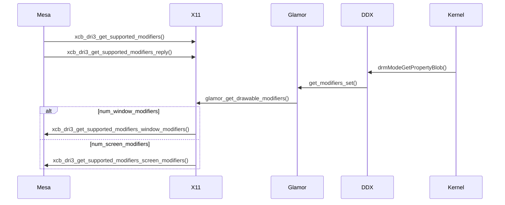

# FourCC
FourCC format code是Linux内核DRM子系统用来描述framebuffer像素格式。它们被定义在内核源码[include/uapi/drm/drm_fourcc.h](https://github.com/torvalds/linux/blob/master/include/uapi/drm/drm_fourcc.h#L156). 基本上FourCC format code足以描述framebuffer中像素的内容了，但是随着GPU的更新，原来线性排列的buffers，为了获取更好的性能，可能会采取vendor specific的布局方式。另外，这些buffer也可能保存的是各种不同的压缩数据，这样一来，原来的FourCC format code就无法携带新的buffer
layout或compression format的信息，DRM format modifier就是用来解决这些问题的。

<!--more-->

# Modifier

# Examples

## [DRM_FORMAT_MOD_ARM_16X16_BLOCK_U_INTERLEAVED](https://elixir.bootlin.com/mesa/latest/source/include/drm-uapi/drm_fourcc.h#L1332)

### How U-interleaved improves performance?


### What is the block size?
对于 U-interleaved 布局的纹理, 有两种可能的 block size:

- 4x4 (压缩格式)
- 16x16 (非压缩格式)

### What is the row stride?
row stride 通常指纹理图片中相邻两行之间的字节数。对于 Linear 布局的纹理, block size 是 1x1, 它的 row stride 即为

$$ RowStride = BytesPerPixel * Width $$

这也是所谓的逻辑 row stride, 而对于 U-interleaved 布局的纹理，由于它在内存中是按块存储的（块与块之间是线性的），所以 U-interleaved 布局的纹理的 row stride 已经不是通常意义的“行”了，而是由**块**组成的**行**。所以 U-interleaved 布局的纹理的 row stride 为

$$ RowStride = BytesPerBlock * nBlocksX $$

#### 非压缩格式的 U-interleaved 布局的 row stride


#### 压缩格式的 U-interleaved 布局的 row stride
以 [BC1 压缩格式](https://sv-journal.org/2014-1/06/en/index.php?lang=en#5)为例, BC1 是 S3TC 家族的一员(所有的 S3TC 家族都使用 4x4 的块大小)，而 DRM_FORMAT_MOD_ARM_16X16_BLOCK_U_INTERLEAVED 是 16x16 大小的，所以一个 U-interleaved 块中包含 4x4 个 BC1 压缩块。


# Modifier Negotiation

## On X11

在 DRI3 扩展里， 因为 render buffer 是由驱动(应用)创建后导出给 X11 的， 所以在驱动创建 buffer 前，需要向 X11 查询现在支持哪些 modifiers, 驱动根据查询到的支持的 modifiers 再去创建 buffer (BO, 也即 resource)。



**modifiers** 集是提前存储在一个 DDX 内部的数据结构中的，例如 xserver 的 **modesetting**，是保存在 `drmmode_format_rec` 结构体中的(当然它是一组)

```c
typedef struct {
    uint32_t format;
    uint32_t num_modifiers;
    uint64_t *modifiers;
} drmmode_format_rec, *drmmode_format_ptr;
```

## On XWayland

# Tool - [drm_info](https://gitlab.freedesktop.org/emersion/drm_info)

**drm_info** 可以列举出所有 KMS 支持的 scanout modifiers ([https://pastebin.com/dwhfdVDf](https://pastebin.com/dwhfdVDf))

```
    ├───Plane 1
    │   ├───Object ID: 44
    │   ├───CRTCs: {0}
    │   ├───Legacy info
    │   │   ├───FB ID: 0
    │   │   └───Formats:
    │   │       ├───YUYV (0x56595559)
    │   │       ├───UYVY (0x59565955)
    │   │       ├───XRGB8888 (0x34325258)
    │   │       ├───XRGB1555 (0x35315258)
    │   │       ├───XBGR2101010 (0x30334258)
    │   │       ├───XRGB2101010 (0x30335258)
    │   │       └───XBGR16161616F (0x48344258)
    │   └───Properties
    │       ├───"type" (immutable): enum {Overlay, Primary, Cursor} = Overlay
    │       ├───"IN_FORMATS" (immutable): blob = 45
    │       │   ├───NVIDIA_BLOCK_LINEAR_2D(h=0, k=254, g=0, s=1, c=0) (0x03000000004fe010)
    │       │   │   ├───YUYV (0x56595559)
    │       │   │   ├───UYVY (0x59565955)
    │       │   │   ├───XRGB8888 (0x34325258)
    │       │   │   ├───XRGB1555 (0x35315258)
    │       │   │   ├───XBGR2101010 (0x30334258)
    │       │   │   ├───XRGB2101010 (0x30335258)
    │       │   │   └───XBGR16161616F (0x48344258)
    │       │   ├───NVIDIA_BLOCK_LINEAR_2D(h=1, k=254, g=0, s=1, c=0) (0x03000000004fe011)
```

# Reference

- [Implementing DRM format modifiers in NVK](https://www.collabora.com/news-and-blog/news-and-events/implementing-drm-format-modifiers-in-nvk.html)
- [Linux DMA-BUF](https://wayland.app/protocols/linux-dmabuf-v1)
