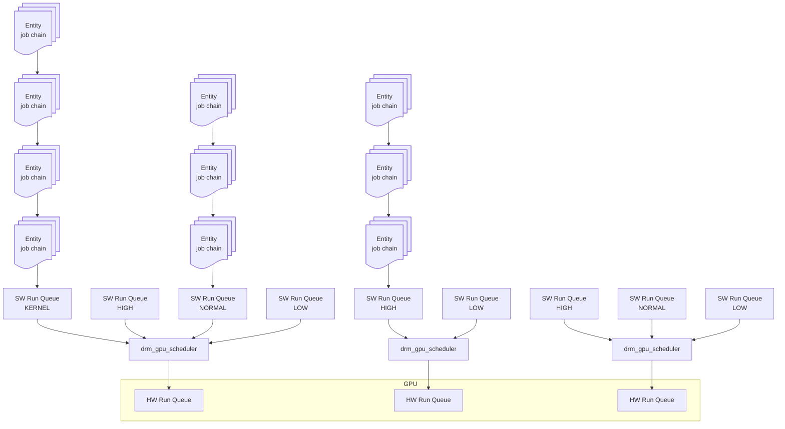

<!--more-->

Notes:

- 每个 hw run queue 对应一个 [drm_gpu_scheduler](https://elixir.bootlin.com/linux/v6.13.4/source/drivers/gpu/drm/panfrost/panfrost_job.c#L36)
- 每个 scheduler 对应多个不同优先级的 scheduler run queue (sw run queue)
- 每个 scheduler run queue 是一个等待被调试的 entity 队列
- 每个 entity 由包含若干个 gpu job 的链表组成

# 数据结构

Linux DRM 子系统的 `drm_gpu_scheduler` 负责提交和调度 GPU job，以一个单独的内核模块(`gpu-sched`) 的形式存在。

- `drm_gpu_scheduler`

调度器实例 (instance)，运行时实际上是一个内核线程 (kthread), 这个线程启动是在 `drm_sched_init()`。

实际上，自从内核 v6.8-rc1 [a6149f039369 ("drm/sched: Convert drm scheduler to use a work queue rather than kthread")](https://lore.kernel.org/all/20231031032439.1558703-3-matthew.brost@intel.com/) `drm_gpu_scheduler` 的实现已经从 kthread 变成 work queue 了。 这个修改与 Intel Gen9+ 引入的 microcontrollers (μC) 之一 [GuC](https://igor-blue.github.io/2021/02/10/graphics-part1.html#the-guc) 有关。

- `drm_sched_rq`

若干个 `drm_sched_entity` (list) 的封装。一个 scheduler 实例最多可以有 `DRM_SCHED_PRIORITY_COUNT` 个 `drm_sched_rq`。调度器调度的其实就是一个个 entity。 这么多个 entity 按什么顺序提交给 GPU 由具体的 **调度策略 (Scheduling Policy)** 决定，而**调度优先级 (Scheduling Priority)** 由 `drm_sched_rq` 实现，有多少个优先级，一个 `drm_gpu_scheduler` 里就有多少个 `drm_sched_rq`，每个优先级对应一个 `drm_sched_rq`。 

- `drm_sched_entity`

若干个 `drm_sched_job` (list) 的封装

- `drm_sched_job`

被 entity 运行的一个 job, 一个 job 总是属于某一个 entity

# 参考资料

- [linux DRM GPU scheduler 笔记](https://www.cnblogs.com/yaongtime/p/14305463.html)
- [drm/panfrost: Add initial panfrost driver](https://patchwork.freedesktop.org/patch/297644/)

