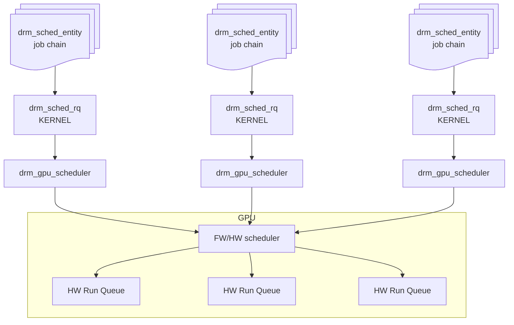
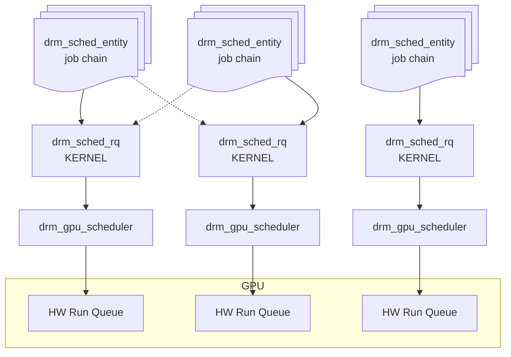
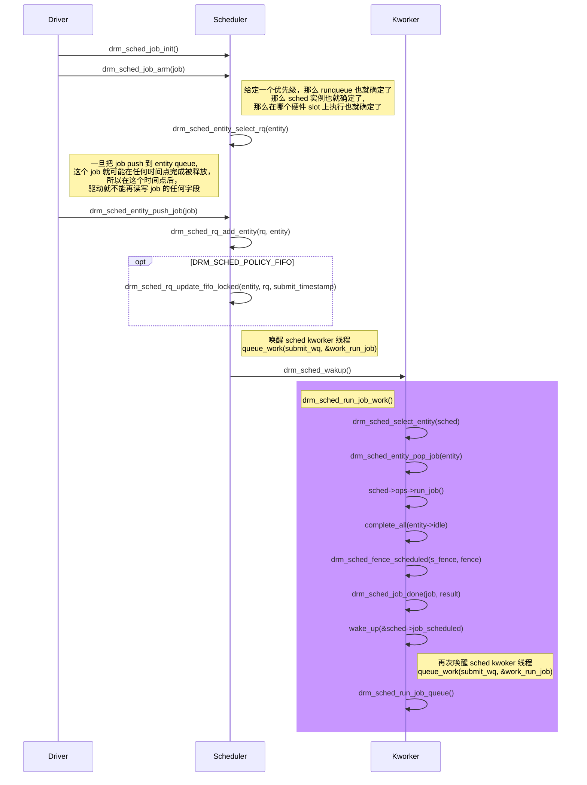
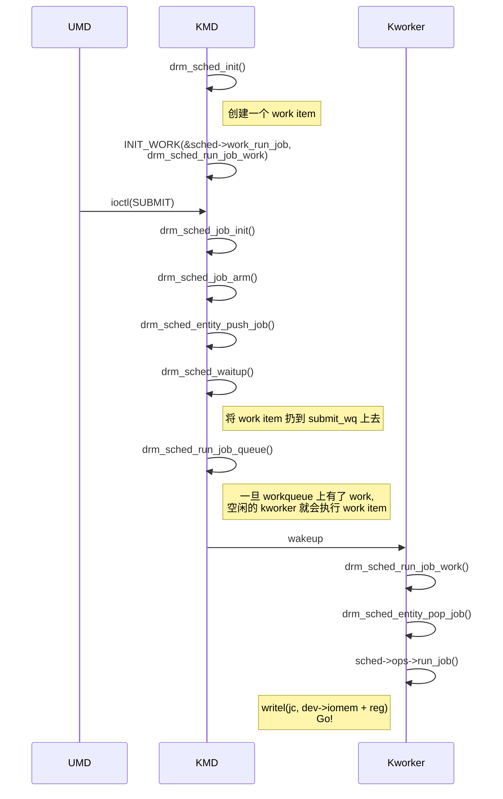

<!--more-->

Notes:

- 每个 hw run queue (hw ring) 对应一个 [drm_gpu_scheduler](https://elixir.bootlin.com/linux/v6.13.4/source/drivers/gpu/drm/panfrost/panfrost_job.c#L36)

| DRIVER    |  MAX_HW_RINGS                 |  VALUE  |
|:----------|:------------------------------|:--------|
| amdgpu    | AMDGPU_MAX_RINGS              | 124     |
| etnaviv   | ETNA_MAX_PIPES                | 4       |
| powervr   |                               | 4       |
| panfrost  | NUM_JOB_SLOTS                 | 3       |
| v3d       | V3D_MAX_QUEUES                | 6       |

- 每个 scheduler 对应多个不同优先级(`enum drm_sched_priority`)的 scheduler run queue (sw run queue)

但似乎对于未来的硬件，尤其那些通过 FW/HW 调度 job 的 GPU, 更希望的拓扑结构是 scheduler : run queue : entity 是 1:1:1. 这样的 `drm_gpu_scheduler` 已经退化成一个 **dependency tracker**, 没有了实质的~~调度~~的作用。



- 每个 scheduler run queue 是一个将被调度的 entity 队列
- `drm_sched_entity.sched_list`, 一个 entity 上的 jobs 可以被调度到这个 **sched_list** 上的任意一个 scheduler 上, 实现这个过程是通过 [`drm_sched_entity_select_rq()`](https://elixir.bootlin.com/linux/v6.13.5/source/drivers/gpu/drm/scheduler/sched_entity.c#L539) 完成的。




- 每个 entity 由包含若干个 gpu job 的链表组成

# 数据结构

Linux DRM 子系统的 `drm_gpu_scheduler` 负责提交和调度 GPU job，以一个单独的内核模块(`gpu-sched`) 的形式存在。

## `drm_gpu_scheduler`

调度器实例 (instance)，运行时实际上是一个内核线程 (kthread), 这个线程启动是在 `drm_sched_init()`。

实际上，自从内核 v6.8-rc1 [a6149f039369 ("drm/sched: Convert drm scheduler to use a work queue rather than kthread")](https://lore.kernel.org/all/20231031032439.1558703-3-matthew.brost@intel.com/) `drm_gpu_scheduler` 的实现已经从 kthread 变成 work queue 了。 这个修改与 Intel Gen9+ 引入的 microcontrollers (μC) 之一 [GuC](https://igor-blue.github.io/2021/02/10/graphics-part1.html#the-guc) 有关。

## `drm_sched_rq`

若干个 `drm_sched_entity` (list) 的封装。一个 scheduler 实例最多可以有 `DRM_SCHED_PRIORITY_COUNT` 个 `drm_sched_rq`。调度器调度的其实就是一个个 entity。 这么多个 entity 按什么顺序提交给 GPU 由具体的 **调度策略 (Scheduling Policy)** 决定，而**调度优先级 (Scheduling Priority)** 由 `drm_sched_rq` 实现，有多少个优先级，一个 `drm_gpu_scheduler` 里就有多少个 `drm_sched_rq`，每个优先级对应一个 `drm_sched_rq`。 

## `drm_sched_entity`

若干个 `drm_sched_job` (list) 的封装

## `drm_sched_job`

被 entity 运行的一个 job, 一个 job 总是属于某一个 entity

## [`drm_sched_fence`](https://elixir.bootlin.com/linux/v6.13.5/source/include/drm/gpu_scheduler.h#L267)

```c
struct drm_sched_fence {
  // job 一旦被调度了，就 signal 这个 fence
  struct dma_fence scheduled;

  // job 被硬件完成了， 就 signal 这个 fence
  // 当一个 job 完成时，硬件一般会上报一个中断 interrupt
  struct dma_fence finished;

  //
  ktime_t deadline;

  // 由驱动提供的 run_job() 回调函数返回的 fence,
  // 硬件上 finished/done 中断后，会先 signal 这个 fence
  // scheduler signal @scheduled fence 时，会将 sched->ops->run_job() 的
  // 返回值赋给 parent
  struct dma_fence *parent;

  //
  struct drm_gpu_scheduler *sched;

  //
  spinlock_t lock;

  //
  void *owner;
}
```


# 初始化 Scheduler 实例

## v6.8

```c
int drm_sched_init(
  struct drm_gpu_scheduler *sched,

  // 需要由驱动实现的一组回调函数, 有
  // prepare_job(), run_job(), timedout_job(), free_job()
  const struct drm_sched_backend_ops *ops,

  // 一个 workqueue(6.8 之前是 kthread) 用来向 hw run queue 提交 job
  // 如果驱动没有提供，默认是一个 ordered workqueue
  struct workqueue_struct *submit_wq, 

  // 这个 sched 下的 drm_sched_rq 的个数，最多 4 个，分别对应
  // LOW, NORMAL, HIGH, KERNEL 4 个优先级
  u32 num_rqs,

  // 用来 job flow control, sched 最多能提交多少个 job(chain) 给 hw,
  // 防止 ring buffer overflow
  // 这里的每个job 的概念因不同 GPU 而异
  u32 credit_limit,

  // 允许一个 job 在被丢弃前 hang 多少次
  unsigned int hang_limit,

  // job 超时时长 (jiffies)
  long timeout,

  // 另外一个 workqueue 用来执行超时之后的逻辑。驱动可以不指定，
  // 默认是 system_wq (让这个 workqueue 执行的任务不要太长)
  struct workqueue_struct *timeout_wq,

  atomic_t *score, // 与其它 sched 共享的原子整型的 score
  const char *name, // 用来调试
  struct device *dev // 所属 struct device
);
```

```c
int drm_sched_entity_init(
  struct drm_sched_entity *entity,

  // 一个 priority 对应一个 run queue
  enum drm_sched_priority priority,

  // 这个 entity 上的 jobs 可以在这组 schedulers 中的任意一个 scheduler 上调度
  struct drm_gpu_scheduler **sched_list,
  unsigned int num_sched_list,
  atomic_t *guilty
);

## v5.4

```c
int drm_sched_init(
  struct drm_gpu_scheduler *sched,
  // 需要由驱动实现的一组回调函数，有
  // dependency(), run_job(), timedout_job(), free_job()
  const struct drm_sched_backend_ops *ops,
  unsigned hw_submission, // 允许有多少个 hw 提交同时存在
  unsigned hang_limit, // 允许一个 job 在被丢弃前 hang 多少次
  long timeout, // job 超时时长 (jiffies)
  const char *name // 用来调试
);
```

Note:

- 5.4 没有让驱动提供一个 timeout_wq, 而是固定使用 delayable workqueue 去执行 [drm_sched_job_timedout()](https://elixir.bootlin.com/linux/v5.19.17/source/drivers/gpu/drm/scheduler/sched_main.c#L1016)
- 参数中的 `timeout` 是以 jiffies 计算的，如果设置成 `MAX_SCHEDULE_TIMEOUT`， 表示由驱动自己处理超时

# Entity - Jobs 的容器



# Scheduler 如何工作

Job 提交一般由用户驱动通过 **IOCTL_SUBMIT** 命令触发，将 job 下发给 hw, 所谓下发就是将 64 位的 job(chain) 的起始地址写入 MMIO 寄存器或 ringbuffer, 然后再触发 doorbell, hw 就开始执行



Note:
- `drm_sched_free_job_work()` 和 `drm_sched_run_job_work()` 是分开的两个 work item, 但它俩都会被扔到同一个 workqueue 上 `submit_wq` (workqueue 的实现很有意思，异步执行的单位是函数 (work_struct)，而这些函数会被加入一个队列 (workqueue) 里推迟执行 (deferred)，只要队列不为空，后台线程们就把它们拿出来**并发地**执行 (CMWQ). 后台线程是一个由内核自动管理的线程池，唤醒和睡眠不用驱动管，驱动只需要 `queue_work_on()`)
-  gpu scheduler 里的 `submit_wq` 是一个 **Ordered Workqueue**, 意思就是加到这个 wq 上的函数保证是顺序执行的，这就天然地解决了 **run_job** 和 **free_job** 的依赖问题 (mutual exclusive)

# 参考资料

- [drm/scheduler: improve GPU scheduler documentation v2](https://patchwork.freedesktop.org/patch/567839/)
- [linux DRM GPU scheduler 笔记](https://www.cnblogs.com/yaongtime/p/14305463.html)
- [drm/panfrost: Add initial panfrost driver](https://patchwork.freedesktop.org/patch/297644/)
- [drivers/gpu 下的 `drm_sched_backend_ops`](https://pastebin.com/MssJk6Ky)
- [PowerVR Rogue Command Stream format](https://gitlab.freedesktop.org/mesa/mesa/-/blob/f8d2b42ae65c2f16f36a43e0ae39d288431e4263/src/imagination/csbgen/rogue_kmd_stream.xml)
- [Linux kernel workqueue 机制分析](https://www.cnblogs.com/jimbo17/p/8885814.html)
- [异步处理的强力助手：Linux Workqueue 机制详解](https://cloud.tencent.com/developer/article/2441413)
- [Concurrency Managed Workqueue之（一）：workqueue的基本概念](http://www.wowotech.net/irq_subsystem/workqueue.html)

