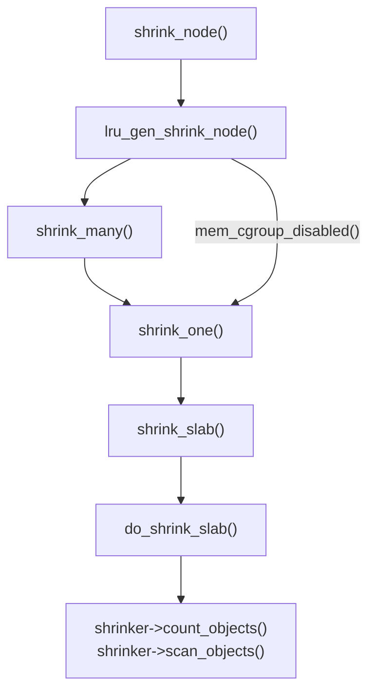

# 背景介绍

之前一直有一个疑问：[为什么在 drm_gpu_sheduler 的 run_job 路径里带 GFP_KERNEL 标志的内存申请可以造成死锁?](https://www.kernel.org/doc/html/latest/driver-api/dma-buf.html#dma-fence-cross-driver-contract), 直到了解内核内存 **Pin** 和 **Shrink** 的机制后，好像是明白了死锁的过程。

<!--more-->

# 内存 Pin
Linux 是基于页 (page) 来管理内存的，物理内存页和虚拟内存页一般有相同的大小，比较常见的是 4KB 页大小。

# 内存 Reclaim

内存页回收有两种方式：
- direct reclaim (同步)

direct reclaim 是指在内存分配时，如果系统内存不足，直接触发内存回收，这时内存申请调用是会被**阻塞的**。

- background reclaim (异步)

background reclaim 是指 kswapd 线程被唤醒异步地扫描 Zone 回收内存。

# 内存 Shrink

为了能够动态的回收内存，内核提供了一套 "shrinker" 接口，通过该机制，内存管理子系统 (mm) 可以通过**回调**的方式回收部分内存页，以减小系统内存压力。

根据文章 [Linux内核页回收](https://blog.csdn.net/weixin_49382066/article/details/130704158) 中的描述，无论是 direct reclaim 还是 kswapd, 最终都会调到 `shrink_node()`， 而 `shrink_node()` 又是如何调到由其它文件系统或驱动注册的 shrinker 的钩子函数的呢？

# GFP_KERNEL

带有 `GFP_KERNEL` 标志的内存申请既可以触发 direct reclaim, 也可以触发 background reclaim。如果 direct reclaim 被触发，回调注册的 shrinker 回调函数，而这个回调函数可以实现任何逻辑(取决于实现这个 shrinker 的文件系统或驱动)，如果这个逻辑恰好是在**等待某个 GPU job 的 dma_fence 被 signaled**, 而你又正好是在 kick off 这个 GPU job 时触发的 direct reclaim, 这样是不是就死锁了？

# 参考
- [Performance Analysis And Tuning On Modern CPUs](https://weedge.github.io/perf-book-cn/zh/chapters/3-CPU-Microarchitecture/3-7_Virtual_memory_cn.html)
- [Locking and pinning](https://lwn.net/Articles/600502/)
- [Smarter Shrinker](https://tinylab.org/lwn-550463/)
- [GFP flags and reclaim behavior](https://www.kernel.org/doc/html/next/core-api/memory-allocation.html#gfp-flags-and-reclaim-behavior)
- [Linux内核页回收](https://blog.csdn.net/weixin_49382066/article/details/130704158)
- [freelancer-leon's notes](https://github.com/freelancer-leon/notes/blob/master/kernel/graphic/Linux-Graphic.md)
- [GEM wikipedia](https://en.wikipedia.org/wiki/Direct_Rendering_Manager#Graphics_Execution_Manager)
