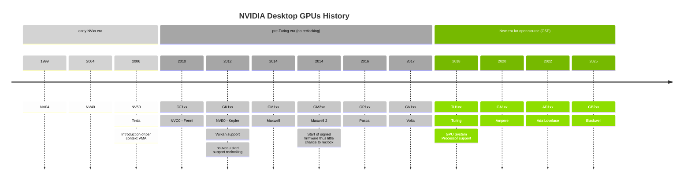

<!--more-->

# Reference

- [GPU Architecture Overview](https://insujang.github.io/2017-04-27/gpu-architecture-overview/)
- [LWN: NVIDIA GPU 和 Nouveau](https://blog.csdn.net/Linux_Everything/article/details/127780944)
- [List of Nvidia GPUs](https://en.wikipedia.org/wiki/List_of_Nvidia_graphics_processing_units)
