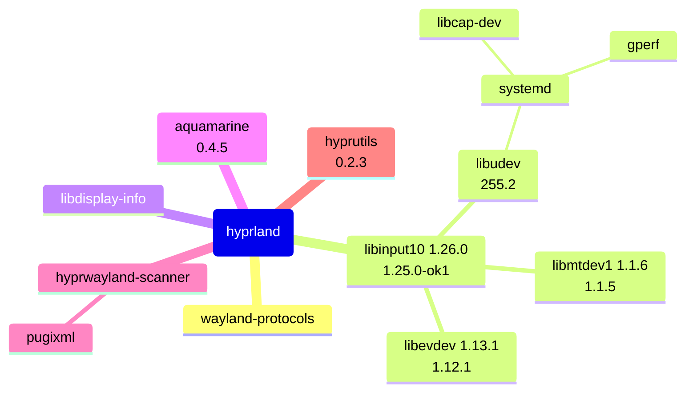

# [OpenKylin 2.0](https://www.openkylin.top/)


<!--more-->

# Install trace-cmd

还算顺利，大部分依赖包从系统 apt 源里都能安装，但也有一些问题

- `/usr/lib64/pkgconfig` 没有在 `pkg-config` 默认的 search paths 里
    - `export PKG_CONFIG_PTH=/usr/lib64/pkgconfig` 可解决构建问题
- `/usr/lib64` 没有在 `ld.so` 的默认的 search paths 里
    - `/etc/ld.so.conf.d/x86_64-linux-gnu.conf` 里增加 `/usr/lib64` 可解决运行时找不到 shared library 的问题
- 因为 xmlto 的依赖问题无法安装，幸好它只是用来构建 Documentation, 通过 `-Ddoc=false` 不构建就可以继续下去

| Dependency   | Apt Install | Problem       |
|:-------------|:-----------:|:--------------|
| meson        | √           |               |
| cmake        | √           |               |
| asciidoc     | √           |               |
| xmlto        | ∅           | docbook unmet |
| flex         | √           |               |
| bison        | √           |               |
| libaudit-dev | √           |               |

# Install apitrace

apitrace 不带 GUI 的话可以非常顺利的安装，带 GUI 的话因为依赖 Qt5/6, 稍微麻烦一点

```
if (ENABLE_GUI)
    if (NOT (ENABLE_GUI STREQUAL "AUTO"))
        set (REQUIRE_GUI REQUIRED)
    endif ()
    if (POLICY CMP0020)
        cmake_policy (SET CMP0020 NEW)
    endif()
    if (ENABLE_QT6)
        find_package (Qt6 COMPONENTS Widgets Network ${REQUIRE_GUI})
    else ()
        find_package (Qt5 5.15 COMPONENTS Widgets Network ${REQUIRE_GUI})
    endif ()
endif ()
```

## Install Qt

一开始通过 [qt-online-installer-linux-x64-4.8.1.run](https://www.qt.io/download-qt-installer-oss) 安装 Qt 6.8, 安装后 cmake `find_package` 还是有问题，就只能源码安装 [qt 5.15.16](https://download.qt.io/archive/qt/5.15/)

- `mkdir -p /opt/Qt5.15`
- `mkdir -p ~/qt-build`
- `cd ~/qt-build`
- `~/qt-everywhere-src-5.15.16/configure -prefix /opt/Qt5.15`
- `make -j $(nproc)`
- `sudo make install`

Qt 5.15.16 安装完成后就可以继续安装 qapitrace 了

- `cd ~/apitrace`
- `cmake -B build -DCMAKE_BUILD_TYPE=Release -DCMAKE_INSTALL_PREFIX=/usr -DCMAKE_MODULE_PATH=/opt/Qt5.15/lib/pkgconfig`
- `sudo cmake --install build`

可惜安装后运行 `qapitrace glxgears.trace` 报段错误，难道是 Qt 的版本太高了?

```
UKUIStylePlugin.........
QObject::connect: No such slot UKUIStylePlugin::tableModeChanged(bool)
BlurHelper00000.............
m_cfgPath... "/usr/share/qt5-ukui-platformtheme/themeconfig/default.json"
段错误
```

将 `/opt/Qt5.15/lib` 添加到 ld.so.conf 后又报出下面的错误, 提示 Qt 缺少 **wayland, xcb platform plugin**

```
qt.qpa.plugin: Could not find the Qt platform plugin "wayland" in ""
qt.qpa.plugin: Could not find the Qt platform plugin "xcb" in ""
This application failed to start because no Qt platform plugin could be initialized. Reinstalling the application may fix this problem.

Available platform plugins are: eglfs, linuxfb, minimal, minimalegl, offscreen, vnc, webgl.

已放弃
```

 所以检查编译配置，发现 **QPA backends** 中的 EGLFS 虽然打开了，但 EGLFS details 里所有的后端一个也没有打开， 阅读 [EGLFS 的文档](https://doc.qt.io/qt-6/embedded-linux.html#eglfs) 后了解到 EGLFS 似乎是运行在 EGL 和 OpenGL ES 2.0 之上， 但 **Qt Gui** 里的 OpenGL ES 2.0/3.0/3.1/3.2 都没有开启， 还有 **XCB Xlib** 也没有开启。

```
Qt Gui:
  Accessibility .......................... yes
  FreeType ............................... yes
    Using system FreeType ................ yes
  HarfBuzz ............................... yes
    Using system HarfBuzz ................ no
  Fontconfig ............................. yes
  Image formats:
    GIF .................................. yes
    ICO .................................. yes
    JPEG ................................. yes
      Using system libjpeg ............... yes
    PNG .................................. yes
      Using system libpng ................ yes
  Text formats:
    HtmlParser ........................... yes
    CssParser ............................ yes
    OdfWriter ............................ yes
    MarkdownReader ....................... yes
      Using system libmd4c ............... no
    MarkdownWriter ....................... yes
  EGL .................................... yes
  OpenVG ................................. no
  OpenGL:
    Desktop OpenGL ....................... yes
    OpenGL ES 2.0 ........................ no
    OpenGL ES 3.0 ........................ no
    OpenGL ES 3.1 ........................ no
    OpenGL ES 3.2 ........................ no
  Vulkan ................................. no
  Session Management ..................... yes
Features used by QPA backends:
  evdev .................................. yes
  libinput ............................... no
  INTEGRITY HID .......................... no
  mtdev .................................. no
  tslib .................................. no
  xkbcommon .............................. no
  X11 specific:
    XLib ................................. yes
    XCB Xlib ............................. no
    EGL on X11 ........................... no
    xkbcommon-x11 ........................ no
QPA backends:
  DirectFB ............................... no
  EGLFS .................................. yes
  EGLFS details:
    EGLFS OpenWFD ........................ no
    EGLFS i.Mx6 .......................... no
    EGLFS i.Mx6 Wayland .................. no
    EGLFS RCAR ........................... no
    EGLFS EGLDevice ...................... no
    EGLFS GBM ............................ no
    EGLFS VSP2 ........................... no
    EGLFS Mali ........................... no
    EGLFS Raspberry Pi ................... no
    EGLFS X11 ............................ no
  LinuxFB ................................ yes
  VNC .................................... yes
```

所以继续阅读 [Qt for X11 requirements](https://doc.qt.io/qt-6/linux-requirements.html) 文档, 安装文档中所有列出的依赖软件包后， 重新编译 Qt 5.15.16, 这次 qapitrace 运行正常，而且之前报出的缺少 **Qt Platform plugin "xcb" in ""** 也消失了


## PAL

Qt Platform Abstraction (QPA) 是 Qt 中主要的**平台抽象层 (Platform Abstraction Layer)**, PAL 这个概念在 [AMD GPU 驱动](https://github.com/GPUOpen-Drivers/pal)中也有， 在 Android 里也有类似的 HAL (Hardware Abstraction Layer) 的概念，在系统软件设计中， PAL 的作用可谓是"承上启下"， 设计一个**接口稳定，易于扩展**的 PAL API 是整个用户态系统软件实现效率的关键。通过这次安装 Qt, 又多了一个学习的例子。

# [openKylin:linux-6.6-next](https://gitee.com/openkylin/linux/tree/linux-6.6-next)

主要关注了一下国产 GPU/DRM 驱动

```
./omapdrm
./nouveau
./mxsfb
./mwv207 # 景嘉微 0x0731
./msm
./mgag200
./meson
./mediatek
./mcde
./loongson # 龙芯 0x0014
./logicvc
./lima
./lib
./kmb
./ingenic
./imx
./i915
./i2c
./hyperv
./hisilicon
./gud
./gma500
./fsl-dcu
./exynos
./etnaviv
./display
./ci
./bridge
./atmel-hlcdc
./ast
./aspeed
./armada
./arm
./arise  # 格兰菲 0x6766
./amd
.
➜  drm git:(linux-6.6-next)
```

# [RedEclipse](https://github.com/redeclipse/base)


# [kylin-wayland-compositor](https://gitee.com/openkylin/kylin-wayland-compositor)

kylin-wayland-compositor 的二进制程序是 `kylin-wlcom`, 它的启动配置在

```txt /usr/share/wayland-sessions/kylin-wlcom.desktop
[Desktop Entry]
Name=Kylin Wlcom
Comment=The Kylin Wayland Compositor
Exec=kylin-wlcom -s ukui-session
Type=Application
```

`/usr/bin/ukui-session` 这个二进制程序会拉起很多应用程序

```bash pstree -p -t 3768
ukui-session(3768)-+-KylinTreasureBo(4259)-+-{KylinTreasureBo}(4279)
                   |                       `-{QDBusConnection}(5164)
                   |-NotifySend(4790)-+-{QDBusConnection}(4955)
                   |                  |-{QThread}(5270)
                   |                  |-{WaylandEventThr}(5190)
                   |                  |-{WaylandEventThr}(5191)
                   |                  |-{dconf worker}(5187)
                   |                  |-{gdbus}(5194)
                   |                  |-{gmain}(5186)
                   |                  `-{pool-spawner}(5176)
                   |-conf2-session-s(3976)
                   |-fcitx5(4137)-+-{fcitx5}(4214)
                   |              |-{fcitx5}(4223)
                   |              |-{fcitx5}(4939)
                   |              |-{fcitx5}(5105)
                   |              `-{fcitx5}(5106)
                   |-ksc-virus-dialo(4180)-+-{CAuthDialogThre}(5750)
                   |                       |-{QDBusConnection}(4219)
                   |                       |-{WaylandEventThr}(4269)
                   |                       |-{WaylandEventThr}(4270)
                   |                       |-{dconf worker}(4268)
                   |                       |-{gdbus}(4274)
                   |                       |-{gmain}(4267)
                   |                       `-{pool-spawner}(4266)
                   |-kylin-activatio(4782)-+-{QDBusConnection}(10066)
                   |                       |-{dconf worker}(10065)
                   |                       |-{gdbus}(10067)
                   |                       |-{gmain}(10064)
                   |                       `-{pool-spawner}(10063)
                   |-kylin-calendar(4131)-+-{QDBusConnection}(4184)
                   |                      |-{WaylandEventThr}(4296)
                   |                      |-{WaylandEventThr}(4297)
                   |                      |-{gdbus}(4305)
                   |                      |-{gmain}(4293)
                   |                      `-{pool-spawner}(4292)
                   |-kylin-device-da(4233)-+-{QDBusConnection}(5060)
                   |                       |-{QThread}(4987)
                   |                       |-{WaylandEventThr}(5324)
                   |                       |-{WaylandEventThr}(5325)
                   |                       |-{dconf worker}(4985)
                   |                       |-{gdbus}(4344)
                   |                       |-{gmain}(4341)
                   |                       `-{pool-spawner}(4340)
                   |-kylin-nm(4237)-+-{QDBusConnection}(4638)
                   |                |-{QThread}(4584)
                   |                |-{QThread}(5167)
                   |                |-{WaylandEventThr}(5012)
                   |                |-{WaylandEventThr}(5013)
                   |                |-{dconf worker}(4583)
                   |                |-{gdbus}(4622)
                   |                |-{gmain}(4582)
                   |                `-{pool-spawner}(4581)
                   |-kylin-os-manage(4371)---{QDBusConnection}(4442)
                   |-kylin-printer-a(4242)-+-{DeviceMonitorBa}(5236)
                   |                       |-{LaunchPrinter}(5235)
                   |                       |-{PopWindowManage}(5237)
                   |                       |-{QDBusConnection}(4496)
                   |                       |-{QThread}(5230)
                   |                       |-{QThread}(5231)
                   |                       |-{QThread}(5250)
                   |                       |-{QThread}(5701)
                   |                       |-{WaylandEventThr}(4881)
                   |                       |-{WaylandEventThr}(4882)
                   |                       |-{dconf worker}(4875)
                   |                       |-{gdbus}(4895)
                   |                       |-{gmain}(4873)
                   |                       `-{pool-spawner}(4867)
                   |-kylin-updatefin(4282)
                   |-kylin-virtual-k(4308)-+-{QDBusConnection}(4543)
                   |                       |-{QXcbEventQueue}(4462)
                   |                       |-{dconf worker}(4542)
                   |                       |-{gdbus}(4545)
                   |                       |-{gmain}(4541)
                   |                       `-{pool-spawner}(4540)
                   |-kylin-vpn(4313)-+-{QDBusConnection}(4710)
                   |                 |-{QThread}(4664)
                   |                 |-{QThread}(5142)
                   |                 |-{WaylandEventThr}(5024)
                   |                 |-{WaylandEventThr}(5025)
                   |                 |-{dconf worker}(4663)
                   |                 |-{gdbus}(4701)
                   |                 |-{gmain}(4662)
                   |                 `-{pool-spawner}(4661)
                   |-kylin-weather-c(4316)-+-{QDBusConnection}(4463)
                   |                       |-{WaylandEventThr}(4651)
                   |                       |-{WaylandEventThr}(4652)
                   |                       |-{dconf worker}(4650)
                   |                       |-{gdbus}(4660)
                   |                       |-{gmain}(4649)
                   |                       `-{pool-spawner}(4648)
                   |-mm-notify(4329)
                   |-peony-qt-deskto(4014)-+-{QDBusConnection}(4141)
                   |                       |-{QThread}(4126)
                   |                       |-{QThread}(5152)
                   |                       |-{WaylandEventThr}(4339)
                   |                       |-{WaylandEventThr}(4347)
                   |                       |-{dconf worker}(4124)
                   |                       |-{gdbus}(4136)
                   |                       |-{gmain}(4123)
                   |                       `-{pool-spawner}(4122)
                   |-polkit-ukui-aut(4338)-+-{QDBusConnection}(5389)
                   |                       |-{QThread}(5377)
                   |                       |-{WaylandEventThr}(5519)
                   |                       |-{WaylandEventThr}(5520)
                   |                       |-{dconf worker}(5375)
                   |                       |-{gdbus}(5387)
                   |                       |-{gmain}(5374)
                   |                       `-{pool-spawner}(5373)
                   |-sdk-date(4326)---{sdk-date}(4368)
                   |-sdk-powermanage(4322)-+-{dconf worker}(4422)
                   |                       |-{gdbus}(4441)
                   |                       |-{gmain}(4421)
                   |                       |-{pool-spawner}(4420)
                   |                       `-{sdk-powermanage}(4389)
                   |-secRiskBox(4362)-+-{QDBusConnection}(4508)
                   |                  |-{WaylandEventThr}(4815)
                   |                  |-{WaylandEventThr}(4816)
                   |                  |-{dconf worker}(4814)
                   |                  |-{gdbus}(4824)
                   |                  |-{gmain}(4813)
                   |                  `-{pool-spawner}(4812)
                   |-sound-theme-pla(4390)-+-{QDBusConnection}(4440)
                   |                       |-{QThread}(4439)
                   |                       |-{dconf worker}(4438)
                   |                       |-{gdbus}(4461)
                   |                       |-{gmain}(4437)
                   |                       |-{pool-spawner}(4436)
                   |                       `-{threaded-ml}(10096)
                   |-sync-config-ses(4132)-+-{dconf worker}(4149)
                   |                       |-{gdbus}(4153)
                   |                       |-{gmain}(4148)
                   |                       |-{pool-spawner}(4147)
                   |                       `-{sync-config-ses}(4158)
                   |-ukui-appwidget-(3985)-+-{QDBusConnection}(3998)
                   |                       |-{WaylandEventThr}(4027)
                   |                       |-{WaylandEventThr}(4028)
                   |                       |-{dconf worker}(4026)
                   |                       |-{gdbus}(4030)
                   |                       |-{gmain}(4025)
                   |                       `-{pool-spawner}(4024)
                   |-ukui-bluetooth(4464)-+-{QDBusConnection}(5251)
                   |                      |-{QThread}(5184)
                   |                      |-{WaylandEventThr}(5337)
                   |                      |-{WaylandEventThr}(5338)
                   |                      |-{dconf worker}(5170)
                   |                      |-{gdbus}(5173)
                   |                      |-{gmain}(5169)
                   |                      `-{pool-spawner}(5168)
                   |-ukui-menu(17330)-+-{BatchProcess}(17365)
                   |                  |-{BatchProcess}(17366)
                   |                  |-{BatchProcess}(17368)
                   |                  |-{BatchProcess}(17369)
                   |                  |-{QDBusConnection}(17331)
                   |                  |-{QQmlThread}(17341)
                   |                  |-{QSGRenderThread}(17371)
                   |                  |-{QThread}(17342)
                   |                  |-{QThread}(271464)
                   |                  |-{WaylandEventThr}(17335)
                   |                  |-{WaylandEventThr}(17337)
                   |                  |-{dconf worker}(17334)
                   |                  |-{gdbus}(17336)
                   |                  |-{gmain}(17333)
                   |                  |-{pool-spawner}(17332)
                   |                  |-{ukui-menu}(17367)
                   |                  `-{ukui-menu}(17370)
                   |-ukui-panel(271872)-+-{BatchProcess}(271903)
                   |                    |-{BatchProcess}(271904)
                   |                    |-{BatchProcess}(271906)
                   |                    |-{BatchProcess}(271907)
                   |                    |-{QDBusConnection}(271873)
                   |                    |-{QQmlThread}(271882)
                   |                    |-{QSGRenderThread}(271909)
                   |                    |-{WaylandEventThr}(271877)
                   |                    |-{WaylandEventThr}(271878)
                   |                    |-{dconf worker}(271876)
                   |                    |-{gdbus}(271879)
                   |                    |-{gmain}(271875)
                   |                    |-{pool-spawner}(271874)
                   |                    |-{ukui-panel}(271905)
                   |                    `-{ukui-panel}(271908)
                   |-ukui-powermanag(4520)-+-{QDBusConnection}(4872)
                   |                       |-{QThread}(4721)
                   |                       |-{WaylandEventThr}(5053)
                   |                       |-{WaylandEventThr}(5054)
                   |                       |-{dconf worker}(4720)
                   |                       |-{gdbus}(4743)
                   |                       |-{gmain}(4719)
                   |                       `-{pool-spawner}(4718)
                   |-ukui-screensave(3992)-+-ukui-screensave(14606)-+-{QDBusConnection}(14617)
                   |                       |                        |-{QThread}(14614)
                   |                       |                        |-{QThread}(14635)
                   |                       |                        |-{WaylandEventThr}(14621)
                   |                       |                        |-{WaylandEventThr}(14622)
                   |                       |                        |-{dconf worker}(14612)
                   |                       |                        |-{gdbus}(14613)
                   |                       |                        |-{gmain}(14611)
                   |                       |                        `-{pool-spawner}(14610)
                   |                       |-{QDBusConnection}(4019)
                   |                       |-{QThread}(4018)
                   |                       |-{dconf worker}(4017)
                   |                       |-{gmain}(4016)
                   |                       |-{pool-spawner}(4015)
                   |                       `-{ukui-screensave}(5094)
                   |-ukui-search(4573)-+-{QDBusConnection}(5395)
                   |                   |-{WaylandEventThr}(5450)
                   |                   |-{WaylandEventThr}(5451)
                   |                   |-{dconf worker}(5449)
                   |                   |-{gdbus}(5454)
                   |                   |-{gmain}(5448)
                   |                   `-{pool-spawner}(5447)
                   |-ukui-search-app(4539)-+-{QDBusConnection}(4838)
                   |                       |-{UkuiSearch::Pen}(5380)
                   |                       |-{WaylandEventThr}(5082)
                   |                       |-{WaylandEventThr}(5083)
                   |                       |-{dconf worker}(5079)
                   |                       |-{gdbus}(5086)
                   |                       |-{gmain}(5068)
                   |                       `-{pool-spawner}(5066)
                   |-ukui-search-ser(4549)-+-{QDBusConnection}(5317)
                   |                       |-{WaylandEventThr}(5393)
                   |                       |-{WaylandEventThr}(5394)
                   |                       |-{dconf worker}(5391)
                   |                       |-{gdbus}(5396)
                   |                       |-{gmain}(5390)
                   |                       `-{pool-spawner}(5388)
                   |-ukui-search-ser(4562)-+-{QDBusConnection}(5331)
                   |                       |-{UkuiSearch::Pen}(5626)
                   |                       |-{WaylandEventThr}(5594)
                   |                       |-{WaylandEventThr}(5595)
                   |                       |-{dconf worker}(5593)
                   |                       |-{gdbus}(5597)
                   |                       |-{gmain}(5592)
                   |                       `-{pool-spawner}(5590)
                   |-ukui-settings-d(3993)-+-{QDBusConnection}(4023)
                   |                       |-{QNetworkAccessM}(5951)
                   |                       |-{QThread}(5421)
                   |                       |-{Qt bearer threa}(5860)
                   |                       |-{WaylandEventThr}(4072)
                   |                       |-{WaylandEventThr}(4073)
                   |                       |-{dconf worker}(4071)
                   |                       |-{dconf worker}(4606)
                   |                       |-{gdbus}(4074)
                   |                       |-{gmain}(4070)
                   |                       |-{pool-spawner}(4069)
                   |                       `-{threaded-ml}(4351)
                   |-ukui-sidebar(4586)-+-{BatchProcess}(6392)
                   |                    |-{BatchProcess}(6393)
                   |                    |-{BatchProcess}(6395)
                   |                    |-{BatchProcess}(6396)
                   |                    |-{BatchProcess}(6417)
                   |                    |-{BatchProcess}(6419)
                   |                    |-{BatchProcess}(6421)
                   |                    |-{BatchProcess}(6422)
                   |                    |-{QDBusConnection}(5047)
                   |                    |-{QQmlThread}(5983)
                   |                    |-{QSGRenderThread}(6398)
                   |                    |-{QSGRenderThread}(6425)
                   |                    |-{QThread}(6034)
                   |                    |-{WaylandEventThr}(5610)
                   |                    |-{WaylandEventThr}(5611)
                   |                    |-{dconf worker}(5609)
                   |                    |-{gdbus}(5619)
                   |                    |-{gmain}(5608)
                   |                    |-{pool-spawner}(5607)
                   |                    |-{ukui-sidebar}(6394)
                   |                    |-{ukui-sidebar}(6397)
                   |                    |-{ukui-sidebar}(6420)
                   |                    `-{ukui-sidebar}(6423)
                   |-ukui-sni-watche(3997)---{QDBusConnection}(3999)
                   |-ukui-volume-con(4609)-+-{QDBusConnection}(5137)
                   |                       |-{QThread}(5065)
                   |                       |-{WaylandEventThr}(5329)
                   |                       |-{WaylandEventThr}(5330)
                   |                       |-{dconf worker}(5064)
                   |                       |-{gdbus}(5067)
                   |                       |-{gmain}(5063)
                   |                       `-{pool-spawner}(5062)
                   |-ukui-window-swi(4635)---ukui-window-swi(4796)-+-{QDBusConnection}(5030)
                   |                                               |-{WaylandEventThr}(5221)
                   |                                               |-{WaylandEventThr}(5222)
                   |                                               |-{dconf worker}(5217)
                   |                                               |-{gdbus}(5225)
                   |                                               |-{gmain}(5216)
                   |                                               `-{pool-spawner}(5215)
                   |-ukuismserver(3914)-+-{QDBusConnection}(3945)
                   |                    |-{WaylandEventThr}(3968)
                   |                    |-{WaylandEventThr}(3970)
                   |                    |-{dconf worker}(3962)
                   |                    |-{gdbus}(3963)
                   |                    |-{gmain}(3961)
                   |                    `-{pool-spawner}(3960)
                   |-user-guide-daem(4304)-+-{QDBusConnection}(4470)
                   |                       |-{WaylandEventThr}(4731)
                   |                       |-{WaylandEventThr}(4732)
                   |                       |-{dconf worker}(4730)
                   |                       |-{gdbus}(4757)
                   |                       |-{gmain}(4729)
                   |                       `-{pool-spawner}(4728)
                   |-user_cmd(4659)
                   |-xembed-sni-prox(4004)-+-{QDBusConnection}(4231)
                   |                       |-{QXcbEventQueue}(4174)
                   |                       |-{dconf worker}(4229)
                   |                       |-{gdbus}(4232)
                   |                       |-{gmain}(4228)
                   |                       `-{pool-spawner}(4227)
                   |-{QDBusConnection}(3791)
                   |-{WaylandEventThr}(3806)
                   |-{WaylandEventThr}(3807)
                   |-{dconf worker}(3812)
                   |-{gdbus}(3814)
                   |-{gmain}(3811)
                   `-{pool-spawner}(3810)
```

# [Hyprland](git@github.com:hyprwm/Hyprland.git)

## Dependencies

|  | dep                        | apt-get             | version required     | yet another install                                                                                            |
|:-|:---------------------------|:--------------------|:---------------------|:---------------------------------------------------------------------------------------------------------------|
|  | wayland-protocols          | wayland-protocols   | 1.38-ok1             |                                                                                                                |
|  | libseat                    | libseat-dev         | 0.8.0-ok2            |                                                                                                                |
|  | libinput                   | libinput-dev        | 1.26.0(1.25.0-ok1.2) | [https://gitlab.freedesktop.org/libinput/libinput](https://gitlab.freedesktop.org/libinput/libinput)           |
|  | wayland                    | libwayland-dev      | 1.23.0-1ok3          |                                                                                                                |
|  | libdisplay-info            | libdisplay-info-dev | 0.1.1-ok1            |                                                                                                                |
|  | aquamarine                 |                     | >=0.4.5              | [https://github.com/hyprwm/aquamarine](https://github.com/hyprwm/aquamarine)                                   |
|^ | hyprwayland-scanner        |                     |                      | [https://github.com/hyprwm/hyprwayland-scanner](https://github.com/hyprwm/hyprwayland-scanner)                 |
|^ | pugixml                    | libpugixml-dev      | 1.14-ok1             | required by hyprwayland-scanner                                                                                |
|  | hyprutils                  |                     | >=0.2.3              | [https://github.com/hyprwm/hyprutils](https://github.com/hyprwm/hyprutils)                                     |



在 openKylin 2.0 上折腾(编译) Hyprland 遇到的两个问题是：

- openKylin 的 APT 源里 development files 包和 library 包有很多版本不匹配的，导致 [**apt-get install libxxx-dev**](https://gitee.com/openkylin/release-management/issues/IBLF9O) 失败
- hyprland 对 C++ 版本的要求太高了 (**c++26**), 这导致很多问题， 不仅需要升级编译器 (llvm 19.1.7), 甚至连 meson 都有刚刚不久才修复的跟 c++26 有关的 [Bug](https://github.com/mesonbuild/meson/pull/14139)


# Resources

- [KylinOS 的软件包 OpenKylin 基本都能用](https://archive.kylinos.cn/kylin/KYLIN-ALL/)
- [trace-cmd](https://trace-cmd.org/)
- [Platform plugins for Embedded Linux devices - EGLFS](https://doc.qt.io/qt-6/embedded-linux.html#embedded-eglfs)
- [Qt for X11 Requirements](https://doc.qt.io/qt-6/linux-requirements.html)

