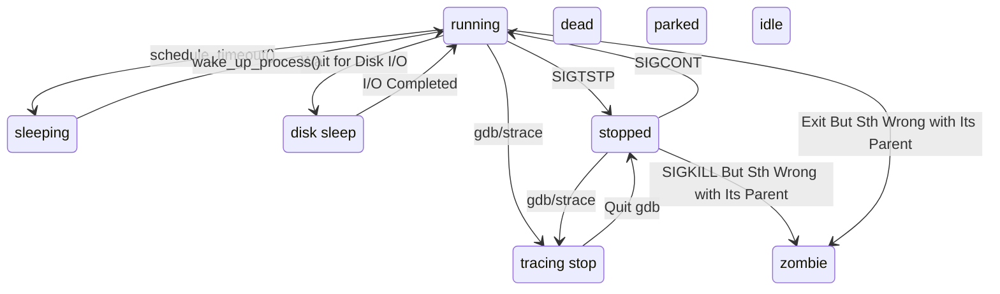

# Task State

<!--more-->

Notes:
- `disk sleep` 也就是 **uninterruptible sleep** 状态
- `zombie` 状态的进程在 `ps` 中被标记为 `<defunct>`
- 正常的空闲用户进程一般是 `sleeping` 状态，空闲的 kthread 是 `idle` 状态

# 内核中和调度相关的 APIs

- `signed long __sched shedule_timeout_interruptible(signed long timeout);`
    - 调用者 task 开始*睡眠直到超时*

- `wait_event_timeout(wq_head, condition, timeout)`
    - `wq_head`: 正在等待的一个队列 *waitqueue*, 每次 *wq_head* 被唤醒， *condition* 都会被检查一次 

# 其它

- `static inline int signal_pending(struct task_struct *)`
    - 检查当前 task 是否有信号处理，返回*非 0* 表示有信号需要处理

# References

- [when-to-use-kernel-threads-vs-workqueues-in-the-linux-kernel](https://stackoverflow.com/questions/2147299/when-to-use-kernel-threads-vs-workqueues-in-the-linux-kernel)
- [Making workqueues non-reentrant](https://lwn.net/Articles/511421/)
