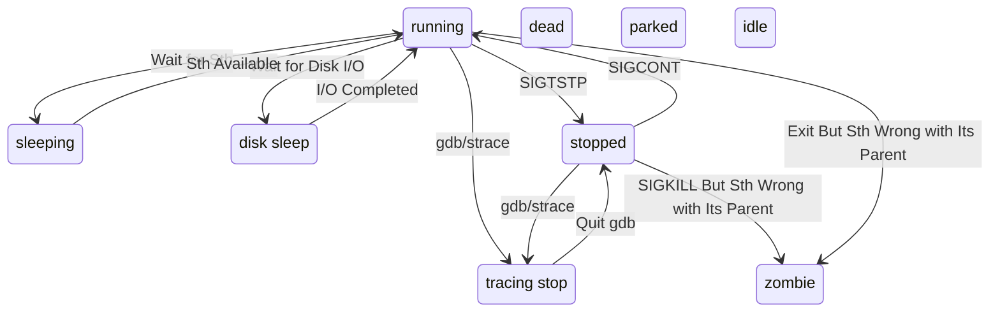

# Task State

```mermaid
stateDiagram-v2
    R: running
    S: sleeping
    D: disk sleep
    T: stopped
    t: tracing stop
    X: dead
    Z: zombie
    P: parked
    I: idle

    R --> S: Wait for Sth
    R --> D: Wait for Disk I/O
    R --> T: SIGTSTP
    R --> t: gdb/strace
    S --> R: Sth Available
    D --> R: I/O Completed
    T --> R: SIGCONT
    T --> t: gdb/strace
    T --> Z: SIGKILL But Sth Wrong with Its Parent
    R --> Z: Exit But Sth Wrong with Its Parent
    t --> T: Quit gdb
```

<!--more-->

Notes:
- `disk sleep` 也就是 **uninterruptible sleep** 状态
- `zombie` 状态的进程在 `ps` 中被标记为 `<defunct>`
- 正常的空闲用户进程一般是 `sleeping` 状态，空闲的 kthread 是 `idle` 状态
