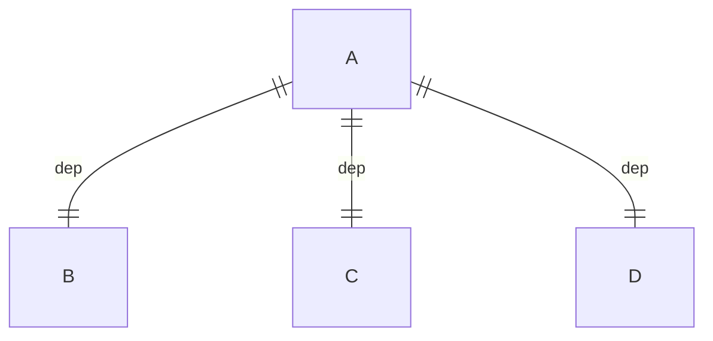

# GLX


GLX (Initialism for "OpenGL Extension to the X Window System") is an extension to the X Window System core protocol providing an interface between OpenGL and the X Window System as well as extensions to OpenGL itself. (From WiKi)


Mesa的GLX实现有3种
- xlib
- gallium-xlib
- dri

