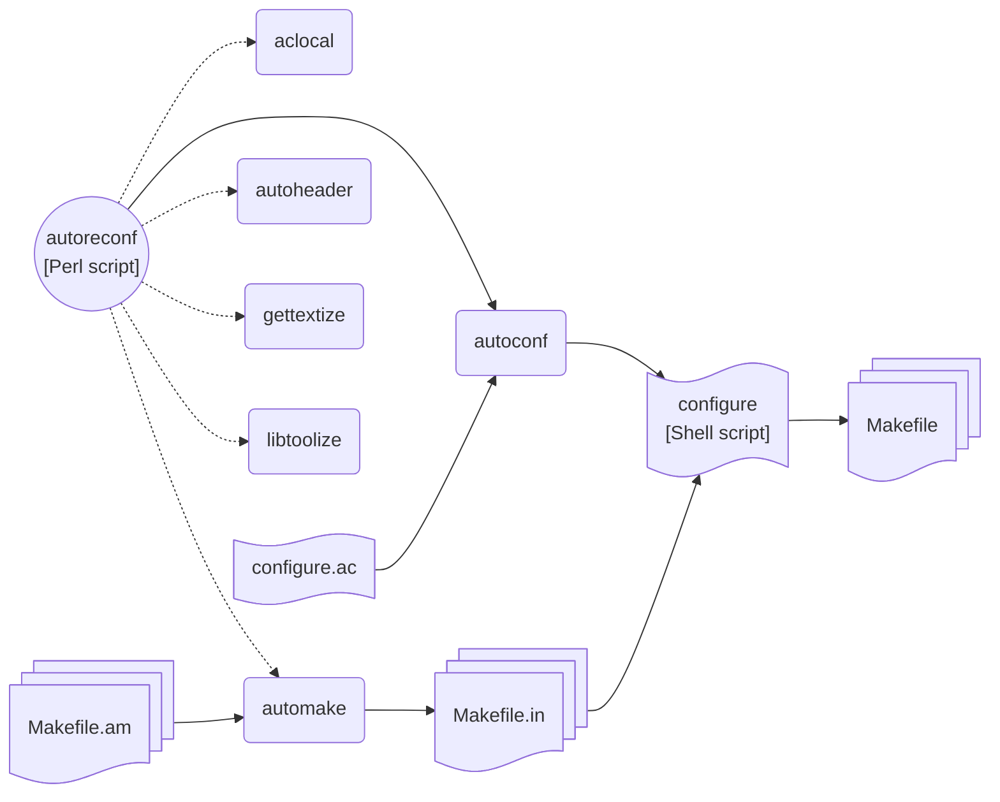

《程序员的自我修养--链接，装载与库》这本书是在读研时才看的，印象很深，现在想想这本书讲的都是程序员，尤其是从事系统编程的必备素养。这里我将平时使用的跟编译，链接和构建应用程序及库相关的知识记录下来，希望以后能温故知新。

<!--more-->

# 编译器与链接器

- gcc
- [g++](https://gcc.gnu.org/projects/cxx-status.html)
- clang
- [clang++](https://clang.llvm.org/cxx_status.html)

- bfd (使用 Binary File Descriptor 库构建的 Linker, Ubuntu 上默认的 ld)
- gold ([**go**ogle **l**oa**d**er](https://android.googlesource.com/toolchain/binutils/+/53b6ed3bceea971857c996b6dcb96de96b99335f/binutils-2.19/gold))
- mold ([**mo**dern **l**oa**d**er](https://github.com/rui314/mold))

## gcc 的优化级别

`-O` 和 `-O1` 是等价的。 `-O` 会对目标文件大小和执行时间进行优化，但不会进行非常耗时的优化，以下是 `-O` 打开的优化: (其中红色的是 `-Og` 关闭的)

- -fauto-inc-dec
- <span style="color:red">-fbranch-count-reg</span>
- -fcombine-stack-adjustments
- -fcompare-elim
- -fcprop-registers
- -fdce
- -fdefer-pop
- <span style="color:red">-fdelayed-branch</span>
- <span style="color:red">-fdse</span>
- -fforward-propagate
- -fguess-branch-probability
- <span style="color:red">-fif-conversion</span>
- <span style="color:red">-fif-conversion2</span>
- <span style="color:red">-finline-functions-called-once</span>
- -fipa-modref
- -fipa-profile
- -fipa-reference
- -fipa-reference-addressable
- -fmerge-constants
- <span style="color:red">-fmove-loop-invariants</span>
- <span style="color:red">-fmove-loop-stores</span>
- -fomit-frame-pointer
- -freorder-blocks
- -fshrink-wrap
- -fshrink-wrap-separate
- -fsplit-wide-types
- -fssa-backprop
- <span style="color:red">-fssa-phiopt</span>
- <span style="color:red">-ftree-bit-ccp</span>
- -ftree-ccp
- -ftree-ch
- -ftree-coalesce-vars
- -ftree-copy-prop
- -ftree-dce
- -ftree-dominator-opts
- <span style="color:red">-ftree-dse</span>
- -ftree-forwprop
- -ftree-fre
- -ftree-phiprop
- <span style="color:red">-ftree-pta</span>
- -ftree-scev-cprop
- -ftree-sink
- -ftree-slsr
- <span style="color:red">-ftree-sra</span>
- -ftree-ter
- -funit-at-a-time

## 编译器背后做的事

- 当你编译一个 hello world C 程序时，一般并不会指定 `-lc` 链接选项，那为什么会自动链接 libc.so.6 呢？

原因是 gcc 有一套内置的链接规则，通过 `gcc -dumpspecs` 可以看到它，这套规则规定在满足条件时，gcc 会默认为你加上 `-lc` 选项

# 动态链接器(/lib64/ld-linux-x86-64.so.2) vs 静态链接器 (/usr/bin/ld) 

动态链接器是程序运行时调用的，它由操作系统内核通过 execve 类系统调用加载到内存，进而由它加载其它用到的**动态链接库**。它本身是一个静态链接库，不依赖其它库。

静态链接器是编译链接程序时用的，它由编译器(如 gcc)调用, 它本身是一个可执行程序，而且可以读入链接脚本(linker script)来指导它的行为。例如，常见的 **/lib/x86_64-linux-gnu/libc.so** 就是一个链接器脚本文件(纯ASCII text), 而不是共享对象(shared object)文件, 这个链接脚本的内容如下

```
/* GNU ld script
   Use the shared library, but some functions are only in
   the static library, so try that secondarily.  */
OUTPUT_FORMAT(elf64-x86-64)
GROUP (
  /lib/x86_64-linux-gnu/libc.so.6
  /usr/lib/x86_64-linux-gnu/libc_nonshared.a
  AS_NEEDED ( /lib64/ld-linux-x86-64.so.2 )
)
```

## 动态库都去哪儿呢

- pkg-config

**pkg-config (symbolic link to `/usr/bin/pkgconf`)** 是用来获取系统上安装的库的信息的程序。cmake, meson 这些构建系统底层都是靠它来解析依赖包的。 下面的命令可以查看 pkg-config 工作时所搜索的路径和优先次序， 用户也可以通过环境变量 **`PKG_CONFIG_PATH`** 来指定自己想要优先搜索的路径。

```bash
pkg-config --variable pc_path pkg-config | sed 's/:/\n/g'
```

```
/usr/local/lib/x86_64-linux-gnu/pkgconfig
/usr/local/lib/pkgconfig
/usr/local/share/pkgconfig
/usr/lib/x86_64-linux-gnu/pkgconfig
/usr/lib/pkgconfig
/usr/share/pkgconfig
```

`pkg-config` 是二进制可执行程序 `/usr/bin/pkgconf` 的一个符号链接文件，它是 CMake, meson 等构建系统主要使用的系统动态库检测的工具。`pkg-config` 本质上是在解析 `*.pc` 文件。下面是常见的 Mesa OpenGL Library 的 .pc 文件。

```
➜  piglit git:(main) ✗ find /usr -name 'gl.pc' -ls
    78674      4 -rw-r--r--   1 root     root          205 Jan  3  2023 /usr/lib/x86_64-linux-gnu/pkgconfig/gl.pc
    72985      4 -rw-r--r--   1 root     root          362 Jun  7 18:16 /usr/local/lib/x86_64-linux-gnu/pkgconfig/gl.pc
➜  piglit git:(main) ✗ bat /usr/local/lib/x86_64-linux-gnu/pkgconfig/gl.pc
───────┬────────────────────────────────────────────────────────────────────────────────────────────────────────────────────────────────────
       │ File: /usr/local/lib/x86_64-linux-gnu/pkgconfig/gl.pc
───────┼────────────────────────────────────────────────────────────────────────────────────────────────────────────────────────────────────
   1   │ prefix=/usr/local
   2   │ includedir=${prefix}/include
   3   │ libdir=${prefix}/lib/x86_64-linux-gnu
   4   │
   5   │ glx_tls=yes
   6   │
   7   │ Name: gl
   8   │ Description: Mesa OpenGL Library
   9   │ Version: 24.2.0-devel
  10   │ Requires.private: x11, xext, xfixes, x11-xcb, xcb, xcb-glx >=  1.8.1, xcb-dri2 >=  1.8, xxf86vm, libdrm >=  2.4.75
  11   │ Libs: -L${libdir} -lGL
  12   │ Libs.private: -lpthread -pthread -lm
  13   │ Cflags: -I${includedir}
───────┴────────────────────────────────────────────────────────────────────────────────────────────────────────────────────────────────────
➜  piglit git:(main) ✗ bat /usr/lib/x86_64-linux-gnu/pkgconfig/gl.pc
───────┬────────────────────────────────────────────────────────────────────────────────────────────────────────────────────────────────────
       │ File: /usr/lib/x86_64-linux-gnu/pkgconfig/gl.pc
───────┼────────────────────────────────────────────────────────────────────────────────────────────────────────────────────────────────────
   1   │ prefix=/usr
   2   │ includedir=${prefix}/include
   3   │ libdir=${prefix}/lib/x86_64-linux-gnu
   4   │
   5   │ Name: GL
   6   │ Description: Legacy OpenGL and GLX library and headers.
   7   │ Version: 1.2
   8   │ Libs: -L${libdir} -lGL
   9   │ Cflags: -I${includedir}
───────┴────────────────────────────────────────────────────────────────────────────────────────────────────────────────────────────────────
```

- `lib*-dev` 与 `lib*` 的区别

```
$ dpkg -L libxcb1
/.
/usr
/usr/lib
/usr/lib/x86_64-linux-gnu
/usr/lib/x86_64-linux-gnu/libxcb.so.1.1.0
/usr/share
/usr/share/doc
/usr/share/doc/libxcb1
/usr/share/doc/libxcb1/changelog.Debian.gz
/usr/share/doc/libxcb1/copyright
/usr/lib/x86_64-linux-gnu/libxcb.so.1
```

```
$ dpkg -L libxcb1-dev
/.
/usr
/usr/include
/usr/include/xcb
/usr/include/xcb/bigreq.h
/usr/include/xcb/xc_misc.h
/usr/include/xcb/xcb.h
/usr/include/xcb/xcbext.h
/usr/include/xcb/xproto.h
/usr/lib
/usr/lib/x86_64-linux-gnu
/usr/lib/x86_64-linux-gnu/libxcb.a
/usr/lib/x86_64-linux-gnu/pkgconfig
/usr/lib/x86_64-linux-gnu/pkgconfig/xcb.pc
/usr/share
/usr/share/doc
/usr/share/doc/libxcb1-dev
/usr/share/doc/libxcb1-dev/copyright
/usr/lib/x86_64-linux-gnu/libxcb.so
/usr/share/doc/libxcb1-dev/changelog.Debian.gz
```

- `/usr/sbin/ldconfig`

Configure Dynamic Linker Run Time Bindings

```sh
#!/bin/sh

if  test $# = 0							\
    && test x"$LDCONFIG_NOTRIGGER" = x				\
 && test x"$DPKG_MAINTSCRIPT_PACKAGE" != x			\
 && dpkg-trigger --check-supported 2>/dev/null
then
	if dpkg-trigger --no-await ldconfig; then
		if test x"$LDCONFIG_TRIGGER_DEBUG" != x; then
			echo "ldconfig: wrapper deferring update (trigger activated)"
		fi
		exit 0
	fi	
fi

exec /sbin/ldconfig.real "$@"
```

## GOT, PLT & PIC

- GOT Global Offset Table
- PLT Procedure Linkage Table
- PIC Position Independent Code

# 构建系统

- autotools
- cmake
- make
- meson
- ninja 
- scons

## autotools



[**autotools** 的唯一的可取处就是 GNU 项目广泛使用它](https://stackoverflow.com/questions/4071880/what-are-the-differences-between-autotools-cmake-and-scons)。使用它的项目的构建步骤一般是

```bash
./autogen.sh
./configure --prefix=$PREFIX
make
```

当你遇到 `./autogen.sh: 13: autoreconf: not found` 这样的错误时，你可能需要安装这些软件包

```bash
sudo apt-get install autoconf automake libtool gettext
```

## cmake

- use `gold`

```bash
cmake -B build -DCMAKE_BUILD_TYPE=Debug -DCMAKE_EXPORT_COMPILE_COMMANDS=On -DCMAKE_EXE_LINKER_FLAGS=-fuse-ld=gold
```

## meson

- [-D buildtype](https://mesonbuild.com/Builtin-options.html#details-for-buildtype)

meson 的 buildtype 是用来设定编译优化级别 (optimization levels: -O0, -O1, -O2, -O3, -Os) 和是否有调试信息 (debug: -g)。 实际上，meson 提供两个分开的选项分别控制编译优化级别和调试信息

  - -Doptimization (plain|0|2|3|s, plain 指不设置任何 optimization flags)
  - -Ddebug (true|false)

- 只编译某个 target

```
ninja -C build target
```

- meson install --tags tag1,tag2

Installation tags 是专门为打包 (packaging) 设计的，因为打包时开发文件包(头文件)，文档包 (mannul) 和二进制包 (shared libraries) 一般是分开的 3 个包。所以 `meson install --tags` 可以让用户分 3 次安装，每次只安装这个包所需的文件。meson 有几个预定义的 tags (不用用户自己使用 `install_tag` 关键字去指定 tag 名)

| tags      | files                                                                        |
|:----------|:-----------------------------------------------------------------------------|
| devel     | static_library(), install_headers(), .a, .pc                                 |
| runtime   | executable(), shared_library(), shared_module(), .so, .dll                   |
| man       | install_man()                                                                |
| doc       | hotdoc.generate_doc()                                                        |
| i18n      | i18n.gettext(), files installed into `localedir`                             |
| bin       | scripts and executables bundled with a library used by end users             |
| bin-devel | scripts and executables bundled with  a library used by developers           |

- use `gold`

```bash
meson build --prefix=/usr -D{c,cpp}_args=-fuse-ld=gold -Dflavors=x11-gl,x11-glesv2
```

# 参考

- [C++ compiler support](https://en.cppreference.com/w/cpp/compiler_support)
