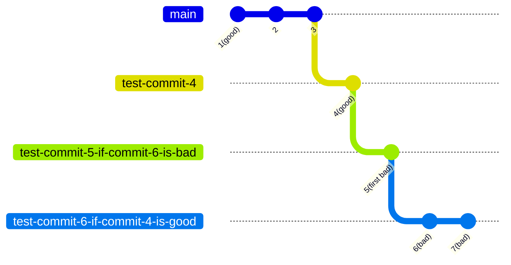

<!--more-->

# git am
- `git am foo.patch`
  - 应用补丁 foo.patch (注意与 `git apply` 的区别，`git am` 同时会将commit log 也应用上去)
- `git am -i -3 /tmp/patches/*`
  - `-i`：交互式地 apply patch, 即每个 Patch 都询问 *Apply? [y]es/[n]o/[e]dit/[v]iew patch/[a]ccept all:*
  - `-3`: 当有冲突时进入 3way merge 模式，即允许你手动解决冲突(如果 git 自动解决不了)，然后 `git am -i --continue`

# git bisect
- `git bisect start <end-commit> <start-commit>`
  - 一般 *end-commit* 是最近的提交(如 HEAD), *start-commit* 是比较老的提交
  - 执行这个命令，代码库会 checkout 到这个范围**正当中**的那个提交，接下来你可以做一些测试和验证
- `git bisect good` 或 `git bisect bad`
  - 根据前面测试的结果，设置当前的提交是 *good* 还是 *bad*
  - 如此重复前两步，直到找到问题提交
- `git bisect log > file.txt`
  - 打印出前两步的过程记录
- `git bisect replay file.txt`
  - 将 bisect 过程记录加以修改，重新执行
- `git bisect reset`
  - 将仓库由**二分查找**状态恢复到原来状态

# git clone
- `git clone --recurse-submodules`
  - 克隆仓库时连同子仓库一同克隆

# git describe
- `git describe <commit>`
  - 找到离 `<commit>` 最近的 tag

- `git describe --contains <commit>`
  - 找到**包含** `<commit>` 的 tag
  - 例：`git describe --contains a6149f03`
    - `v6.8-rc1~111^2~23^2~81`
  - 它和不加 `--contains` 的区别是，`git describe` 仅仅是**离得最近**，从前往后都算，而 `git describe --contains` 是 **包含**，上面例子中命令的输出 `v6.8-rc1~111^2~23^2~81`， 表示在 v6.8 中一定包含 `a6149f03` 这个 commit, 而且它指出了具体的位置：从 `v6.8-rc1` 这个 tag 的 commit 往后第 111 个 commit (`^2` 表示它是一个 **merge commit**), 从这个 merge commit 再往后第 23 个 commit (仍然是一个 merge commit), 从这个 commit 再往后第 81 个 commit， 就是 `a6149f03`

# git log
- `git log -S<regex> --pickaxe-regex /path/to/a/file`
  - 查找匹配的字串在这个文件中出现的次数发生变化的 commit
- `git log -G<regex> /path/to/a/file`
  - 查找到涉及修改文件 `file` 的内容匹配正则表达式 <regex> 的 commit
- `git log --diff-filter=D --summary --oneline`
  - 找出有文件删除记录的 commit, 并显示出哪些文件被删除
  - filters 有:
      - A: Added
      - C: Copied
      - D: Deleted
      - M: Modified
      - R: Renamed
  - 当 filters 使用小写时，表示**不包含**这些变更类型
- `git log --oneline --grep "fix:"`
  - tig 类似的参数是 `--grep="fix:"`

# git remote
- `git remote prune <remote>`
  - 将给定的 `<remote>` 远端不存在的**本地分支**全部删除(注意: rm -rf 警告，最好先 `git remote prune --dry-run <remote>`)

# git shortlog
- `git shortlog -sne --author="Name Surname"
  - 统计某个贡献者的提交，像这样：`17  Luc Ma <luc@sietium.com>`

# git submodule
- `git submodule init`
  - 在主仓库初始化一个子仓库
- `git submodule update`
  - 更新所有子仓库
    - `git submodule update --recursive`
      - 递归地更新所有子仓库，有时候子仓库里又有子仓库，如
        ```
        Submodule path 'thirdparty/snappy': checked out '6af9287fbdb913f0794d0148c6aa43b58e63c8e3'
        Submodule path 'thirdparty/snappy/third_party/benchmark': checked out 'd572f4777349d43653b21d6c2fc63020ab326db2'
        Submodule path 'thirdparty/snappy/third_party/googletest': checked out 'b796f7d44681514f58a683a3a71ff17c94edb0c1'
        ```
- `fatal: remote error: upload-pack: not our ref e15ab44e64c70b54fc375c019c95bddc066a84cf
fatal: Fetched in submodule path 'submodules/ImGuiScope', but it did not contain e15ab44e64c70b54fc375c019c95bddc066a84cf. Direct fetching of that commit failed`
  - 如果你需要在一个 submodule 仓库里添加自己的修改，那么可能需要将 `.gitmodules` 文件里对应仓库的 `url` 变成你自己的**远程可写**仓库的 URL

# .gitignore

## 记几个与gitignore相关的命令：

```
git check-ignore -v file # 输出file是写在哪个.gitignore文件中
git status -s --ignored # 查看所有被ignored的文件
git ls-tree -r --name-only master # 查看所有被tracked的文件
git rm --cached file # 永久撤销对file文件的跟踪
```

## 记几个与gitignore相关的要点：

- git支持嵌套的`.gitignore`文件，就是说可以在repo下的某个子目录里写一个`.gitignore`文件，但是这个`.gitignore`只能影响这个目录下的内容
- `.gitignore`文件里的记录*只影响untracked*的文件，就是说如果想ignore一个之前已经跟踪了的文件，就必须先对这个文件执行`git rm --cached`，否则即使把这个文件写到`.gitignore`中也不生效。而且会产生疑惑，明明已经把某个文件加到`.gitignore`中了，为什么仍然被跟踪? 这时最好使用`git ls-tree -r --name-only master`命令确认那个文件是否还在被跟踪。

# GitHub

## `ssh: connect to host github.com port 22: Connection timed out`

之前好好的，突然 `git pull`, `git clone` 等这个错误，两种解决方法

- 修改 git 配置

```shell
git config --global "url.ssh://git@ssh.github.com:443/.insteadOf" git@github.com:
```

- 修改 ssh 配置

``` vim ~/.ssh/config
Host github.com
    Hostname ssh.github.com
    Port 443
```
