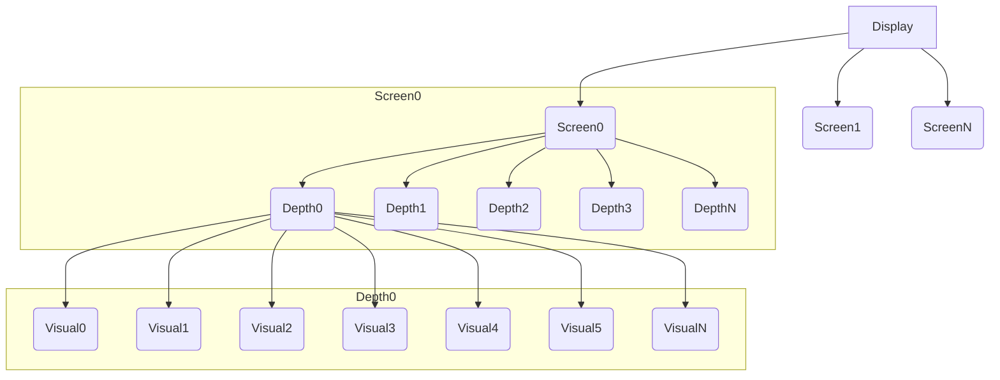

# X Window System
X Window System是一个基于网络的窗口系统协议，它的一个实现是[Xorg](https://www.x.org/wiki/)。

<!--more-->

# What are data structures in Xorg?
- Display
    Display datatype maintaining display specific data. The contents of this structure are implementation dependent. A Display should be treated as oqaque by application code.
- Screen
    Information about the screen. The contents of this structure are implementation dependent. A Screen should be treated as opaque by application code.
- Depth
    Depth structure; contains information for each possible depth.
- Visual
    Visual structure; contains information about colormapping possible.

以上4个结构体都被定义在[Xlib.h](https://gitlab.freedesktop.org/xorg/lib/libx11/-/blob/master/include/X11/Xlib.h),前两个相对大一些，尤其是`Display`,可以说是统领万象者。它们四者之间的关系是前者包含多个后者，依次类推。

# How are they organized?


# How do we get their information?
一般的Linux系统中有一个命令`xdpyinfo`,利用它可以查看到所有的4者的信息，当然和其它的X的工具一样，使用前要确保环境变量`DISPLAY`已经为有效值。下面是在Xorg作为X Server时查看到的系统X11 Window的相关信息。(只截取前面部分)
```

name of display:    :18.0
version number:    11.0
vendor string:    The X.Org Foundation
vendor release number:    12008000
X.Org version: 1.20.8
maximum request size:  16777212 bytes
motion buffer size:  256
bitmap unit, bit order, padding:    32, LSBFirst, 32
image byte order:    LSBFirst
number of supported pixmap formats:    7
supported pixmap formats:
    depth 1, bits_per_pixel 1, scanline_pad 32
    depth 4, bits_per_pixel 8, scanline_pad 32
    depth 8, bits_per_pixel 8, scanline_pad 32
    depth 15, bits_per_pixel 16, scanline_pad 32
    depth 16, bits_per_pixel 16, scanline_pad 32
    depth 24, bits_per_pixel 32, scanline_pad 32
    depth 32, bits_per_pixel 32, scanline_pad 32
keycode range:    minimum 8, maximum 255
focus:  window 0x300000f, revert to PointerRoot
number of extensions:    25
    BIG-REQUESTS
    DAMAGE
    DOUBLE-BUFFER
    DRI2
    GLX
    Generic Event Extension
    MIT-SCREEN-SAVER
    MIT-SHM
    Present
    RANDR
    RECORD
    RENDER
    SECURITY
    SHAPE
    SYNC
    X-Resource
    XC-MISC
    XFIXES
    XFree86-DGA
    XFree86-VidModeExtension
    XINERAMA
    XInputExtension
    XKEYBOARD
    XTEST
    XVideo
default screen number:    0
number of screens:    1

screen #0:
  dimensions:    1920x1080 pixels (508x286 millimeters)
  resolution:    96x96 dots per inch
  depths (7):    24, 1, 4, 8, 15, 16, 32
  root window id:    0x34d
  depth of root window:    24 planes
  number of colormaps:    minimum 1, maximum 1
  default colormap:    0x20
  default number of colormap cells:    256
  preallocated pixels:    black 0, white 16777215
  options:    backing-store NO, save-unders NO
  largest cursor:    1920x1080
  current input event mask:    0xfa800f
    KeyPressMask             KeyReleaseMask           ButtonPressMask          
    ButtonReleaseMask        ExposureMask             StructureNotifyMask      
    SubstructureNotifyMask   SubstructureRedirectMask FocusChangeMask          
    PropertyChangeMask       ColormapChangeMask       
  number of visuals:    240
  default visual id:  0x21
  visual:
    visual id:    0x21
    class:    TrueColor
    depth:    24 planes
    available colormap entries:    256 per subfield
    red, green, blue masks:    0xff0000, 0xff00, 0xff
    significant bits in color specification:    8 bits
  visual:
    visual id:    0x22
    class:    DirectColor
    depth:    24 planes
    available colormap entries:    256 per subfield
    red, green, blue masks:    0xff0000, 0xff00, 0xff
    significant bits in color specification:    8 bits
  visual:
    visual id:    0x25e
    class:    TrueColor
    depth:    24 planes
    available colormap entries:    256 per subfield
    red, green, blue masks:    0xff0000, 0xff00, 0xff
    significant bits in color specification:    8 bits

```

