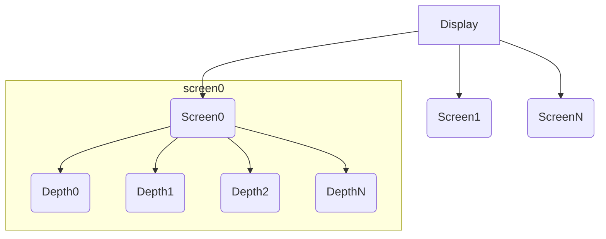

# X Window System
X Window System是一个基于网络的窗口系统协议，它的一个实现是[Xorg](https://www.x.org/wiki/)。

# What are data structures in Xorg?
- Display
- Screen
- Depth
- Visual

# How are they organized?

```mermaid
graph TD
    D[Display]
    D --> s0(Screen0)
    D --> s1(Screen1)
    D --> sN(ScreenN)
    subgraph screen0
    s0 --> d0(Depth0)
    s0 --> d1(Depth1)
    s0 --> d2(Depth2)
    s0 --> dN(DepthN)
    end
```
